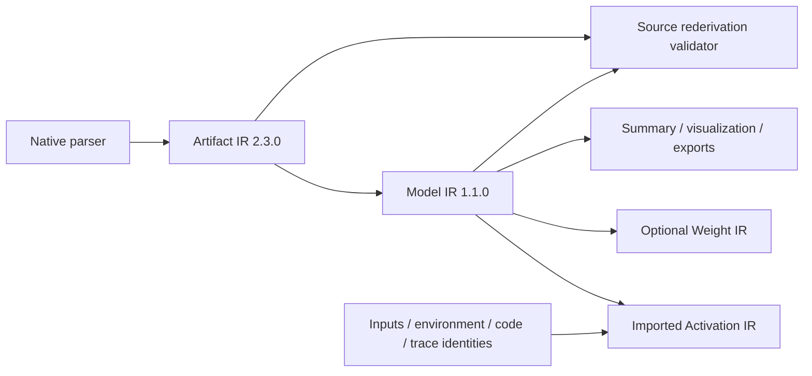

# 공통 IR 강화: 구현과 검증 기록

대상 릴리스: DEEPBOM **1.108.0**. Artifact IR method **2.3.0**, Model IR method **1.1.0**, Model Summary method **1.1.0**.
이 문서는 [선행 검토](CORE_IR_REVIEW_2026-09-24.md)의 후속 구현을 설명한다.
배포 성공 여부와 최종 커밋 검증 결과는 문서 끝의 릴리스 기록에서 구분한다.

## 실제로 수정한 오류

| 경로 | 수정 전 문제 | 수정 후 계약 |
|---|---|---|
| 중첩 graph → quantization | scope가 다른 동일 tensor index가 primary binding을 덮어쓸 수 있음 | scope와 native index를 함께 사용, TFLite nested quantization도 보존 |
| MAC 합계 fallback | 누락된 연산 MAC을 0처럼 더하고 complete total로 표시 | 계산한 소계와 미확정 전체값을 분리 |
| logical tensor bytes | ONNX activation의 initializer storage 부재를 0바이트로 표시 | shape·dtype로 exact byte count 계산; unknown rank는 null |
| graphless tensor → Model IR | 0바이트 SafeTensors가 logical inventory에서도 사라짐 | 독립 logical inventory에 유지, storage와 graph는 생성하지 않음 |
| native type → common value | scalar, unknown rank, sequence/map/optional/sparse의 구조 소실 | 재귀 type tree와 native type descriptor 보존 |
| TFLite scalar | native `has_rank` 누락으로 [] 해석 불가 | Rust → WASM → primary/nested IR까지 has_rank 전달 |
| ONNX 내부 quantization | 256개 UI sample로 인해 전체 vector digest 미수집 | parser가 이미 읽은 전체 벡터에서 streaming canonical digest 생성 |
| native control ledger | 다른 scope의 같은 operator index로 control ref 오염 가능 | primary scope의 operator로 제한 |
| artifact-set validation | number mirror의 문자열을 숫자로 강제 변환, JSON clone이 invalid 값을 지움 | 정확한 타입을 검증하고 원본 JSON부터 확인 |
| activation shape binding | unknown rank를 scalar처럼 취급, decimal 차원을 wildcard처럼 허용 | 재귀 type의 rank·exact dimensions·공유 symbol 제약 검증 |
| IR → summary | graphless logical value 누락, nested MAC 중복 합산, scalar 표시 소실 | 독립 inventory count·entry-region MAC 범위·타입 계약 보존 및 source 검증 |
| report → artifact identity | TFLite file_size 누락을 0으로 전달 | 두 native size 필드를 읽고 unknown은 null 유지 |
| bundle/attribute ordering | locale에 따라 배열 정렬과 식별 해시가 달라질 수 있음 | locale-independent UTF-16 정렬 |

선행 보고서의 “TFLite 파서 전체 scale 미수집”은 현재 코드에 대해 정확하지 않았다.
Rust의 `scale_sample`은 이름과 달리 전체 vector를 보존하고 있었다. 이번에 실제로
수정한 손실은 ONNX의 **내부** tensor sample 경로이며, TFLite는 nested scope 전파를 추가했다.

## 데이터 흐름



모든 채널은 같은 공통 모듈을 사용한다. Web은 브라우저 파서와 WASM,
CLI와 로컬 MCP는 동일 JavaScript/WASM 배포물을 소비한다. Hosted MCP는
ChatGPT 위젯의 브라우저 분석을 연결한다. 새 IR 필드는 기존 출력 경로로 전달되며
새 모델 실행이나 서버 업로드를 요구하지 않는다.

## 공통 계층의 아홉 과제에 대한 대응

1. **타입과 rank** — `ir-value-type.js`에서 tensor/sparse tensor, sequence,
   map, optional, opaque, unknown을 표현한다. 차원은 exact constant, named
   symbol, unknown으로 구분한다. native type tree가 없는 adapter는 제공된
   tensor descriptor만 투영하며 원본에 없는 구조를 만들지 않는다.
   ONNX의 dimension variable은 main/nested graph 사이에 공유된다. 이는
   [ONNX IR shape 규칙](https://onnx.ai/onnx/repo-docs/IR.html#static-tensor-shapes)에
   따른 것이며 operator/value ID의 지역 scope와 다르다.
2. **Native 속성·계산 의미** — operator에 adapter attribute ledger와 versioned
   semantic contract를 추가했다. ONNX와 Core ML에서 노출된 속성을 보존하고,
   계산 이유·native source locator·미제공 상태를 기록한다. 이 ledger는 전체
   native schema defaults, tensor/graph attribute payload를 재실행 가능한 형태로
   변환하는 compiler IR이 아니다. 이 차이는 loss ledger에 남긴다.
3. **양자화 vector** — 전체 읽기가 이미 끝난 ONNX parameter array를 별도의
   대형 JSON 문자열로 복사하지 않고 SHA-256에 순차 입력한다. canonical JSON
   배열 해시와 바이트 단위로 동일하다. 작은 vector만 inline으로 보존한다.
   partial sample, invalid/inexact value, complete digest를 구분한다. 외부
   payload가 제공되지 않았다면 이를 완료로 표시하거나 추가로 읽지 않는다.
4. **Logical inventory** — 논리 값의 존재와 저장 객체의 존재를 분리했다.
   `[0,3]` 텐서는 element count 0인 논리 값이며, payload storage 0개와 양립한다.
   scalar의 element count는 1이고 unknown rank의 count는 null이다.
5. **Artifact members** — acquisition manifest, bundle file, ONNX external data를
   typed member identity와 storage binding으로 연결한다. 누락된 member ref,
   잘못된 범위 길이 등 IR 자체 모순은 거부한다. 파일 밖 absolute range는
   분석 대상의 결함일 수 있으므로 `outside_artifact_member`로 보고한다. 이 판정을
   다시 계산해 잘못된 정상 판정은 거부한다. 같은 파일·offset basis의
   겹치는 범위는 연결된 overlap group으로 보고하며 자동으로 결함으로 단정하지
   않는다. adapter가 shard/archive payload의 정확한 소속을 노출하지 않으면
   `partial_member_binding`으로 남는다.
6. **원본 재유도 검증** — `validateModelIr`는 단독 문서의 내부 일관성과 digest를
   검증한다. `validateModelIrAgainstSource(modelIr, artifactIr, options)`는
   독립적으로 제공된 source에서 현재 method의 projection을 재계산하여 전체
   문서를 비교한다. supplementary native ledger가 필요하면 별도로 제공해야
   한다. 자기 문서의 hash를 다시 계산하는 것만으로 source 검증을 통과하지 못한다.
7. **Metric 계약** — unit, exact integer, coverage, source refs, assumptions,
   not-assessable reason을 가진 공통 계약을 operator MAC/논리 I/O bytes에 적용했다.
   합계 API는 단위 혼합과 중복 source를 거부하고 partial subtotal을 complete total로
   승격하지 않는다. 모델 전체의 MAC, latency, bytes를 한 단위로 합산하지 않는다.
   native formula 구현은 각 format adapter에 계속 존재한다.
8. **Upstream 변경 gate** — `config/ir-support-gate.v1.json`에 검토한 source manifest
   digest·commit·필수 검사·지원 경계를 고정했다. pin을 바꾸면 schema diff와 adapter
   영향 검토 없이 gate를 통과하지 못한다. gate 자체가 새 operator 지원을 입증하는
   것은 아니며, 기존 source verifier와 format별 fixture를 함께 실행해야 한다.
9. **실행 provenance** — 선택적 run provenance에 environment, input manifest,
   code, trace의 digest와 detached Ed25519 signature claim을 보존한다. input
   digest는 실제 capture input evidence와 비교한다. signature는 payload binding을
   확인하되 신뢰할 key를 대신 선택하거나 측정자를 인증하지 않는다. 상태는
   `declared_not_attested`, signature verification은 `not_verified`로 유지한다.

TFLite scalar 규칙은 [공식 schema의 Tensor.has_rank](https://github.com/tensorflow/tensorflow/blob/master/tensorflow/compiler/mlir/lite/schema/schema.fbs),
해시 직렬화는 [RFC 8785](https://www.rfc-editor.org/rfc/rfc8785.html)를 참고했다.
조사한 최신 문서와 DEEPBOM이 실제 지원하는 pinned native semantics는 별개다.

Model Summary도 원본 Model IR에서 재유도하여 비교할 수 있다. graphless artifact의
MAC는 not-assessable/null이며 nested body는 entry-region nominal MAC에 중복 합산하지
않는다. 이는 분기·loop의 실제 실행 횟수를 추정한다는 뜻이 아니다.

## 호환성 및 유지보수

- Artifact IR 2.2.0/2.2.1, Model IR 1.0.0/1.0.1, Model Summary 1.0.0 읽기를 유지한다. 이전 문서의
  digest를 재작성하지 않는다. 현재 method로 새로 만든 IR은 이전과 digest가
  달라질 수 있으며 모델 원본 hash 변경을 의미하지 않는다.
- source rederivation은 현재 method에 대해 수행한다. 이전 method 문서는
  standalone validator로 검증하고, 원본을 다시 분석하면 새 method로 생성한다.
- 공통 계약은 작은 모듈로 분리했다. storage→logical value, port→value 조회는
  Map으로 바꾸어 반복적인 전체 배열 검색을 줄였다.
- 새 모듈은 공개 소스 allowlist와 service worker offline asset 목록에 포함한다.
- schema·계산 계약 변화에 맞춰 공개 reference 문서를 재생성하고 consumer의
  pinned digest를 함께 갱신한다. metadata에 고정된 예제 analyzer 버전은 실제
  신규 실행 버전으로 오해하면 안 된다.
- source budget 증가는 새 계약·schema·회귀 fixture의 실측 증가분을 반영했다.
  환경 변수로 검사를 우회하지 않는다.

## 검증 범위와 릴리스 기록

새 regression runner `scripts/check-ir-hardening.mjs`는 실제 ONNX/SafeTensors
바이트, scoped adapter fixtures, streaming hash oracle, rehashed tamper,
runtime input binding을 검사한다. 기존 공통 의미 검사와 전체 regression suite를
함께 실행한다. 이 기록은 모든 native operator의 수학적 구현 완전성이나 무오류
인증을 뜻하지 않는다.

```bash
node scripts/check-common-ir-semantics.mjs
node scripts/check-ir-hardening.mjs
node scripts/check-ir-support-gate.mjs
node scripts/check-artifact-ir.mjs
node scripts/check-model-ir.mjs
node scripts/check-numerical-ir.mjs
node scripts/check-all.mjs
```

초기 frozen commit `35c32b7` 전체 검사는 251개 중 245개 통과, 6개 실패였다.
세 실패는 결함 artifact의 저장 범위를 IR이 거부하는 같은 원인, 나머지는 새
모듈 분류 누락·생성 CLI 문서 갱신·현재 버전 배포 검증 기록 부재였다. 이를
숨기거나 검사를 제거하지 않고 수정했다. 요약 전용 검사도 전체 gate에 추가했다.

후속 commit `ecb81a0`에서 Rust 129개, 새 hardening 22개 묶음, 6형식 IR·요약,
공식 CycloneDX 1.7 schema 및 export 회귀 검사를 통과했다. 실제 측정은
사전 검사 96개 206.859초, 채널 빌드 13.617초, Linux 설치 smoke 52.364초,
릴리스 계약 비교 156.783초였다. 이 값은 다른 OS에서 실행한 결과가 아니다.

전체 252개 최종 검사와 실제 배포 결과는 커밋을 고정한 로그·릴리스 manifest 및
[1.108.0 릴리스 기록](https://github.com/JunHwan-Kwon/deepbom/releases/tag/channels-v1.108.0)에
별도로 남긴다. 사전 검사 통과를 배포 완료로 해석하지 않는다.
GitHub Actions는 사용하지 않으며 원래 작업 폴더의 사용자 변경은 보존한다.
