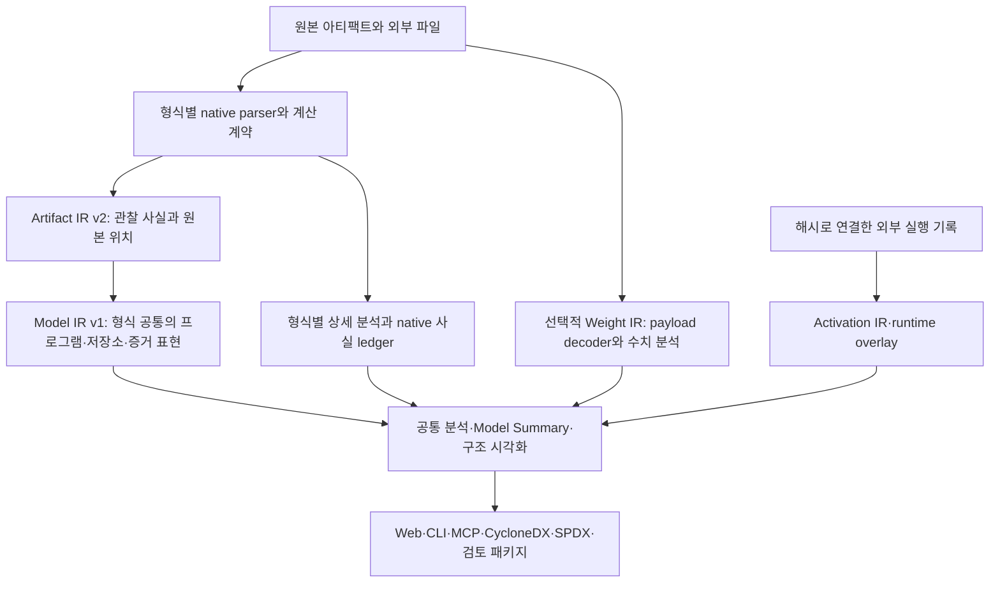

# DEEPBOM 공통 IR·계산 정확성 검토

후속 구현: [2026-09-24 공통 IR 강화 및 배포 기록](CORE_IR_HARDENING_2026-09-24.md). 아래 표는 해당 후속 수정 이전의 검토 기록이며, 완료 범위와 정정 사항은 후속 문서를 기준으로 한다.

검토일: 2026-09-24 (Asia/Seoul). 대상 기준 코드: `71cb1cfba94dc0fdecdc54036803703008a05e3e`, DEEPBOM 1.107.0. 추가 수정 브랜치: `codex/core-ir-standards-audit`.

## 1. 먼저 답: “전체 계산을 최종 검사했는가?”

이전 작업에서는 전체 회귀 검사 248개를 **수정 과정에 걸쳐 누적 통과**했고, 최종 커밋에서는 빌드·배포 채널 동등성·공개 소스 경계 등을 확인하는 10개 릴리스 검사를 통과했다. 따라서 이전 결과를 “248개 전부를 마지막 코드에 다시 실행했다”로 해석하면 정확하지 않다. 이번에는 배포 기준 커밋을 변경하지 않고 248개를 다시 실행했다. 최종 결과는 아래 검증 기록에 기재한다.

그러나 검사 통과는 알려진 사례의 통과다. 이번에 기존 검사와 다른 관점으로 공통 IR의 정수 표현, 정규화, 직렬화, 외부 저장소, 양자화 벡터를 검사하자 **기존 코드에서 실패하는 새로운 회귀 사례 15개**를 재현했다. 실제 ONNX·SafeTensors 바이트를 사용하는 사례와 정규화 어댑터 경계에 값을 직접 넣는 사례를 구분했다. 수정 후 15개 모두 통과했다.

따라서 현재의 정확한 평가는 다음과 같다.

- 정적 계산, 선택적 수치 분석, 실행 증거, 내보내기에 대한 넓은 검사 기반은 있다.
- 공통 표현으로 옮기는 과정에도 수치·증거 의미가 손실되는 오류가 있었으며 이번에 추가 수정했다.
- 지원 형식의 모든 연산·버전·사용자 정의 확장과 모든 실수 입력에 대한 무오류 증명이 완료된 것은 아니다.
- 지금 필요한 공통 계층은 **출처, 정확도, 적용 범위, 정보 손실을 함께 보존하는 분석 IR**이다. 현재 구현을 모든 모델을 재실행할 수 있는 범용 컴파일러 IR로 설명하면 안 된다.

## 2. 무엇을 검사했는가

| 영역 | 계산·계약 검토 범위 | 해석 경계 |
|---|---|---|
| 파일·저장소 | 전체 해시, 파일/텐서 구간, 저장 객체, 논리 바이트, 정수 범위 | 파일 해시와 텐서 payload 해시는 서로 다른 대상이다 |
| 그래프·계산량 | 형상 전파, broadcast, contraction, MAC 합계, 동적 차원, 하위 그래프 | 명목상 정적 계산량은 실제 GPU 명령 수나 지연시간이 아니다 |
| 양자화 | dtype, Q/DQ 계약, per-axis/block/group 표현, 수량과 coverage | 작은 정수 dtype만으로 전체 정수 추론을 단정하지 않는다 |
| 비교·통계 | 오차, 제곱합, cosine, 분산, 회귀, 분위수, 집계 | 표본 정의, 단위, 비유한 값, 분모를 함께 확인해야 한다 |
| Weight IR | 선택적 payload 검사, 분포, 행렬·희소성·pruning 분석 | 디코더와 계산 예산에 따른 범위가 있으며 모델 품질은 별도 평가다 |
| 실행 증거 | 외부 trace·activation·timing의 식별자와 수치 입력 | 외부 기록의 내부 일관성이 측정자나 장치의 진실성을 보증하지는 않는다 |
| 공통 IR | 식별자, 참조, 보존 합계, canonical JSON, schema/method, native provenance | JSON Schema 통과와 의미적 검증을 구분한다 |
| 소비 계층 | Web·CLI·MCP, summary, 시각화, CycloneDX, SPDX | 한 출력의 잘못된 축약이 다른 출력으로 전파되지 않아야 한다 |

1.107.0의 이전 수정에는 TFLite BatchMatMul adjoint/broadcast, Conv3DTranspose, 2^53 초과 MAC, ONNX zero-batch·symbolic 계산, 출력 비교의 정확한 합산, benchmark 통계, 논리 메모리의 scalar/INT4 처리가 포함된다. 이번 추가 검토는 그 계산 결과를 공통 표현에 옮기는 경계를 집중적으로 검사했다. “Weight만 검토했다”는 범위가 아니다.

검증 실행 환경은 Linux x64와 Node 24.12.0이다. 기존 Rust 128개 통과 기록과 배포 브라우저 검사 기록도 확인했지만, 이번 JavaScript 공통 IR 수정에 대한 새 Rust 실행 결과로 중복 계산하지 않았다. Windows·macOS 설치 파일 전체와 실제 Jetson 장치 성능을 이번 검사에서 새로 검증한 것은 아니다.

## 3. 이번에 재현하고 수정한 오류

아래 표의 수정 상태는 **추가 검토 브랜치의 코드 상태**다. 운영 배포 여부는 마지막 절에서 따로 설명한다. 한 원인에 복수의 회귀 사례가 있으므로 표의 행 수와 테스트 수는 다르다.

| 문제 | 수정 전 재현 | 수정 내용 | 근거 |
|---|---|---|---|
| 객체 키 순서에 따른 오판 | 유효한 Model IR을 canonical JSON으로 저장했다가 읽으면 capability 검증 실패 | 객체 의미 비교에도 canonical JSON 사용 | 실제 ONNX에서 생성한 IR 왕복 |
| 언어 설정에 따른 해시 변동 | `ä.w`, `z.w`, `a.w` 이름을 가진 동일 입력이 en_US/sv_SE에서 다른 IR 해시 생성 | 해시 대상 배열 정렬에서 locale 의존 비교 제거 | en_US·sv_SE·tr_TR 별도 Node 프로세스 |
| 잘못된 JSON 값의 은폐 | sparse array가 잘못된 문자열로 직렬화되고, 검증 전 clone이 undefined/NaN을 제거·변환 | 원본을 먼저 엄격히 검증, sparse array 거부 | 희소 배열·undefined·NaN 변형 |
| 숫자 강제 변환 | `true`가 1, 일부 빈 값이 0으로 취급됨 | 공통 exact integer helper에서 허용 타입 제한 | boolean·배열·공백·안전 범위 초과 입력 |
| unknown·zero·scalar 혼동 | `[null,3]`이 `[0,3]`, SafeTensors `[]`의 원소 수가 미평가 | unknown 보존, 저장 객체에 rank 상태 추가, 알려진 scalar는 1 | 실제 scalar SafeTensors와 어댑터 경계 |
| 큰 정수 형상의 계산 누락 | `["9007199254740993",2]`의 원소 수를 계산하지 않음 | BigInt 계산 후 정확한 decimal 보존, unsafe number는 null | 결과 `18014398509481986` |
| 같은 정수의 두 표현이 모순 | decimal은 맞고 number만 바꾼 IR을 다시 해시하면 검증 통과 | 안전한 범위에서 numeric mirror와 decimal 일치 강제 | Artifact IR·Model IR 변형 검사 |
| Model IR 저장소 합계·ID | 중복 storage ID 또는 잘못된 바이트 합계를 다시 해시해도 통과 | ID 유일성, 객체/논리 값/범위/해시 수량과 바이트 보존 검증 | 중복 및 합계 변형 검사 |
| 외부 파일 해시 오표기 | 16바이트 ONNX sidecar의 해시를 offset 4, length 8 텐서의 payload 해시로 사용 | 파일 증거를 `native_source.external_data`에 분리, payload 해시는 실제 구간 해시만 허용 | 실제 ONNX external_data fixture |
| 샘플을 전체 양자화 벡터로 취급 | 실제 300채널 ONNX가 IR에서 256개로 축약, 부분 샘플에 전체 해시 부여 | 전체 interface 벡터 우선, 선언 수량 보존, 부분 벡터의 전체 해시는 null | 실제 300채널 ONNX 및 부분 샘플 |
| 샘플 없는 양자화 계약 소실 | 선언된 scale 수량은 300인데 sample이 없으면 기록 자체가 없음 | 기록과 per-axis 수량 유지, 파라미터 미완전 상태 명시 | 어댑터 경계 |

추가로 `null` axis를 0으로 만드는 경로를 제거했고, 연산 native attributes·복합 타입 트리·불완전 양자화 벡터가 공통 IR에 완전히 담기지 않는다는 사실을 `loss_ledger`에 기록했다. 이는 해당 의미를 새로 구현한 것이 아니라 **현재 표현 손실을 숨기지 않도록 한 변경**이다.

회귀 스크립트: [check-common-ir-semantics.mjs](../scripts/check-common-ir-semantics.mjs). 원래 1.107.0에 같은 사례를 실행한 결과는 0/15 통과, 수정 코드에서는 15/15 통과다. 기존 제품 검사에 이 스크립트를 추가했다.

중요한 수정 파일:

- [exact-integer.js](../web/lib/exact-integer.js): 공통 정수 생성·검증.
- [report-utils.js](../web/lib/report-utils.js): canonical JSON과 locale 독립 정렬.
- [Artifact IR normalization](../web/lib/artifact-ir/internal/shared.js), [storage](../web/lib/artifact-ir/internal/storage.js), [quantization](../web/lib/artifact-ir/internal/quantization.js), [validation](../web/lib/artifact-ir/internal/validation.js).
- [model-ir.js](../web/lib/model-ir.js): 공통 projection, cardinality, loss ledger, 의미적 검증.

## 4. 현재 코어 구조와 역할



**Artifact IR**은 무엇을 어느 원본 위치에서 관찰했는지 보존하는 계층이다. **Model IR**은 다양한 native 사실을 공통 subject·relationship·profile에 연결한다. **Weight IR**은 선택적으로 읽은 값에 대한 수치 증거다. **Activation IR/runtime overlay**는 특정 입력·환경·실행에서 관찰한 증거다. 공통 ID와 해시로 연결하되 서로의 증거 등급을 대신하지 않는다.

현재 모든 계산이 Model IR만을 입력으로 수행되지는 않는다. 연산별 비용, 형상, encoding의 일부 계산은 native parser/adapter에서 먼저 수행되며 Model IR에는 그 결과와 provenance가 들어간다. 이를 “한 개의 범용 공통 계산 엔진으로 모든 형식을 완전히 통합했다”고 표현할 수는 없다.

포맷별 이름이 같아도 의미가 같다고 가정하지 않는다. native format, operator domain, 버전, 속성, layout, 저장 인코딩을 보존한 뒤 검증된 공통 의미만 승격해야 한다. 예를 들어 INT8은 저장 dtype이고, affine quantization 계약 및 실제 integer compute와는 각각 다른 사실이다.

## 5. 기존 연구·공식 구현과 비교

아래 “DEEPBOM에 적용할 이유”는 자료의 직접 주장과 구별되는 **이번 코드 검토의 설계 판단**이다.

| 자료 | 확인한 핵심 구조 | DEEPBOM에 적용할 이유와 한계 |
|---|---|---|
| MLIR | 여러 추상화 수준의 dialect, operation/region/block/value, interface | native 의미를 보존하면서 공통 interface만 추출하는 접근이 적합하다. MLIR을 도입해야 한다는 결론은 아니다 |
| ONNX IR / ONNX IR Python | graph·value·initializer, 다양한 타입, 별도의 IR/opset 버전, in-memory protocol | 저장소와 논리 값의 분리 및 타입 트리를 참고한다. ONNX 표현만으로 GGUF·실행 trace 전체를 대체하지 않는다 |
| StableHLO | 명시적 연산 의미와 버전별 portable artifact 계약 | schema·method·opset 버전 분리와 reader 호환성 테스트의 근거다 |
| Relay / Relax | 타입 기반 표현, 동적 shape, graph와 하위 tensor program의 연결 | 동적 차원을 placeholder 숫자로 계산하지 않고 제약과 symbolic identity로 유지한다 |
| torch.export | graph signature, 파라미터/버퍼/사용자 입력 역할, shape 제약 | 이름으로 weight 역할을 추측하는 대신 선언된 역할과 source binding을 보존한다 |
| Netron | 형식별 loader와 공통 그래프·텐서 표시 | 시각화 adapter 구조의 참고 자료다. Netron의 표시 결과를 수치 정확성 oracle로 삼지는 않는다 |

MLIR의 다단계 확장 접근과 interface 분리는 공통화 과정에서 native 의미를 없애지 않는 설계에 근거를 준다. [MLIR 논문](https://arxiv.org/abs/2002.11054), [MLIR 언어 참조](https://mlir.llvm.org/docs/LangRef/), [MLIR Interfaces](https://mlir.llvm.org/docs/Interfaces/).

ONNX는 IR 버전과 operator-set 버전이 다른 축이며, tensor 외에도 sequence·map·optional 등 타입을 가진다. DEEPBOM의 문자열 dtype와 shape만으로는 이 타입 트리를 완전히 표현할 수 없다. ONNX IR Python의 `ValueProtocol`, `TensorProtocol`, `GraphProtocol` 분리는 구현 참고점이다. [ONNX IR specification](https://onnx.ai/onnx/repo-docs/IR.html), [ONNX versioning](https://github.com/onnx/onnx/blob/main/docs/Versioning.md), [ONNX IR Python](https://github.com/onnx/ir-py).

StableHLO의 호환성 보장은 지정된 portable serialization 절차와 버전 조건에 적용된다. 이를 DEEPBOM JSON에 자동 적용할 수는 없다. 참고할 것은 보장 범위를 명문화하고 구버전 reader/writer 사례로 검증하는 방식이다. [StableHLO specification](https://openxla.org/stablehlo/spec), [StableHLO compatibility](https://openxla.org/stablehlo/compatibility).

Relay는 모델 프로그램을 타입 기반 IR로 다루는 선행 연구이고, Relax는 symbolic shape를 일급 정보로 유지하며 graph·tensor program·외부 호출을 연결한다. DEEPBOM에는 실행 최적화 자체보다, 차원 제약과 단계별 증거를 잃지 않는 표현 원칙이 유용하다. [Relay 논문](https://arxiv.org/abs/1810.00952), [Relax 논문, 2025 revision](https://arxiv.org/abs/2311.02103), [Apache TVM](https://github.com/apache/tvm).

`torch.export`의 graph signature와 range constraints는 파라미터 역할과 동적 입력 계약을 구분하는 사례다. 해당 문서의 `main` 내용과 DEEPBOM이 지원하는 파일 버전을 동일시해서는 안 된다. [Export IR specification](https://docs.pytorch.org/docs/main/user_guide/torch_compiler/export/ir_spec.html). Netron은 여러 loader와 표시용 타입 계층의 실제 구현을 확인했다. [Netron repository](https://github.com/lutzroeder/netron).

## 6. 여러 파일 형식을 공통 표현에 연결하는 방법

| 원본 | 공통화할 수 있는 정보 | 반드시 별도로 보존할 의미 |
|---|---|---|
| ONNX | graph, 연산 domain/opset, logical value, initializer, shape, external_data | 하위 graph·function·복합 타입·속성·domain별 규칙 |
| TFLite/LiteRT | subgraph, tensor/buffer, operator, quantization, sparsity | builtin/custom options, shape_signature, has_rank, buffer 공유 |
| Core ML | feature contract, NN layer/MIL program, parameter storage | pipeline/model kind, shape flexibility, MIL block, scale+bias/LUT 의미 |
| ExecuTorch | execution plan, value, tensor/storage, delegate 연결 | instruction과 delegate payload, memory planning, native scalar type |
| GGUF | tensor inventory, native dimension order, block encoding, metadata | 파일 자체에 없는 executable graph를 이름으로 만들어내지 않음 |
| SafeTensors | 이름·dtype·shape·data_offsets, metadata | graph가 없으며, packed quantization은 검증된 별도 계약이 필요 |
| archive/checkpoint 계열 | 안전하게 관찰한 container·member·metadata | 실행 없이 관찰할 수 없는 객체 의미는 미평가; 학습 graph를 복구했다고 주장하지 않음 |

이 표는 **표현 설계 범위**이며 모든 native 버전·연산이 완전 지원된다는 표가 아니다. 실제 지원 경계는 [SUPPORT_MATRIX.md](SUPPORT_MATRIX.md), [Model IR 문서](MODEL_IR_V1.md), [source pin 설정](../config/model-ir-upstream-sources.v1.json)과 함께 읽어야 한다.

TFLite 공식 schema는 scalar `shape=[]`와 unknown rank를 `has_rank`로 구분한다. 이번 수정은 공통 storage에 rank 상태를 추가했지만, 모든 native adapter가 이 플래그를 손실 없이 공급하도록 바꾼 것은 아니다. 단순히 모든 빈 배열을 scalar로 취급하는 수정도 잘못이다. [공식 TFLite schema, 조사 시점 고정](https://github.com/tensorflow/tensorflow/blob/9edd58f895c58c3db484a9e39ab2e953baca4bca/tensorflow/compiler/mlir/lite/schema/schema.fbs).

SafeTensors는 tensor의 shape와 데이터 구간을 저장하고, GGUF는 tensor 정보 및 형식별 인코딩을 저장한다. 두 형식의 텐서 이름 계층은 구조적 힌트가 될 수 있지만 연산 실행 관계 자체를 입증하지 않는다. [SafeTensors](https://github.com/safetensors/safetensors), [GGUF specification](https://github.com/ggml-org/ggml/blob/master/docs/gguf.md). Core ML과 ExecuTorch는 각각의 native program·storage 계약을 유지해야 한다. [Core ML format](https://github.com/apple/coremltools/tree/main/mlmodel/format), [ExecuTorch program schema](https://github.com/pytorch/executorch/blob/main/schema/program.fbs).

## 7. 권장 공통 표현: 하나의 평평한 텐서 목록으로 만들지 않는다

다음은 **후속 설계 제안**이다. 현재 JSON schema에 아래 구조가 모두 구현돼 있다는 뜻이 아니다.

1. **ArtifactSet / File / ByteRange**: 각 파일 해시·길이와 역할, byte range의 기준 파일을 명시한다. 파일 전체 해시, 압축 member 해시, 텐서 payload 해시, 디코딩된 값의 해시를 각각 구분한다.
2. **Program / Region / Block / Operation / Value**: data/control/call/state 관계를 분리한다. 연산 native identity와 version, 속성, inference method를 보존한다. 그래프가 없는 원본에는 이 profile을 적용하지 않는다.
3. **Type / Shape / Layout / Encoding**: 논리 dtype, 저장 packing, 축 의미, physical layout을 구분한다. sequence/map/optional/sparse 타입을 문자열 하나로 축약하지 않는다.
4. **StorageObject / StorageView / Alias**: 하나의 저장소를 여러 logical value가 공유할 수 있게 한다. 객체 바이트 합, 겹침을 제거한 파일 구간 합, runtime allocation을 다른 지표로 유지한다.
5. **QuantizationContract**: scheme·axis·block/group, code domain, scale/zero-point/bias/LUT를 typed parameter reference로 연결한다. declared count와 실제 관찰 count, 전체 vector digest와 sample을 구분한다.
6. **Evidence / AnalysisActivity / Method**: 관찰·유도·예측·미검증 선언·미평가를 구분하고, 입력 hash·analyzer version·method version·source refs·손실을 연결한다.
7. **Optional numerical/runtime profiles**: Weight IR·Activation IR·실행 trace는 위 subject를 참조한다. 기본 정적 분석이 자동으로 payload 전체를 읽거나 모델을 실행하게 만들지 않는다.

W3C PROV의 entity/activity/agent/derivation 구분은 원본·분석 실행·도구·파생 결과를 연결하는 개념적 참고가 된다. DEEPBOM이 현재 PROV serialization을 구현했다는 뜻은 아니다. [W3C PROV-DM](https://www.w3.org/TR/prov-dm/).

### 형상과 정확한 숫자

| 상태 | 권장 의미 | 원소 수 |
|---|---|---|
| rank=0, dims=[] | 알려진 scalar | 1 |
| rank=2, dims=[0,3] | 알려진 empty tensor | 0 |
| rank=2, dims=[unknown,3] | rank만 알려짐 | 미평가 또는 symbolic |
| rank=unknown | 차원 수 자체가 미상 | 미평가 |
| dims=[symbol N,3] | scope에 속한 동일 symbol과 constraint | 3N, 바인딩 없이는 숫자 합계로 승격하지 않음 |
| dims=[9007199254740993,2] | 정확한 정수 차원 | decimal `18014398509481986`, JSON number mirror는 null |

차원 문자열 `N`은 이름만 같은 다른 scope의 `N`과 자동으로 동일하지 않다. JSON null, 빈 문자열, boolean을 숫자 0/1로 바꾸지 않는다. 또한 알려진 영점 한 축과 미지의 다른 축이 섞인 경우처럼, 수학적으로 계산 가능하더라도 현재 일부 경로는 보수적으로 미평가한다. 이는 향후 “증명 가능한 계산 범위 확장” 대상으로 남긴다.

현재 exact integer 계약은 `decimal`을 권위 있는 값으로, 안전한 범위에서만 `number`를 편의 mirror로 사용한다. RFC 8785의 JSON 정규화는 숫자의 원래 의미를 복원해 주지 않으므로, 이미 반올림된 큰 number를 문자열로 옮겨도 정확도가 돌아오지 않는다. 객체 키 정렬과 별개로, 집합 성격의 배열에는 locale 독립 정렬이 필요하고, 실행/축/포트 순서처럼 순서가 의미인 배열은 그대로 유지해야 한다. [RFC 8785](https://www.rfc-editor.org/rfc/rfc8785.html).

### 양자화의 완전성

실제 300개 scale이 있는데 256개 sample만 있으면, 수량은 300, 관찰은 부분, 전체 vector digest는 미평가다. 256개에 대한 해시를 300개 계약의 해시로 쓰면 안 된다. 전체 벡터가 decoder에서 이미 확보된 경우에는 그 벡터를 재사용하고, 확보되지 않은 내부 벡터는 선택적 decoder 또는 streaming digest 기능을 명시적으로 확장하는 편이 맞다.

Core ML scale+additive bias와 ONNX/TFLite scale+zero-point, GGUF block encoding을 같은 affine JSON에 억지로 맞추지 않는다. per-axis의 axis도 format/layout에 종속된 의미다. [LiteRT 8-bit quantization specification](https://developers.google.com/edge/litert/conversion/tensorflow/quantization/quantization_spec).

## 8. CycloneDX·SPDX와 공통 IR의 관계

| 출력 | 현재 구현에 대한 판단 | 하지 말아야 할 주장 |
|---|---|---|
| CycloneDX 1.7 | native component/evidence/hash와 DEEPBOM property, companion IR을 연결하는 투영 | JSON schema 통과가 모든 수치·AI 의미의 표준화를 보장한다 |
| `deepbom:*`, `mlbom:*` | 정의된 producer/consumer 계약에 따른 property 이름; 검증 coverage가 필요 | `mlbom`이라는 이름만으로 공식 표준 속성이라고 부른다 |
| SPDX | 현재 artifact exporter는 SPDX 2.3 문서/파일 목적의 package 표현 | SPDX 3.0.1 AI profile export가 이미 구현됐다 |
| 공통 IR | BOM에 다 담기 어려운 graph·storage·quantization·numerical 증거를 보존 | BOM 자체가 실행 IR이나 정확도 인증서다 |

조사한 공식 CycloneDX AI/ML property taxonomy는 `cdx:ai-ml:*` namespace를 정의한다. 따라서 과거 대화의 “mlbom namespace가 표준 쪽 namespace”라는 단정은 근거가 부족하며 정정해야 한다. 속성별 등록·정의와 소비자 구현을 확인해야 한다. 단, 검증기가 emit한 속성을 누락하지 않고 match/mismatch/absent/unsupported로 설명해야 한다는 요구는 namespace의 표준 여부와 무관하게 유효하다. [공식 property taxonomy, 고정 커밋](https://github.com/CycloneDX/cyclonedx-property-taxonomy/blob/658451fdf5501f857f77d1372c9ac6323279d8d1/cdx/ai-ml.md), [CycloneDX 1.7 specification](https://github.com/CycloneDX/specification/tree/1.7.2).

SPDX 3.0.1의 AI profile은 별도의 목표 의미 체계다. 후속 exporter를 만든다면 현재 SPDX 2.3 결과와 버전·mapping·손실을 구분하고 새로운 round-trip 사례를 검증해야 한다. [SPDX 3.0.1 AI profile](https://spdx.github.io/spdx-spec/v3.0.1/model/AI/AI/).

JSON Schema는 구조적 허용 여부를 검사하는 기반이다. ID 유일성, graph 참조 방향, 합계 보존, 숫자 mirror 일치, 해시와 대상의 의미 일치는 별도 코드 검사가 필요하다. 이번에 해시를 다시 계산한 모순 문서가 통과했던 문제가 그 차이를 보여 준다. [JSON Schema validation 2020-12](https://json-schema.org/draft/2020-12/json-schema-validation).

## 9. 최신 자료 확인의 범위와 재현성

공식 GitHub 저장소 13개에서 조사 시점 default branch commit과 선택 파일의 SHA-256을 기록했다. 별도로 CycloneDX property taxonomy도 확인했다. 전체 기록은 [upstream snapshot](research/CORE_IR_UPSTREAM_SNAPSHOT_2026-09-24.json)에 있다. 이 파일은 문서·코드 조사 기록이며 의존성을 자동 갱신한 lockfile이 아니다.

| 저장소 | GitHub latest-release API에서 관찰한 tag | 조사 목적 |
|---|---|---|
| llvm/llvm-project | llvmorg-23.1.2 | MLIR 구조·interface |
| openxla/stablehlo | v1.0.0 | portable artifact 호환성 정책 |
| onnx/onnx | v1.23.0 | native IR·타입·버전 |
| onnx/ir-py | v1.0.0 | 공통 in-memory protocol |
| apache/tvm | v0.26.0 | Relay/Relax 구현 맥락 |
| safetensors/safetensors | v0.8.0 | shape·dtype·offset 계약 |
| ggml-org/ggml | v0.25.1 | GGUF 저장 표현 |
| lutzroeder/netron | v9.2.9 | 다중 format 시각화 adapter |
| CycloneDX/specification | 1.7.2 | 1.7 schema·표준 projection |
| spdx/spdx-spec | 3.0.1 | AI profile과 기존 exporter의 차이 |
| pytorch/executorch | v1.5.1 | execution plan·value·storage |
| apple/coremltools | 9.0 | Core ML format family |
| tensorflow/tensorflow | v2.21.0 | LiteRT/TFLite native schema |

이 표의 tag는 API가 반환한 published release이며, default branch의 기능 버전이나 패키지 registry 최신 버전과 같다는 뜻이 아니다. 특히 ONNX 공식 문서 화면의 버전은 조사 당시 1.24.0이지만 GitHub latest release는 1.23.0이었다. StableHLO의 실제 dialect version도 release tag가 아니라 해당 source의 version 계약으로 확인해야 한다. DEEPBOM의 기존 source pin도 별도다. 최신 자료를 읽었다는 사실만으로 그 HEAD의 모든 기능을 지원한다고 표시하지 않는다.

일부 upstream 파일 경로는 이동했다. TFLite schema는 새 위치를 찾아 snapshot에 기록했고, TVM의 예전 `include/tvm/relax/struct_info.h` 경로는 조회 실패를 기록했다. 읽지 못한 파일을 읽었다고 간주하지 않았다. 선택 파일 조사는 각 저장소 전체 구현에 대한 전수 검토가 아니다.

## 10. 남은 공통 계층 과제

| 우선순위 | 현재 경계 | 필요한 작업·완료 기준 |
|---|---|---|
| 높음 | graph logical value의 rank/type 트리가 완전하지 않음 | scalar/unknown-rank/symbol/sequence/map/optional/sparse fixture를 모든 대상 adapter→IR→export에서 왕복 |
| 높음 | native attributes가 공통 projection에 전부 없고 일부 수식은 native 경로에서 계산 | 속성 ledger와 versioned semantic interface를 추가하고, 각 공통 계산에 source refs·가정·unsupported 이유 부여 |
| 높음 | 큰 내부 quantization 벡터는 sample만 노출하는 경로가 있음 | parser가 이미 읽는 전체 벡터에 streaming digest/typed reference 제공; 예산 초과와 미수집은 구별 |
| 높음 | graphless tensor inventory와 storage 목록이 독립적이지 않은 부분 | 0바이트 tensor도 logical inventory에 유지하고 storage existence와 분리 |
| 중간 | artifact-set 해시와 개별 file/member/range의 IR 연결이 제한적 | 외부 파일·shard·archive member에 typed identity graph, missing member와 중복 범위 검사 |
| 중간 | Model IR validator가 모든 파생 사실을 원본으로 재계산하지는 않음 | 단독 내부 검증과 source Artifact IR을 함께 받는 재유도 검증을 별도 API로 정의 |
| 중간 | 여러 지표에 format-specific 합계·계산 경로가 남음 | 단위·정확도·분모·coverage를 가진 공통 Metric 계약으로 단계적 이동 |
| 중간 | native schema 갱신과 실제 지원 범위 갱신이 별개 | upstream diff→변경 영향→fixture→지원 matrix의 연동 gate |
| 중간 | runtime trace import는 측정자 신뢰를 보장하지 않음 | 장치·환경·입력·코드·trace digest와 선택적 서명을 별도 provenance로 유지 |

빈 tensor의 표현 한계는 실제 최소 SafeTensors로도 확인했다. F32 `[0,3]`, offsets `[0,0]` 파일에는 native tensor가 1개 있지만 공통 storage object와 graph logical value는 각각 0개다. payload storage가 없는 것은 맞고, 별도의 graphless logical tensor inventory가 필요하다는 뜻이다.

이 항목들은 이번 수정에서 전부 구현했다고 표시하지 않는다. 예를 들어 전체 native attribute 보존은 schema와 소비자에 영향을 주므로, 표시만 추가해 완전 지원으로 취급할 수 없다. 확장 시에는 먼저 작은 native fixture와 독립 oracle을 만들고 adapter→Artifact IR→Model IR→출력의 보존 조건을 통과시켜야 한다.

## 11. 버전·검증·배포 기록

이번 수정의 출력 method version은 Artifact IR `2.2.1`, Model IR `1.0.1`이다. schema identity는 각각 `deepbom.artifact_ir.v2`, `deepbom.model_ir.v1`을 유지한다. `shape_rank_status`와 외부 파일 증거는 추가 필드이며 구 method `2.2.0`/`1.0.0` 문서도 읽는다. 실제 이전 공개 예제 두 개를 새 validator에 넣어 원래 해시가 유지되는 것을 확인했다.

새로 분석한 IR은 정렬·수치 의미·추가 필드·method version 때문에 예전 IR과 digest가 달라질 수 있다. 원본 모델 SHA-256이 바뀌었다는 뜻은 아니다. golden 예제는 명시적 재생성 후 차이를 검사했다. Model IR 관계의 내용은 동일하며 순서만 canonical ordering으로 바뀌었고, 나머지 차이는 rank/loss/method와 연결된 해시에 해당한다. 예제의 고정 analyzer metadata를 실제 신규 실행 버전으로 오해하면 안 된다.

<!-- AUDIT_VERIFICATION:START -->
| 검증 대상 | 결과 | 정확한 범위 |
|---|---|---|
| 기존 배포 기준 `71cb1cf` | **248/248 통과** | 시작·종료 시 동일한 clean 커밋을 확인한 전체 실행 |
| 공통 계산 수정 `92c7b6c` | 전체 249개 실행, 최초 **246 통과 / 3 실패** | 27개 순차 실행 후 나머지는 동일 커밋의 격리 worktree 4개에서 실행. 중단한 CLI 시도는 폐기하고 다시 실행 |
| 새 의미 회귀 사례 | **15/15 통과** | 기존 코드에서는 같은 15개 그룹이 모두 실패; 전체 249개 안에 포함되는 사례이며 별도 합산하지 않음 |
| 후속 수정 `a0c46df` | **12/12 통과** | 공통 의미, SW assets/lifecycle/offline/version/imports, CycloneDX 소비, 외부 검토 ledger, 공식 export 예제, source budget |
| 파서 단독 재실행 | **126개, 예상 밖 결과 0개** | 제한 시간 변경 없음. 정상 MobileNetV2는 15,000 ms 제한에서 10,192 ms에 통과 |
| 구버전 호환성 | 이전 공개 IR 문서 **2개 통과** | Artifact IR 2.2.0 / Model IR 1.0.0의 원래 해시 보존 |
| 공개 소스 경계 | allowlist/export/import 검증 통과 | 실제 공개 배포와는 별개인 소스 패키지 검증 |

최초 실패 세 건은 (1) 병렬 실행 중 변경하지 않은 WASM 파서의 정상 파일 15초 시간 초과, (2) 새 `exact-integer.js`의 SW 오프라인 목록 누락, (3) 재생성한 공식 CycloneDX 예제와 기존 consumer fixture SHA-256 불일치였다. 첫 실패는 같은 제한의 단독 전체 재실행에서 재현되지 않았다. 나머지 두 건은 파일 목록과 검토한 예제의 해시 기록을 수정하고 관련 검사를 통과시켰다. 최초 실패 기록을 성공으로 덮어쓰지 않았다.

`92c7b6c`와 `a0c46df` 사이의 변경은 `web/sw.js`와 consumer fixture manifest 두 파일뿐이며 **계산 라이브러리·수식·IR 변환 코드는 동일하다**. 따라서 이 결과를 서로 다른 커밋을 섞은 “최종 커밋에서 249/249 일괄 통과”로 표기하지 않는다. 전체 실행과 후속 수정 검증을 구분한 [기계 판독용 검증 기록](research/CORE_IR_VALIDATION_2026-09-24.json)에 commit, 실패 항목, 재검사, 원본 결과 파일 SHA-256을 남겼다.

원본 로그 위치는 배포 기준 worktree의 `.local-validation/core-ir-final-audit/` 및 추가 검토 worktree의 같은 경로와 `.local-validation/core-ir-audit/`다. 이 기록은 무오류 인증이나 모든 native operator의 구현 완전성 주장이 아니다.
<!-- AUDIT_VERIFICATION:END -->

재현할 핵심 검사:

```bash
node scripts/check-common-ir-semantics.mjs
node scripts/check-artifact-ir.mjs
node scripts/check-model-ir.mjs
node scripts/check-model-ir-source-contracts.mjs
node scripts/check-export-contract-documents.mjs
node scripts/check-all.mjs
```

확인 시점의 기존 배포는 Web·원격 MCP가 1.107.0이고, GitHub의 `channels-v1.107.0` 패키지도 공개돼 있다. npm `latest`와 MCP Registry는 npm 게시 인증이 완료되지 않아 1.106.0이었다. 이번 공통 IR 추가 수정은 이 문서의 검토 브랜치에 있으며 **아직 운영 배포 완료로 기록하지 않는다**. GitHub Actions는 사용하지 않았다.

기존 사용자 작업 폴더의 수정 사항은 보존했다. 이 문서와 upstream snapshot을 현재 작업 폴더에서도 볼 수 있도록 복사하고, 코드 변경은 별도 검토 worktree에서 관리한다.
