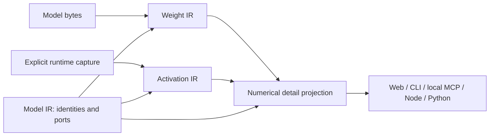

# Weight and activation detail

Version 2.2.0 adds numerical detail, reference-capture comparison and
Node/Python numerical API entry points. These additions require a 2.2.0 or later
package; they are not included in the earlier 2.1.0 SDK.

Weight IR describes decoded stored values. Activation IR describes explicitly
imported runtime observations. Both bind to the same Model IR references and
artifact identity. Optional detail is a derived output,
`deepbom.numerical_details.v1`; it does not introduce another Evidence IR layer
or change the existing Weight IR and Activation IR v1 contracts.



## Available analysis

| Evidence | Analysis | Boundary |
| --- | --- | --- |
| Weight IR and Activation IR | Finite/non-finite fractions, exact signs and zero counts, constant finite value, all-zero state | Signs require the complete finite histogram. Unsafe large integers retain exact zeros and integer extrema but have no floating histogram. Empty populations return null fractions. |
| Both | P1, P5, P25, P50, P75, P95 and P99 nearest-rank bounds | Based on existing fixed bins, not interpolated or sampled percentiles. Each interval preserves its open/closed upper boundary. An exact value is emitted only when resolved. |
| Weight analysis, already available | Channels, kernel slices, signed cosine similarity, singular spectrum, numerical rank, sparsity and 2:4 checks, affine quantization, original/candidate comparison | Decoder, layout, explicit axes and calculation budgets determine coverage. No inferred pruning benefit or task accuracy. |
| Activation detail | Inputs, captured intermediates/outputs, missing requests, unrequested values and unmapped captures | Missing and unrequested values have null statistics, not fabricated zero tensors. |
| Activation detail | Operation input/output port coverage, with links to the tensor inventory | Uses serialized Model IR connections; does not infer runtime scheduling, actual delegate placement or causal importance. |
| Reference capture comparison | Finite histogram total variation, mean/RMS/population-standard-deviation changes | Same Model IR only, aligned by exact `value_ref`. Different dtype/shape or uncaptured values are explicitly not assessed. This is not paired element error. |
| Reference capture context | Equality of recorded inputs, runtime, collector, configuration, instrumented artifact, probe description and entry region | Matching recorded identity is not independent attestation. Different inputs/settings are visible; the difference cannot be attributed to training or optimization alone. |

Histogram total variation uses exact integer counts before a single floating
rounding:

`TV = sum(abs(a_i * B - b_i * A)) / (2 * A * B)`

`A` and `B` are the respective finite totals. Each result preserves its exact
numerator and denominator. TV ranges from 0 to 1. Values in the same bin can
still differ when TV is zero. Non-finite values remain in their own ledgers;
they are not silently mixed into the finite distribution. Integer activations
are recorded runtime codes, with no implicit scale/zero-point dequantization.

## Browser workflow

1. Select and audit a model; open **Weight** and choose **Analyze weights**.
2. Select a tensor. **Distribution detail** shows signs, finite coverage and
   percentile bounds. Existing tabs provide channel, spectrum, sparsity and
   other advanced weight views.
3. Choose **Import activation capture**. Open **Activation flow** to see which
   ports have captured values and which do not. Select a port to inspect its
   value; the inventory also includes captured inputs and explicit gaps.
4. Choose **Compare reference capture** to compare a previous observation of
   the same model. The selected value shows context differences, numerical
   changes and the reference distribution. **Clear reference capture** removes
   the comparison while retaining current evidence.
5. **Save evidence JSON** includes both source IRs, the reference IR when
   supplied and the complete numerical detail. SVG/PNG export continues to
   export the selected chart; it is not an export of the entire dashboard.

Imports do not execute the model. Existing limits apply: activation JSON is
at most 16 MiB and 1,000,000 values, including captured inputs. Every import
validates source hashes, run context, tensor contracts and coverage before
replacing the displayed evidence. A rejected import retains the previous
valid result. Replacing the model clears its activation and reference evidence.

## CLI and executable capture example

Weight-only inspection:

```bash
node bin/deepbom.mjs audit model.onnx --weight-analysis --json \
  --section model_ir,weight_ir,weight_analysis,numerical_details \
  -o weight-evidence.json
```

The following example uses the repository's existing **local execution**
collector and an ONNX sample. The Python environment must contain NumPy, ONNX
and ONNX Runtime. Use a fresh output directory; the collector refuses to
overwrite captures. Synthetic zeros/ones are diagnostic probes, not task data.

```bash
mkdir -p .local-validation/numerical-example
node bin/deepbom.mjs audit web/samples/sample_cnn_float.onnx \
  --section model_ir --json -o .local-validation/numerical-example/model-ir.json

python scripts/capture-activation-evidence.py web/samples/sample_cnn_float.onnx \
  --model-ir .local-validation/numerical-example/model-ir.json \
  --allow-execution --probe zeros \
  --output .local-validation/numerical-example/zeros.json

python scripts/capture-activation-evidence.py web/samples/sample_cnn_float.onnx \
  --model-ir .local-validation/numerical-example/model-ir.json \
  --allow-execution --probe ones \
  --output .local-validation/numerical-example/ones.json

node bin/deepbom.mjs audit web/samples/sample_cnn_float.onnx --weight-analysis \
  --activation-evidence .local-validation/numerical-example/ones.json \
  --activation-baseline .local-validation/numerical-example/zeros.json --json \
  --section model_ir,weight_ir,activation_ir,activation_baseline_ir,numerical_details \
  -o .local-validation/numerical-example/comparison.json
```

The resulting `same_inputs` and `same_probe` are false. Distribution differences
describe responses to different probes; they do not demonstrate improvement.
Use `--inputs-npz` instead of `--probe` for explicitly supplied real inputs.
The existing collector supports the primary ONNX graph and TFLite subgraph;
it does not claim to collect live PyTorch/Keras training activations.

## In application code

Both APIs invoke the same packaged engine. They perform no independent
statistics, graph matching or framework execution. Call after an explicit
export/capture, not on every batch in a latency-sensitive training loop.

```ts
import { numericalEvidence } from "deepbom";

const result = await numericalEvidence("model.onnx", {
  weights: true,
  activationCapture: "current.capture.json",
  activationBaseline: "reference.capture.json",
});
const detail = result.sections.numerical_details;
```

```python
from deepbom import numerical_evidence

result = numerical_evidence(
    "model.onnx", weights=True,
    activation_capture="current.capture.json",
    activation_baseline="reference.capture.json",
)
detail = result["sections"]["numerical_details"]
# An MLflow integration can record this JSON as a run artifact.
```

Weight-only calls require `weights=True`/`weights: true`. Original/candidate
weight comparison accepts `weight_baseline`/`weightBaseline`; optional analysis
and alignment JSON files use `weight_options`/`weightOptions` and
`weight_mapping`/`weightMapping`. A reference activation requires a current
capture. Unsupported options and incompatible sidecars fail explicitly.

Local MCP `deepbom_audit` accepts `weight_analysis`, `activation_evidence`,
`activation_baseline` and `section: "numerical_details"`. Sidecars must be
under the configured allowed roots. This addition does not update the hosted
ChatGPT plugin's reviewed tool schema.

## Training and optimization loop boundaries

The optimization proposal concerns the model's structure and state. The user
restores the selected structure, weights and required buffers, then creates a
new optimizer for training or fine-tuning. Training-schedule optimization,
optimizer-state migration and deterministic training replay are outside this
contract. Observation collectors serve recording and analysis; neither complete
checkpoint capture nor replayability is required to retain a bounded observation.

Keep structure proposals, accepted candidates, training runs and evaluations
as separate records. A proposed structure can be revised or discarded before
training. During development, export a checkpoint artifact, inspect its weights,
and import explicitly captured activations for that exact artifact.

The [training lifecycle design](evidence-ir/TRAINING_LIFECYCLE.md) defines the
proposed **Training IR** as a snapshot of the observed lifecycle, timeline and
training-specific evidence, with time-bound references to model states. It remains
Training IR after completion. The optional **Training Result Manifest** references
a selected state and its supporting evidence. Neither
contract is implemented by this numerical feature. There is no separate Trained
IR: Weight IR can describe initialized or previously trained values, while
training origin requires its own evidence. A completed run does not establish
quality, and a failed run can still have a separately identified checkpoint.
Weight and activation calculations retain their existing IR owners; Training IR
links those observations to the lifecycle and time coordinates. The same evidence
can be consumed by the proposed DeepBoard viewer or projected through optional
MLflow/TensorBoard/W&B adapters. See the [consumer mapping design](evidence-ir/TRAINING_LIFECYCLE.md#85-하나의-근거-선택-가능한-표시저장-대상)
for artifact storage versus native summary charts and current implementation limits.

New weights change the artifact hash. Consequently activation captures from
different checkpoints cannot enter this same-model comparator. Use the
existing aligned weight comparison across artifacts and inspect each
checkpoint's activation evidence separately. Cross-model activation alignment,
live framework hooks, gradient/optimizer-state evidence and training-curve
collection remain separate work; this feature does not imply their availability.

An in-memory training observation must not borrow an older checkpoint's hash.
Model state includes relevant buffers as well as parameters; optimizer state is
a separate role. A future collector must establish a consistent snapshot and
validate native-to-Model-IR references. Module names and the training step number
alone do not establish this binding. Different serialization bytes can also change
the artifact hash without changing numerical weights; digest inequality is not
itself a measured weight difference.

The proposed Training IR can retain observations without a saved artifact, but
the current Weight/Activation IR source fields still require an exact Model IR
and artifact identity. Reusing the numerical engine for a captured training
tensor does not by itself produce a valid Weight/Activation IR. Artifact-less
runs also cannot enter the current Provenance IR builder. See the
[binding conditions](evidence-ir/TRAINING_LIFECYCLE.md#63-기존-ir로-연결할-수-있는-조건).

These are current schema constraints. A future [Model State Snapshot source](evidence-ir/TRAINING_LIFECYCLE.md#64-파일보다-상위의-모델-상태-스냅샷)
can identify a consistent immutable in-memory state independently of disk storage.
Adding that source requires explicit schema and validator changes; a snapshot
digest must not be substituted for an artifact byte digest.

## Contracts and verification

- [Numerical detail JSON Schema](schemas/deepbom-numerical-details-v1.schema.json)
- [Unchanged source IR contracts](schemas/deepbom-numerical-ir-v1.schema.json)
- [Versioned input/IR/output crosswalk](evidence-ir/compatibility/README.md)
- Semantic validation: `validateNumericalDetails` rebuilds the projection from
  bound source IRs and compares the canonical document, including its digest.
  JSON Schema validation alone cannot establish source truth.

The numerical regression suite compares percentile intervals with independently
sorted raw arrays, checks normalized TV and extreme values, exercises missing
and unmapped captures, rejects tampering, and checks CLI/Node/Python agreement.
Browser tests cover selection, capture gaps, reference imports, stale evidence,
theme and mobile rendering. Local MCP tests exercise the transport and allowed
root boundary. Core statistics retain their existing exact-rational oracle
tests and format-specific decoder checks.
