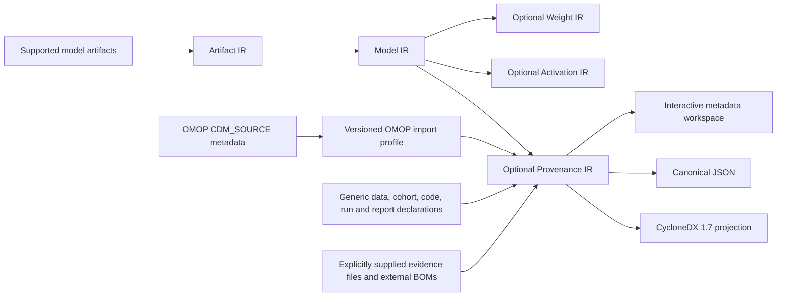

# Provenance IR — metadata, lineage and external references

Status: unreleased contract transition. This is a versioned DEEPBOM interchange contract, not a new OMOP table, an OHDSI-endorsed extension, or a change to CycloneDX/SPDX.

## Naming and compatibility

Provenance IR is part of [DEEPBOM Evidence IR](evidence-ir/README.md). The only current schema is `deepbom.provenance_ir.v1`; the digest field and full-analysis section are `provenance_ir_sha256` and `provenance_ir`. Generic input uses `deepbom.provenance_input.v1`; bounded host output uses `deepbom.provenance_summary.v1`. CycloneDX properties use `deepbom:provenance:*`. There is one implementation and no compatibility aliases. This layer describes provenance and contextual references; it does not attest relationship truth. [Migration instructions](evidence-ir/MIGRATION.md) explain the deliberate break from previously published documents.

## Layering



Connections attach to a validated Model IR and its artifact/artifact-set identity. They do not change graph, weight, activation or model-summary calculations. All supported model adapters that produce Model IR can use the same connection layer; no format-specific OMOP parser exists. The common source-binding helper is also used by numerical evidence. Model IR and optional evidence have separate digests.

## Identity and evidence rules

1. The input requires the full artifact SHA-256 and an explicit artifact-set SHA-256 (or `null` when the source has none). Both must match the active Model IR. An optional Model IR digest, when present, must match too. A renamed file, different acquisition/closure, or different analysis projection can change a source digest; regenerate and review a template instead of silently rebinding it.
2. Canonical JSON is RFC 8785 JCS, UTF-8, SHA-256, excluding only `/provenance_ir_sha256` from that document's digest. The input document has its own canonical digest. Raw supporting files are hashed as bytes, not as reserialized JSON. Source object key order does not alter the digest; declared array order is retained as evidence.
3. `artifact:primary` is the observed model; imported records and relationships are `DECLARED_UNVERIFIED`. A matching digest identifies supplied bytes. It does not prove that a dataset trained a model, a run occurred, or a publisher is authentic. A hash of a manifest is not the hash of a database.
4. The semantic validator rebuilds every derived node, relationship, check, count and verdict from the bound model, original input and supplied observation records. Rehashing falsified counts does not make the IR valid. Imported observation records still require independent provenance if used outside the local file-reading session; this validator does not attest their origin.
5. Schema validity, identity, reference resolution, file consistency, attribute reconciliation and authenticity are separate. No signature verification or network retrieval is implied. A supported profile means field mapping is available, not that CDM conformance or data quality has been established.
6. Unknown root/node fields are rejected to catch typos. Unknown CDM_SOURCE columns and generic `attributes` remain visible in a field ledger. Supported shapes with unimplemented meaning produce `unsupported`, not a verified fact. Unresolved relationship endpoints remain in the IR and counts.
7. `check_count` is the sum of all five check statuses. `field_count` is the sum of mapped declarations and unmapped fields. The field denominator covers CDM_SOURCE columns, generic node attributes, and properties of a selected external BOM component; it is not a count of every JSON property in every document. There is no overall verification percentage. `attested_relationship_count` is always zero in v1.

Verdicts are `contradiction_observed`, `incomplete`, or `no_contradiction_observed`, in that priority order. A small metadata document can have no observed contradiction while containing little evidence. None of these states is a blanket PASS for lineage or clinical suitability.

## OMOP boundary and mapping

The adapter supports the published [OMOP CDM 5.4 CDM_SOURCE](https://ohdsi.github.io/CommonDataModel/cdm54.html#cdm_source) and [5.5 CDM_SOURCE](https://ohdsi.github.io/CommonDataModel/cdm55.html#cdm_source) field sets, checked on 2026-09-28. It accepts one JSON row or a one-row array. A table may contain multiple rows; selection is the operator's responsibility. The adapter rejects an ambiguous multirow import.

| Source | Representation and limit |
| --- | --- |
| `cdm_source_name`, abbreviation, holder, description | Retained source values on the `omop:release` node; declarations, not publisher authentication |
| `source_release_date` | Source extraction date; not inferred to be a model training date |
| `cdm_release_date` | ETL completion date; not automatically equated with source extraction |
| `cdm_version`, `cdm_version_concept_id`, `vocabulary_version` | Distinct version declarations. The vocabulary is not downloaded to verify the concept identifier |
| `cdm_etl_reference`, `source_documentation_reference` | Original references retained; never automatically fetched or treated as immutable code identifiers |
| 5.5 `cdm_release_identifier` | Must agree with the declared `release_id` when supplied; 5.4 does not acquire this native field retroactively |
| `instance_id`, `release_id` | Explicit DEEPBOM profile context supplied by the operator, not new standard OMOP columns |
| Cohort and feature definitions, ETL code, quality reports | Separate typed nodes and explicit relationships; optional supplied files and expected hashes |

Column case is normalized for mapping and collisions are rejected. Original input and source pointers remain available. Supported text lengths/types, exact integer representation and real ISO calendar dates are checked. Missing required CDM_SOURCE values produce `not_assessed`; this import does not inspect database constraints, patient rows, vocabulary membership, ETL correctness or DataQualityDashboard results. Unknown CDM versions are retained as unsupported profiles, not treated as 5.4/5.5. Large integer identifiers must use canonical decimal strings rather than rounded JSON numbers.

The only automatically added relationship is `artifact:primary associated_with omop:release`. Training, evaluation and calibration relationships require an explicit declaration. No device join key or patient exposure linkage is created.

## Generic connections

Node kinds: `model_artifact`, `dataset`, `data_release`, `manifest`, `cohort_definition`, `feature_contract`, `software`, `environment`, `run`, `evaluation_report`, `quality_report`, `protocol`, `bom`, `document`.

Roles: `associated_with`, `uses_training_data`, `uses_evaluation_data`, `uses_calibration_data`, `derived_from`, `generated_by`, `uses_code`, `uses_environment`, `defined_by`, `uses_features`, `evaluated_by`, `has_quality_report`, `references_bom`, `documented_by`. Role/target compatibility and `derived_from` cycles are checked. Supporting evidence references must resolve to suitable records; their existence does not attest the relationship.

For example, a model can be `generated_by` a run, that run can `uses_training_data` an OMOP release and `uses_code` an immutable script, and the release can be `defined_by` a cohort definition and `has_quality_report` an externally generated report. MLflow run IDs, evaluation records and Olive configurations can be represented as declarations/files without importing a second experiment-tracking engine. This layer neither logs to MLflow nor executes Olive.

## BOM interoperability

CycloneDX 1.7 export projects data releases to data components and appropriate training/evaluation references to `modelCard.modelParameters.datasets`. Runs use formulation workflows with the supported `taskTypes: ["other"]`; explicit roles remain in properties. Calibration roles are preserved without relabeling them as evaluation data. All original relationship/check/field ledgers remain in `deepbom:provenance:*` properties. These are DEEPBOM properties, not official OMOP or CycloneDX vocabulary. The resulting document gets a new deterministic serial number; its model hash remains unchanged. Export is validated against the repository-pinned official [CycloneDX 1.7 schema](https://github.com/CycloneDX/specification/blob/1.7/schema/bom-1.7.schema.json).

An external BOM reference carries format, specification version, document identifier, document revision and element reference. The CycloneDX 1.7 resolver checks these separately; a model reference also checks the selected component's type and SHA-256. It inventories that component's properties as unsupported attribute comparisons. Use the existing `deepbom verify --bom` for supported BOM-to-artifact attribute reconciliation; resolving a reference must never certify fabricated quantization claims.

Other BOM formats can be retained as explicit references but are not silently validated. Existing SPDX 2.3 file/artifact export remains unchanged. An SPDX 3 AI/dataset/relationship adapter is not implemented in this release. OMOP clinical semantics remain in OMOP. FAIR identifiers, provenance and accessibility descriptions can be linked, but FAIR conformance is not assessed.

## Use and transport

Web: analyze a model → Analysis palette → Provenance → OMOP template → enter instance/release identifiers → import one CDM_SOURCE JSON row → add connected records or edit JSON → choose supporting files → Check connections. Click records in the list or graph; download Provenance IR or linked CycloneDX. A generic template uses the same graph without OMOP fields.

CLI:

```sh
deepbom audit model.onnx --metadata-template omop -o metadata.json
# Fill identifiers, cdm_source, nodes and relationships in metadata.json.
deepbom audit model.onnx --metadata metadata.json --evidence-files ./evidence \
  --output-format json --section provenance_ir -o links.json
deepbom audit model.onnx --metadata metadata.json --evidence-files ./evidence \
  --output-format cyclonedx -o model-linked.cdx.json
```

Metadata commands use exit 1 for invalid input/parsing, 2 for observed contradictions, 3 for incomplete checks, and 0 for no observed contradiction. Existing policy gates can also return 2. Source hash mismatch behavior of the existing `--expected-sha256` option remains unchanged. Templates are intentionally unfinished input, not fake successful evidence.

Local MCP uses `deepbom_audit` with `metadata_template`, or `metadata` plus optional `evidence_files`; use `section: "provenance_ir"` for a bounded selection. Both paths respect allowed roots. ChatGPT and Claude widgets use the same browser module; their explicit report control sends only the closed-schema summary (digests and counts). Raw metadata and supporting files stay local unless the user explicitly exports/shares a generated file through the host. Institution identifiers can still be sensitive: review generated exports before sharing them.

No external URI is fetched. Files are restricted to explicitly mapped relative paths within the selected directory; traversal and escaping symlinks are rejected. Limits: 2 MiB metadata/BOM JSON, 32 MiB per supporting file, 64 MiB total, 256 input nodes, 1024 input relationships, 4096 total evidence references, 128 attributes per input node. Exceeding a bound fails visibly, without reporting a partial result as complete. UI graph neighborhoods show at most 25 records with a visible denominator; all records and checks remain in the IR.

## Maintenance and verification

The [JSON Schema](schemas/deepbom-provenance-ir-v1.schema.json) is generated from common enum/limit contracts. Runtime semantic validation is stricter than shape validation. Changes to meaning or canonicalization require a method/schema version review; adapters do not alter core Model IR schemas. Keep new standard mappings in adapters, unsupported values in the ledger, and host payloads closed to additional properties.

Regression checks cover tampered/rehashed counts, exact identities, OMOP versions and invalid inputs, dangling/cyclic links, imported BOM revisions/hashes/unmapped properties, directory isolation, official CycloneDX validity, CLI/MCP transport, browser/file parity, stale UI state, keyboard navigation, themes, mobile layout and no implicit remote fetches. Existing numerical IR tests guard the shared source helper.
