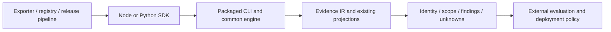

# DEEPBOM SDK contract

Introduced in DEEPBOM **2.1.0**. Install the Node SDK with `npm install deepbom@2.2.0`.
The Python SDK uses the corresponding platform wheel; platform availability
is determined by the published release assets, not by this API description.
See the [installation and integration walkthrough](../examples/integrations/README.md)
for local builds and executable examples. Earlier 2.0.0 packages do not include
this SDK entry point or Python `inspect`.

## Boundary and maintenance

The Node and Python SDKs invoke the same packaged CLI engine. The CLI routes
format readers through the common Evidence IR and existing output builders.
The SDKs validate invocation arguments, bound result reads, parse JSON and
translate errors; they do not count findings, infer shapes, compute MACs,
compare weights, or implement format parsers.

This is a process-based local API, suitable after export, during registration
and before release. Each call starts an engine process; it is not intended for
the per-inference request path. Model code is not executed. The Node SDK does
not download an engine or invoke `npx`; the Python wheel verifies its bundled
native engine and WASM manifest. Neither requires an analysis server.

## Supported surface

| Node / TypeScript | Python | Result |
| --- | --- | --- |
| `inspect(path, options?)` | `inspect(path, **options)` | Existing `deepbom.review_summary.v1`, unwrapped without recalculation |
| `audit(path, options?)` | `audit(path, **options)` | Canonical `deepbom.artifact_evidence_envelope.v1` by default |
| `capabilities(options?)` | `capabilities(**options)` | Installed engine's `deepbom.cli_capabilities.v1` |
| `diff(a, b, options?)` | `diff(a, b, **options)` | Native semantic diff, or explicit tensor projection |
| `captureContract(path)` | `capture_contract(path)` | Artifact-derived interface declaration, bound to that artifact |
| `verifyContract(path, contract)` | `verify_contract(path, contract)` | Native external-interface verification |
| `verifyBom(path, bom, options?)` | `verify_bom(path, bom, **options)` | Bounded BOM reconciliation, not universal standards conformance |
| `numericalEvidence(path, options)` | `numerical_evidence(path, **options)` | Explicit Weight/Activation IR, numerical detail and reference comparison; added in 2.2.0 |

Node supports Node.js >=20, ESM imports and CommonJS dynamic `import()`. The
package root is the supported entry point; internal file imports are private.
TypeScript declarations resolve through `exports.types`. There is no browser
SDK or in-process native API in this contract. Python supports >=3.9 with
platform-specific wheels and a `py.typed` marker. Python returns dictionaries
with the native versioned JSON keys, not custom model classes.

Python's existing `model_ir`, `tensor_inventory`, `tensors` and
`visualization_manifest` remain available. Model IR is a preview projection;
`tensor_inventory`/`tensors` are the existing GGUF inventory path, not a claim
of format-independent weight decoding. `tensors` preserves exact integral and
decimal values as `int` and `Decimal`. Node consumers can explicitly request
native analysis sections with `audit`.

The stable SDK subset accepts local files and supported local package
directories. Format support and scan coverage remain engine-specific; call
`capabilities()` on the installed engine. In particular, `structure` and
`integrity` are bounded GGUF/SafeTensors paths, not valid ONNX scan modes. Use
`auto`, or `full` when explicitly inspecting complete supported payloads.
Unsupported combinations fail instead of silently changing scan depth.
Legacy Python remote-source forwarding remains available but is outside this
stable local subset; remote retrieval and advanced sidecars use the CLI.

Version 2.2.0 adds an explicit numerical API for weights, analysis
budgets, alignment sidecars and activation imports; see the
[numerical evidence guide](NUMERICAL_EVIDENCE_GUIDE.md). It shares the CLI engine
and requires a 2.2.0 or later package. Advanced target profiles, other runtime
imports, custom policy files and image/bundle exports remain CLI/MCP/Web
workflows. An SDK method's existence does not imply all CLI options are exposed.
There is intentionally no arbitrary `extraArgs` escape hatch.

## Options

| Meaning | Node | Python |
| --- | --- | --- |
| Scan depth | `scan` | `scan` |
| Independently expected SHA-256 | `expectedSha256` | `expected_sha256` |
| Defects-only gate | `gate: "defects"` | `gate="defects"` |
| Built-in policy | `policy: "engineering" / "regulatory"` | `policy="engineering" / "regulatory"` |
| Time limit | `timeoutMs` (default 300000) | `timeout_seconds` (default 300) |
| JSON read limit | `maxOutputBytes` (default 64 MiB) | `max_output_bytes` (default 64 MiB) |
| Audit projection | `output`, `sections` | `output`, `sections` |
| Tensor-only diff | `tensorsOnly` | `tensors_only` |
| BOM subject selection | `componentRef` | `component_ref` |

`gate` and `policy` are mutually exclusive. `inspect` fixes its output to the
review summary. `audit` supports `envelope`, `analysis`, `cyclonedx` and `sarif`;
supplying sections selects analysis unless explicitly contradicted. Unknown
options fail. Limits bound execution time and SDK JSON allocation, not total
engine memory or temporary disk usage. Local paths are resolved before
invocation, including names starting with `-`; a shell is never used.

## Consumer-facing evidence

| Question | Review summary field | Full envelope detail |
| --- | --- | --- |
| Which bytes were inspected? | `artifact.sha256`, `byte_length`, `format`, `artifact_ir_sha256` | `identity`, `artifact_set` for multi-file closure |
| What was checked? | `coverage`, `applicability` | Named `capabilities.assessed`, `partial`, `unavailable` |
| Was a static defect observed? | `verdict.artifact_defect_count`, `findings.artifact_defects` | Findings with `finding_kind: artifact_defect` |
| What needs investigation? | `findings.cautions` | Source pointers and finding evidence |
| What remains unknown? | `findings.evidence_needed`, partial/unavailable coverage, nullable metrics | Evidence gaps and format-specific boundaries |
| How can the artifact be checked again? | `reproduction.argv`, `expected_sha256`, `package_version` | Analyzer provenance and envelope digest |

Consumers must check `schema`, retain unknown/additional fields, and keep null,
zero, not-assessed and not-applicable distinct. Decimal strings and dual
decimal/number representations remain as emitted by the engine; do not coerce
them to JavaScript numbers. The SDK does not reinterpret these values.

`coverage.unavailable` counts unavailable or unselected capabilities, not
evidence-gap findings. `coverage.needs_external_evidence` remains a deprecated
alias for v1 consumers; use `verdict.evidence_needed_count` for finding counts.
A symbolic or incomplete MAC assessment is partial coverage, even when an
assessment object exists. Unknown MAC totals remain null.

Semantic diffs separate connectivity, serialized operator attributes, external
interface contracts and storage payload coverage. `payload_comparison` counts
only paired payload digests as comparable: unchanged storage metadata does not
prove equal weights. Missing digests remain unassessed. Scale ratios require
complete, finite, positive inline scales and representable ratios; otherwise
the ratio is null. Change reasons are static review triggers, not acceptance.

The summary's reproduction command is a basic hash-bound reinspection command.
It does not record every scan option, sidecar or environmental dependency.
For a complete replay, record SDK arguments, engine version, file/package
digests and sidecar identities alongside the native result. For multi-file
artifacts, a root-file hash alone is not package identity: retain the full
envelope's artifact-set ledger. Treat model files and sidecars as immutable
throughout a multi-call workflow and recheck identities between results.

An exit-0 audit means the requested operation completed. Absence of an
observed defect does not imply complete coverage, output equivalence,
clinical safety, or deployment acceptance. Similarly a diff identifies static
changes, not accuracy or latency improvements. A captured interface contract
is hash-bound to its original artifact: do not delete that binding merely to
make a changed candidate pass. Use `diff` to compare candidates, and have the
application explicitly govern any new interface declaration.

## Errors

Both languages use these error classes and stable `code` strings. Invalid
SDK arguments use native `TypeError` (Node) and `ValueError`/`TypeError` (Python).

| Class | `code` | CLI exit |
| --- | --- | --- |
| `DeepBomInvocationError` | `INVOCATION_FAILED` | Usually 1; also engine/start/read/JSON failure |
| `DeepBomPolicyBlocked` | `POLICY_BLOCKED` | 2, including verification contradictions |
| `DeepBomIncompleteBinding` | `INCOMPLETE_BINDING` | 3 |
| `DeepBomIdentityMismatch` | `IDENTITY_MISMATCH` | 4 for an expected artifact digest mismatch |
| `DeepBomTimeout` | `TIMEOUT` | No completed exit |
| `DeepBomOutputTooLarge` | `OUTPUT_TOO_LARGE` | Result could not be read within the requested bound |

All derive from `DeepBomError`. Node exposes `exitCode`, Python `exit_code`;
both expose `document`, containing any completed JSON result. `inspect` policy
errors contain the same review-summary shape as a successful inspection.
Messages are diagnostic, not a machine-parseable contract. A BOM subject that
cannot be bound can produce exit 3; do not relabel all binding errors as exit 4.
Both SDKs reject invalid UTF-8 and non-finite JSON numbers. Diagnostic messages
retain at most the last 16 KiB; Python spools diagnostics to temporary storage
instead of retaining an unbounded subprocess output in memory.

## Version policy and checks

The API follows the package's semantic versioning from its first published
SDK release: removing/renaming supported methods/options, changing default
return shapes or error-code meaning requires a major version; compatible
methods/options are minor additions. New optional JSON fields are additive.
Engine rule corrections can change evidence without changing an IR schema,
so pin the engine version as well as checking the schema. Existing Evidence
IR family/schema versions remain independently governed; no new SDK IR is
introduced. Native preview projections retain their documented preview status.

`npm run check:sdk` compares results with the actual CLI, checks imports and
TypeScript declarations, identity failures, missing input, defect gates,
unknown values, BOM/interface checks and process bounds.
`npm run check:python-api` checks Python invocation and error contracts.
The [integration runner](../examples/integrations/README.md) installs generated
tarball/wheel artifacts into isolated consumers and checks Python/Node parity
and all three examples. These tests do not claim exhaustive correctness of
every engine calculation or prove execution on untested operating systems.

Reference interfaces: [Node package entry points](https://nodejs.org/api/packages.html#package-entry-points)
and [MLflow's artifact logging API](https://mlflow.org/docs/latest/api_reference/python_api/mlflow.html#mlflow.log_dict).
