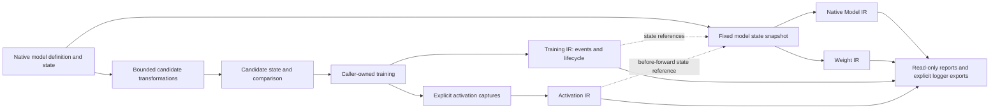

# Native model and training evidence: implementation validation

Date: 2026-10-07. Status: **implemented experimental local extension; not deployed**.
This record describes executed checks, not certification or a guarantee that every
model, framework version or device is supported. The existing release identifier
has not been advanced or published by this development task.

## Implemented path

The application supplies a trusted PyTorch/Keras model or local factory. Keras
files and PyTorch weights-only state dictionaries have explicit loading paths;
PyTorch state dictionaries require a matching definition. The optimizer produces
an independent candidate, a comparison and an immutable selected-state package.
The application chooses a candidate and creates its own training optimizer.



The snapshot identifies named state and the adapter's declared definition scope.
It is not a fabricated model-file hash. Native Model IR describes module
containment; this implementation does not claim a complete executed call graph.
Training IR records lifecycle, observation sequence, caller coordinates, metrics,
update observations and references. There is no separate Trained IR. A Training
Result Manifest selects an already recorded state without claiming training
completion, task quality or checkpoint-resume reproducibility.

Conv–BN folding and dense Conv2D to inverted-block conversion are implemented for
explicitly checked patterns in both frameworks. The latter initializes changed
weights and requires training and task evaluation. Folding is an inference-mode
transformation; train-mode BatchNorm equivalence is not claimed. Unsupported,
shared or frozen patterns are rejected rather than silently rewritten.

The output includes a RAM model, verified state package, loader `.py`, Markdown
code and an interactive HTML structure/state comparison. Refinement starts from
the fixed baseline. Later mutations of the RAM model do not change the selected
package. A generated loader needs the adjacent package and its declared framework
or factory; it is not dependency-free model source.

## Executed qualification

Environment: Linux x86-64, Python 3.12, Node 24.12.0, PyTorch 2.8.0+cpu,
TensorFlow 2.20.0, Keras 3.11.3, NumPy 2.2.6, rfc8785 0.1.4,
MLflow 3.17.0, TensorBoard 2.20.0 and W&B 0.30.0.

| Check | Observed result |
| --- | --- |
| PyTorch candidates | Folding output comparison, inverted replacement, baseline independence, frozen export after RAM mutation, dtype and source binding passed |
| Keras candidates | Folding, inverted replacement, nested layer identities and package restoration passed |
| PyTorch observations | Actual training loops, exact final parameters/buffers and RNG comparison with/without recording, chunk continuity and explicit activations passed |
| TensorFlow observations | Actual eager GradientTape and Keras `fit`; exact training-state comparison with/without recording passed |
| Logger connections | Local SQLite MLflow evidence export/import, actual TensorBoard event round trip and W&B **offline** artifact export passed |
| Sparse/missing gradients | Missing values remain missing; PyTorch sparse stored values/indices and TensorFlow IndexedSlices retain explicit scope; passed |
| Input/export boundaries | Factory plus weights-only input, fresh-process generated loader, aliases, non-finite probe rejection, tampering rejection, result selection and one-writer enforcement passed |
| Serialized schemas | 133 generated documents passed: 20 snapshots, 20 Model IRs, 23 Weight IRs, 3 Activation IRs, 19 Training IRs, 31 chunks, 8 candidate manifests, 8 comparisons and 1 selected-result manifest; native/training input schemas also passed |
| Installed package | The seven framework/integration groups passed with the installed Linux wheel and its verified bundled engine, with source-engine overrides removed; the serialized-schema group also passed |
| DeepBoard | Timeline/state binding, six numerical views, SVG/PNG downloads, dark theme and 390-pixel layout passed in Chromium |
| Candidate report | Expandable before/after structures, clipboard copy, exact `.py`/Markdown downloads and 390-pixel layout passed |

The common numerical engine was checked for exact tensor counts, supported scalar
decoding, source and subject binding, distributions, matrix features, truncation
and explicit budget exhaustion. A one-million-element float32 tensor was included
in transport validation. Existing advanced Weight tests retain independent NumPy
SVD checks, format-specific decoding and pruning checks. Existing numerical-detail
tests include 186 percentile oracle cases, signs, total variation, run binding,
activation flow and CLI/Node/Python agreement.

These are correctness checks, not measurements of collection overhead, clinical
performance, accuracy or deployment speed. Full state capture copies data to the
host and should be explicitly budgeted by the caller.

## Backward compatibility

The comparison baseline was tracked commit
`b161cd4c383e1133e97200a04c8459935f4c7d97`. Its JavaScript, Python and schema files
were isolated; installed dependencies, unchanged WASM and generated build metadata
were shared. This is a source regression comparison, not an independent download
and reconstruction of every historical binary.

- **19 CLI cases** had identical exit codes, stdout and stderr: ONNX, TFLite, GGUF
  and SafeTensors summary/envelope/compact output, plus CycloneDX, SARIF, existing
  numerical sections, self-diff, contract capture and failure paths.
- **10 existing schemas** and **3 existing compatibility archives** remained
  byte-identical to that baseline.
- Existing Python public signatures were unchanged; Node exports remained a
  superset. Numerical-detail entry points are additive.
- Existing SDK, Python API, local MCP, numerical/Weight, Evidence IR family and
  browser regression checks passed. These do not independently requalify the
  live ChatGPT host or every remote integration.
- Artifact-based family v1 remains strict. Native Model/Weight/Activation v2 and
  Training v1 are admitted through the additive family v2; old artifact-only
  consumers do not silently accept the new source contract.
- Compatibility catalog **0.9.0** records 48 endpoints and 57 mappings, with
  implementation hashes and preserved previous snapshots. Native mappings remain
  preview/experimental. Catalog versions are independent of engine releases.

## Defects corrected during qualification

1. JavaScript binary64 values parsed as large Python integers could change or
   invalidate canonical hashes. Engine replies now preserve binary64 semantics;
   exact counts remain decimal strings. Gradient observations use the same path.
2. A nested base64 validation expression could exhaust the JavaScript stack on a
   valid large tensor. Linear validation now checks characters, length and padding.
3. Keras folding needed explicit handling of removed BatchNorm call arguments;
   generated input names and nested identities also required stabilization.
4. PyTorch restoration needed exact dtype, trainability and alias preservation.
   Reloading now rechecks the resulting snapshot, including factory changes.
5. Validation probes could modify caller-owned input gradients. Probes now use
   independent values and reject non-finite observations.
6. Recording needed exclusive writer ownership, strict update-token pairing,
   terminal lifecycle enforcement and correct atomic object-write races.
7. Gradient statistics and sparse indices needed semantic validation in the
   common engine. Gradients are processed in one bounded batch rather than one
   engine process per tensor.
8. The candidate hash could overflow narrow reports. Wrapping and a browser
   regression now cover that layout alongside actual code/file handoffs.

## Scope that is not qualified

GPU execution, AMP skipped updates, compiled/distributed training, arbitrary
custom Python behavior and optimizer closures are not qualified by these CPU
tests. Custom hooks and unsupported reconstruction cases are rejected where
detected; external/global side effects remain outside snapshot scope. There is
no restored optimizer/RNG/dataloader state and no promise of resumable training.

W&B cloud delivery was not exercised; its offline artifact writer was. MLflow was
tested locally. Logger imports alone remain run-only evidence rather than being
attached to a guessed model state. Automatic internal activations/gradients for
Keras `fit` are not claimed: use explicit eager capture for those observations.

No measured optimization benefit follows from a smaller parameter count or
successful gradient smoke test. Delegation, real operator placement and latency
require separate runtime evidence. The remote static MCP does not execute these
trusted native Python workflows.

## Repeating the checks

See [the usage guide](../NATIVE_MODEL_TRAINING_GUIDE.md) for package preparation and
entry points. In a qualified development environment:

```sh
node scripts/check-native-evidence.mjs
python scripts/check-native-training.py
# The framework test prints its temporary result directory.
node scripts/check-training-board.mjs RESULT_DIR/board.html RESULT_DIR/torch-inverted
node scripts/check-weight-analysis.mjs
node scripts/check-numerical-details.mjs
node scripts/check-sdk.mjs
python scripts/check-python-api.py
node scripts/check-mcp-server.mjs
node scripts/check-evidence-ir-family.mjs
node scripts/check-evidence-compatibility.mjs
```

The native Python test defaults to the source package and needs an explicitly
SHA-256-bound development engine. To qualify a built wheel, set
`DEEPBOM_TEST_PACKAGE_ROOT` to its installed package directory and remove the
`DEEPBOM_ENGINE`/`DEEPBOM_ENGINE_SHA256` overrides. Tests use synthetic models;
local recordings and generated wheels are not public source assets.
