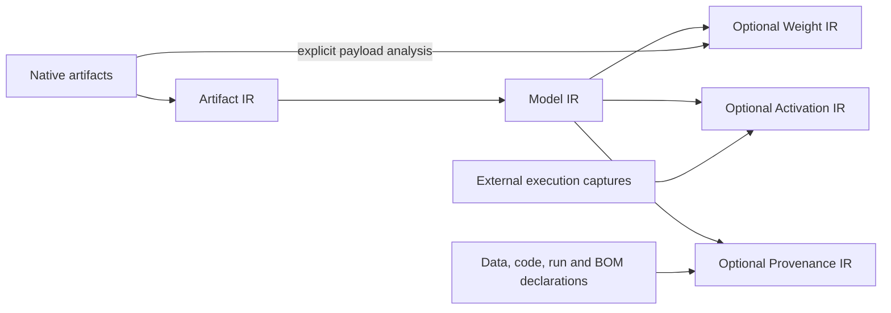

# DEEPBOM Evidence IR

[Compatibility explorer](https://deepbom.org/guides/evidence-ir/compatibility/) · [Generated mapping table and snapshots](compatibility/README.md) · [Compatibility baseline and maintenance](COMPATIBILITY.md)

**Status: draft DEEPBOM-maintained specification, implemented and released in DEEPBOM 2.0.0.**

The package release does not make this an externally approved standard. The family catalog is version 1.0.0; compatibility catalog versions are listed in the [version index](compatibility/index.json). These catalog versions are independent of the package version. A newer checkout snapshot does not establish a deployed release. See the [release record](RELEASE_2_0_0.md) and [migration rules](MIGRATION.md).

DEEPBOM Evidence IR is a family of interoperable intermediate representations for artifact, structural, numerical, runtime, and provenance evidence. It is maintained by the DEEPBOM project; no external standards-body approval or independent adoption is claimed.

## Members and shared rules

| Member | Question answered | Serialized identity |
| --- | --- | --- |
| Artifact IR | What structure, storage and native facts are present in these bytes? | `deepbom.artifact_ir.v2` |
| Model IR | How are those facts represented as a common model program and contracts? | `deepbom.model_ir.v1` |
| Weight IR | What numerical properties were measured from explicitly decoded payloads? | `deepbom.weight_ir.v1` |
| Activation IR | What values were captured for a particular input, run and environment? | `deepbom.activation_ir.v1` |
| Provenance IR | What data, code, runs, documents and external BOMs are declared to be related? | `deepbom.provenance_ir.v1` |



The arrows express source binding and input dependencies, not a requirement to execute every analysis. Model IR does not contain raw weights or reconstruct an execution. Optional evidence retains its own identity and does not modify the source Model IR.

The common core supplies identity, canonical hashing, exact integers, evidence classes, reference resolution and applicable calculation rules. A known scalar width does not imply native-format or decoder support. Unknown values must not become zero; declared, observed, derived and predicted evidence must remain distinct. Format adapters retain their native storage contracts and record unsupported meaning.

The machine-readable naming and identity owner is [`web/lib/evidence-ir.js`](../../web/lib/evidence-ir.js). The [catalog](catalog.json), [family JSON Schema](../schemas/deepbom-evidence-ir-v1.schema.json) and [Provenance IR schema entry point](../schemas/deepbom-provenance-ir-v1.schema.json) are generated from that owner. The family schema accepts **one member document**, not a new wrapper or aggregate bundle. Member schemas remain authoritative and are referenced rather than copied.

## Member specifications

- [Artifact IR schema](../schemas/deepbom-artifact-ir-v2.schema.json) and [common IR semantic review](../CORE_IR_REVIEW_2026-09-24.md).
- [Model IR](../MODEL_IR_V1.md).
- [Weight and activation schemas](../schemas/deepbom-numerical-ir-v1.schema.json).
- [Provenance IR, OMOP import and external BOM references](../PROVENANCE_IR.md).
- [Common calculation ownership and verification](../COMMON_CALCULATION_RULES_REVIEW_2026-09-29.md).
- [Conformance and compatibility](CONFORMANCE.md), [maintenance and publication](GOVERNANCE.md), [change log](CHANGELOG.md).

## Provenance contract

The artifact metadata path uses `deepbom.provenance_ir.v1`, the digest field `provenance_ir_sha256`, and the `provenance_ir` CLI/MCP section. `provenance-ir.js` owns the implementation directly. The generic input and bounded summary have their own identities: `deepbom.provenance_input.v1` and `deepbom.provenance_summary.v1`. No retired-name aliases are supported. See [the explicit transition rules](MIGRATION.md) before using older documents.

```sh
# Run from a DEEPBOM 2.0.0 source checkout.
node bin/deepbom.mjs audit model.onnx --metadata metadata.json \
  --section provenance_ir --output-format json
```

Generic associations, BOM references and documentation links are contextual relationships; they are not all derivation claims. Hash agreement establishes byte identity, not the truth of a training claim or the authenticity of a publisher.

## Training and immutable model-state evidence

The [training lifecycle design](TRAINING_LIFECYCLE.md) separates a training process
from the particular model states it produces. It proposes **Training IR** as an
immutable snapshot of the observed training lifecycle, temporal coordinates,
training-specific evidence and time-bound model-state references. It retains the
same IR type after a run ends; each changed snapshot has its own digest. An optional
**Training Result Manifest** references a selected
checkpoint, existing IRs and evaluation evidence. The manifest is a linking
document and is not required to use Training IR. There is no separate **Trained IR**;
Artifact, Model, Weight and Activation IR retain their existing responsibilities.

Model optimization returns a selected model structure and state for use with a
new user-owned optimizer. Training IR records observations, rather than requiring
training replay or a resumable checkpoint. The [consumer adapter design](TRAINING_LIFECYCLE.md#85-하나의-근거-선택-가능한-표시저장-대상)
keeps common evidence independent of the DeepBoard viewer and external
MLflow, TensorBoard or W&B presentations. Missing state binding remains explicit.

The additive experimental native family implements CPU-qualified PyTorch and
TensorFlow collectors, including eager GradientTape observations and Keras fit
callbacks. Native Model/Weight/Activation v2 bind to an immutable Model State
Snapshot; Training IR v1 references ordered observations and their available
state bindings. The artifact-bound v1 members keep their original contracts.
A snapshot digest must never be substituted for an artifact-file digest.

The additive **Snapshot IR** and typed Provenance v2 workflow is implemented in
[the shared evidence workflow](SNAPSHOT_WORKFLOW.md). It links existing native
state, dataset/configuration manifests and external evaluations without changing
older member digests. The additive family entry point is
`deepbom-evidence-ir-v3.schema.json`. See the implementation guide for exact
Web/CLI/SDK/local-MCP support and hosted continuation limits. These are
DEEPBOM-maintained contracts, not an externally approved standard.

Run completion, checkpoint selection, evaluation and release decisions remain
independent. A missing state binding stays explicit. The existing artifact Provenance v1/BOM route and the new typed Provenance v2
route have explicit contracts. Native Training records retain their ordered
chunk and source dependencies. New standard projections preserve the full source
document separately and report mapping loss. See the [qualified APIs](../NATIVE_MODEL_TRAINING_GUIDE.md).

Saved optimization reports share state-identity correspondence validation with
native bundle comparison. Distribution claims still require their original
numerical evidence for independent recomputation. Explorer weight views use
Model IR bindings and the common Weight IR/statistics/advanced-analysis owners;
legacy WASM histogram calls return an explicit retirement error.

The [2026-10-07 compatibility review](TRAINABLE_COMPATIBILITY_REVIEW_2026-10-07.md)
records tested current boundaries and the remaining native-framework acceptance
conditions, including immutable candidates, transformation modes and export projections.

## External standards boundary

- **W3C PROV:** entity/activity/agent concepts provide useful comparison points. Model/data records and runs have conceptual correspondences, but this release does not provide a complete PROV-DM mapping, PROV-O export or PROV conformance claim. [PROV-DM](https://www.w3.org/TR/prov-dm/)
- **CycloneDX and SPDX:** external BOMs are referenced by their own document and element identities. Implemented projections and validation limits are documented in the Provenance IR specification; the family name does not expand them.
- **OMOP:** clinical definitions and database semantics remain in OMOP. The import profile maps supplied metadata; it does not introduce an OMOP table or claim OHDSI endorsement.
- **TEA:** discovery and exchange belong outside the IR calculation layer. See the [pinned TEA review and proposed adapter boundary](TEA_REVIEW.md). No TEA client/server is implemented by this change.

Public source exports of these documents, schemas and examples use the repository's [Apache-2.0 distribution license](../../channels/LICENSE). Reuse should identify the schema URI, supported method versions and exact release or commit. Schema validity alone is not evidence authenticity, model quality or regulatory compliance.

## Native model state and Training extension

The additive experimental [native catalog](native-catalog.json) and [family v2 schema](../schemas/deepbom-evidence-ir-v2.schema.json) add explicitly versioned native Model/Weight/Activation contracts and Training IR. The five-member artifact family v1 above remains unchanged. Supporting snapshots and chunks are not analytical IR layers. See [implementation and qualified APIs](../NATIVE_MODEL_TRAINING_GUIDE.md).
