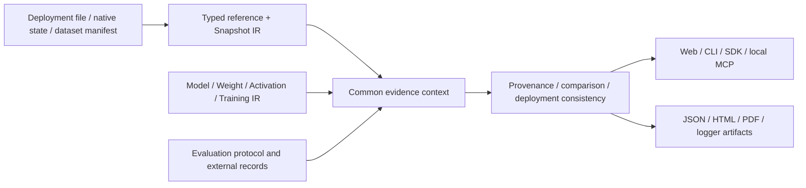

# Snapshot and model-change evidence workflows

This additive implementation connects fixed state, lineage and evaluation records through the existing Evidence IR family. **Snapshot IR** means an entity's fixed content within its declared scope. It does not mean an atomic copy of arbitrary Python state, a replayable training checkpoint or an externally approved standard.



## Identities and compatibility

- `artifact_file`: SHA-256 of exact supplied file bytes. It has no JSON document schema.
- `artifact_set`: the existing canonical Artifact Set identity.
- `native_state`: the unchanged `deepbom.model_state_snapshot.v1` digest; definition and named tensor identities within the adapter's scope.
- `snapshot`: `deepbom.snapshot_ir.v1`, wrapping a native state or an explicit dataset/configuration manifest. The wrapper has a new identity; it never replaces the original native digest.
- `evidence_document`: the member's canonical document digest and schema. Internal subject references are separate from document identities.

A schema, SHA-256, digest scope and optional internal subject form one reference. The resolver never substitutes a file digest for a snapshot digest. Model-state snapshots exclude optimizer, RNG and external Python state. Dataset manifests state which extract, cohort, ETL, vocabulary and quality records are fixed. A cohort-definition digest does not identify its extracted records. Missing members remain unresolved.

The additive family entry point is `deepbom-evidence-ir-v3.schema.json`. Previous family schemas and persisted native state records retain their contracts. Provenance v1 remains available for the existing artifact metadata route; v2 accepts typed artifact/native/dataset references. No automatic rewrite of archived evidence occurs. Training IR remains the ordered lifecycle/time record: there is no separate Trained IR.

## One computation path

`runEvidenceWorkflow` validates a bounded request, builds an `EvidenceContext`, dispatches to one operation owner, and preserves the request and source documents in its result. The Web Worker, CLI, Node/Python SDK and local MCP invoke this same owner. Python does not reimplement statistics or criteria. Existing artifact analysis finalization now uses `finishArtifactEvidenceWorkflow` in Web, CLI and the ChatGPT/Claude widgets.

| Operation | Owner | Meaning |
| --- | --- | --- |
| snapshot | `snapshot-ir.js` | Fixed scoped content; explicit adapter for existing native state |
| protocol / evaluation | `evaluation-evidence.js` | Typed external estimates, exact denominators, units, CI metadata and method identity |
| provenance | `provenance-v2.js` | Resolved identities; relationships and arbitrary attributes remain declared |
| omop | `evidence-workflow-omop.js` → existing `provenance/omop.js` | Existing CDM_SOURCE profile, connected to a dataset snapshot without copying an OMOP database |
| review | `change-review.js` | Conditions first, then permitted after-minus-before calculations |
| deployment | `deployment-evidence.js` | Consistency of explicitly supplied configuration and execution declarations |
| verify | member semantic validators | Reconstruct results from the supplied context |

Readers re-run the workflow from preserved records and reject altered counts or deltas even if a caller recomputes the outer hash. This verifies consistency, not who supplied the records. A saved `file_observations` entry is a prior claim: fresh byte verification requires the original request and explicitly selected files. No URLs in evidence are fetched.

## Evaluation rules

Each record identifies the model, protocol, dataset release, cohort, run, code, environment and evaluation configuration. The protocol fixes populations, metric meaning, unit, analysis unit, aggregation, repeated-observation handling, missing-value policy, direction and threshold. A protocol hash does not prove that the criteria were registered before seeing results.

`DB-CHANGE-BINDING` resolves required sources. `DB-CHANGE-COMPARABILITY` requires the same declared conditions and, for paired results, an explicit pair-set identity and equal analysis denominators. `DB-CHANGE-REGRESSION` computes after minus before and evaluates the declared direction/threshold. Reported rounding widens the comparison interval; a threshold inside it stays unassessed. A missing threshold also stays unassessed. Decimal-string counts retain values beyond JavaScript's exact integer range. Delta and threshold comparisons use exact arithmetic on the canonical decimal spelling of the reported JSON values; `delta_exact` is authoritative, and the finite numeric mirror is optional. This cannot recover digits omitted by the source.

The implementation does not calculate MAE/AUC from patient records, infer a paired confidence interval from two marginal intervals, combine overlapping populations, average subgroup means or convert units. Unknown is not zero. A missing reference produces an incomplete result; a supplied contradiction is rejected. `criteria_met` applies only to the included external-evaluation criteria. Transformation equivalence, clinical suitability and deployment approval remain unestablished. An optimization report or artifact diff may be attached as separate structure evidence; its before/after identities must match.

The initial profile supports explicit same-release paired/unpaired comparisons. Descriptive records can be retained but do not produce acceptance checks. Cross-population comparisons require a separate protocol extension; the two-population example compares each population to itself before/after. Custom thresholds are not regulatory requirements.

## Use

```javascript
import { evidenceWorkflow } from 'deepbom';
const result = await evidenceWorkflow(request, {
  files: [{ sha256: expectedHash, path: './before.onnx' }]
});
// Inspect result.document.status, counts and source pointers.
```

```python
from deepbom import evidence_workflow
result = evidence_workflow(request, files={expected_hash: './before.onnx'})
from deepbom.evidence import export
export(result, destination='mlflow', run_id=existing_run_id)
# TensorBoard: destination='tensorboard', logdir='./evidence-logs'
# W&B: explicitly start a run first; offline mode is supported.
```

```sh
deepbom evidence-workflow request.json --file SHA256:./before.onnx --output result.json
deepbom evidence-workflow result.json --format html --output report.html
deepbom evidence-workflow result.json --format pdf --output report.pdf
deepbom evidence-workflow result.json --offset 0 --limit 25
```

PDF requires the matching `deepbom[report]` Python package. `DEEPBOM_REPORT_PYTHON` selects its interpreter. Web: open `/reports/evidence/`, select the request plus originals, and inspect checks/source pointers; saved results can also be explored and exported. Browser PDF uses the print dialog. Web model analysis and metadata/review inputs remain separate.

Local MCP: `deepbom_evidence_workflow` reads an allowed local JSON path, optional exact-hash/local-path file pairs, offset/limit and expected result digest. It returns a bounded page with exact total and next offset. Hosted ChatGPT/Claude tools continue their existing attachment/browser contracts and provide a link to the Web review; this release does not add arbitrary remote evaluation execution. A browser test is not a claim that an actual hosted ChatGPT/Claude session was manually tested.

Requests/results are limited to 16 MiB; original files to 64 MiB each and 256 MiB combined in this bounded workflow. These limits do not change the separate artifact CLI's large-file support. Results that cannot be preserved inside the limit fail explicitly. Missing originals do not prevent inspection, but required binding checks stay unresolved.

## Outputs and standards

The JSON result preserves source records and exact denominators. HTML and the monochrome PDF render a common view; neither recomputes criteria. Model optimization structure/diff remains in its existing report contract and is linked when supplied. MLflow/W&B preserve the complete JSON artifact. TensorBoard presents before/after/delta as a single review at step zero, not as training time; exact counts remain in the JSON.

Both PDF report types share the embedded font and text handling. Characters outside that font's coverage use explicit Unicode escapes with a report note; JSON and HTML retain the original text.

`--format cyclonedx` / `--format spdx` returns a `deepbom.evidence_standard_projection.v1` wrapper containing a standards document, the evidence JSON file's **byte** hash and a loss ledger. Extract `.document` for a CycloneDX 1.7 or SPDX 2.3 consumer, and write `.source_file.content` as UTF-8 to retain the exact referenced evidence file. Its byte hash covers these exported bytes, not an arbitrarily formatted input JSON file. This is an inventory of the evidence file, not a complete model dependency BOM. Snapshot, evaluation and clinical semantics are not silently mapped into standard fields. The original result file remains required. The older optional `deepbom-review` project is a separate contract; its records are not silently accepted as these new records.

## Deployment declaration limits

A configuration snapshot may reference model, preprocessing, postprocessing, thresholds and runtime/build files. Deployment intervals are half-open `[start,end)` and timestamps require a timezone and at most millisecond precision. Overlap, rollback ambiguity, clock uncertainty or conflicting configuration remain unresolved/conflicting. An explicit execution declaration is required; installation alone never implies execution. `generated`, `displayed` and `used` remain separate supplied claims. This is not a patient-event store or an authenticated audit log.

## Regression boundaries corrected

Execution overrides/hooks are rejected when native reconstruction cannot preserve them. Rule suggestion and application use the same applicability owner, including shared-call checks. Smoke training probes inspect the post-update state for nonfinite values. Gradient shape, optimizer membership, activation event coordinates and required context are checked before recording. TensorBoard phases remain distinct and are restored on import. Policy exceptions cannot silently expand a subject-specific exception to a whole finding, apply before creation, or execute a free-text expiration condition. Runtime sidecars pass through the existing format-specific validators instead of accepting partial self-consistent summaries.
