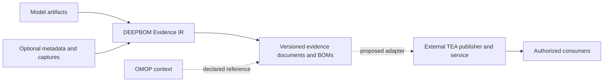

# TEA and DEEPBOM Evidence IR

Reviewed: 2026-09-29. Status: architectural review and proposed integration boundary; **no TEA client or server has been implemented**.

## Source and specification status

The supplied [Ecma TC54 page](https://ecma-tc54.github.io/ECMA-xxx-TEA/) describes a format-independent discovery and exchange protocol. It explicitly leaves artifact contents to other specifications. The page labels itself **Draft ECMA-xxx** and displays an edition date of December 8, 2026, later than this review date. Neither that date nor the source OpenAPI's version field demonstrates adoption as a final numbered Ecma standard.

This review pins the sources instead of treating the moving web page as a release:

- [Ecma rendering source: `949cae5aaa20e5f6215c5d2201b9dcd89d6362dc`](https://github.com/Ecma-TC54/ECMA-xxx-TEA/tree/949cae5aaa20e5f6215c5d2201b9dcd89d6362dc), committed 2026-09-24.
- [TEA source: `faee30e820b502055eeb560860031b4a559a21f3`](https://github.com/CycloneDX/transparency-exchange-api/tree/faee30e820b502055eeb560860031b4a559a21f3), committed 2026-09-24. Its consumer OpenAPI reports version `1.0.0`.

## Architectural fit

DEEPBOM should generate and validate evidence independently of where it is published. TEA can provide the external discovery/delivery path for selected exports. It should not become a sixth evidence-calculation IR or replace Provenance IR.

The IR retains meaning and source binding. CycloneDX or SPDX retains its own document semantics. A TEA service manages discovery and delivery. OMOP retains clinical meaning. None of these roles makes a supplied relationship true merely because another system can resolve it.

## Proposed mapping

The following is DEEPBOM design guidance, not a normative TEA mapping or an implemented export.

| TEA concept | Candidate DEEPBOM use | Boundary |
| --- | --- | --- |
| Product / Product Release | A publisher's distributed application or model product and its release | Do not assume a model filename uniquely identifies a product release. |
| Component / Component Release | A model component and a specific released version | Preserve the publisher's identifiers; do not substitute a tensor or node identifier. |
| Release distribution | Distinct distributed model bytes or package variant | A model digest can identify bytes in that distribution; the release may contain several distributions. |
| Collection | A versioned set of selected BOMs and reports for a release | Separate changes to the set from changes to the model. |
| TEA Artifact | An exported evidence document or BOM | This is different from the deployed model file called an artifact in DEEPBOM. |
| Artifact format | One exact exported representation | Its digest describes the exported file, not its model or its internal IR digest. |

The [pinned consumer OpenAPI](https://github.com/CycloneDX/transparency-exchange-api/blob/faee30e820b502055eeb560860031b4a559a21f3/spec/openapi.yaml) distinguishes these objects, their required fields and their API operations. For a first adapter, a CycloneDX export can use the BOM category. A standalone DEEPBOM IR can use the generic document category unless a more specific standardized profile is justified. Do not label an ordinary static report as certification. Different IR documents should have separate artifact identities, rather than pretending that every JSON file is another format of the same document.

## Three distinct digest roles

1. **Model digest:** SHA-256 of the model bytes being analyzed.
2. **IR digest:** the member's canonical hash under its explicit exclusion rules. For Provenance IR, the self-digest field is excluded.
3. **Delivery digest:** SHA-256 of the complete exported file, including its self-digest field and exact serialization/newline choices.

An adapter should compute the third value from the actual export bytes. It must not reuse either of the first two. JSON and XML exports also require separate byte digests. Download integrity, signature validity, publisher trust and truth of the reported claims remain separate assessments.

The [pinned collection narrative](https://github.com/CycloneDX/transparency-exchange-api/blob/faee30e820b502055eeb560860031b4a559a21f3/tea-collection/tea-collection.md) defines immutable artifact revisions and versioned collections. It binds checksums to bytes after HTTP content decoding without reserializing them. A new document revision must be published when its content or metadata changes; adoption of that revision changes the collection version. A reproducibility record should therefore retain service identity, release identity, collection version, artifact UUID/revision, format, and expected byte checksum. A moving “latest” endpoint is insufficient as the final evidence reference.

## Discovery and remote access

The [pinned discovery specification](https://github.com/CycloneDX/transparency-exchange-api/blob/faee30e820b502055eeb560860031b4a559a21f3/discovery/readme.md) uses `tei://` identifiers and a domain's `/.well-known/tea` document to locate APIs. A TEI may resolve to multiple product releases. A future adapter must retain that ambiguity rather than picking an arbitrary subject. The [hash identifier profile](https://github.com/CycloneDX/transparency-exchange-api/blob/faee30e820b502055eeb560860031b4a559a21f3/tei-types/hash.md) is marked provisional; its publisher chooses what is hashed. An existing DEEPBOM digest alone is not a registered or resolvable TEI.

For DEEPBOM, remote retrieval should be a separate, explicitly invoked adapter with bounded downloads and destination policy. Existing static analysis and Provenance IR validation should continue to work offline. Remote results must pass normal file, schema and semantic checks after retrieval. TEA credentials must not be forwarded to external artifact URLs. Merely keeping a TEI in a generic `uri` field today does not validate or resolve it.

## Recommended next implementation

1. Start with a separate local packaging adapter: accept already-generated documents, compute their delivery digests, and prepare metadata validated against a pinned TEA schema. Reuse the common IR validators; do not reimplement analysis.
2. Test it against an existing TEA service using explicit local credentials and revision-pinned download/verification. Keep that service outside the browser analyzer's default data path.
3. Add optional retrieval only after identifier ambiguity, redirects, credentials, media-type selection, byte checksums and version retention have integration tests.
4. Claim conformance only after covering the applicable client/server operations and publishing their results. GitHub-hosted JSON or a discovery file alone is not a TEA service.

The [publisher API note](https://github.com/CycloneDX/transparency-exchange-api/blob/faee30e820b502055eeb560860031b4a559a21f3/spec/publisher/README.md) treats publication as a recommended API separate from the consumption conformance baseline. Therefore a consumer specification must not be read as an implemented upload endpoint.

The current change establishes the clean Provenance IR contract and this review only. TEA publication, discovery, download, authentication and signatures remain unimplemented. No model files, institution metadata, identifiers or reports were uploaded as part of this review.
