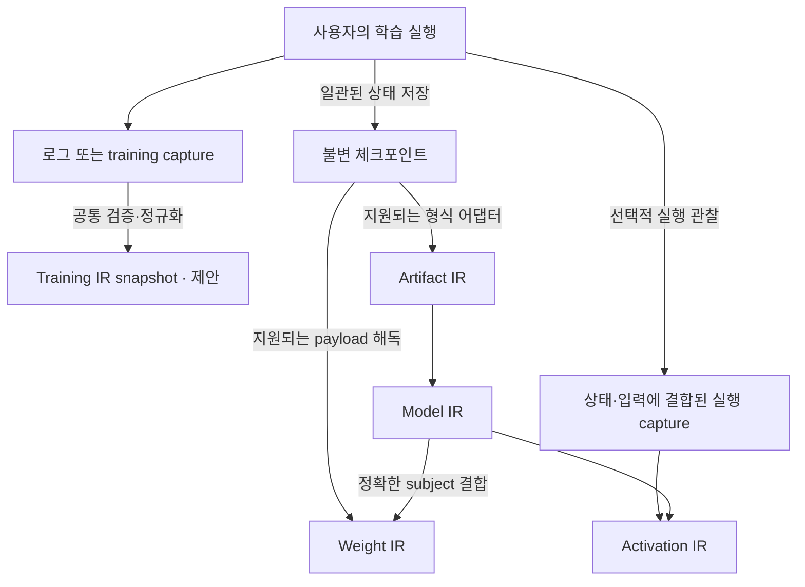
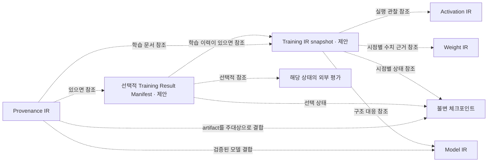
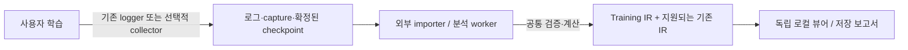
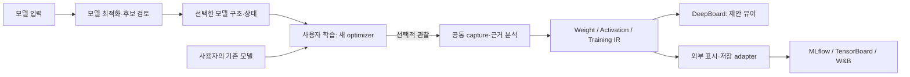

# Training 과정과 학습된 모델 상태의 Evidence IR 계약

> 구현 상태 갱신: CPU용 PyTorch·TensorFlow native 경로와 Training IR가 구현되었습니다.
> 실행 가능한 현재 API·지원 범위는 [Native model and training guide](../NATIVE_MODEL_TRAINING_GUIDE.md)를 따릅니다.
> 아래 내용은 구현 전 설계 기록입니다. 예전의 미구현 표시는 그 시점의 상태이며,
> 제안 API 전부가 현재 지원된다는 뜻은 아닙니다.

**상태: 설계 초안 0.5, 2026-10-07. Training IR 및 Training Result Manifest는 미구현이다.**

이 문서는 학습 확장의 용어·책임·참조 규칙을 정의한다. 현재 구현된 다섯 IR의
계약을 변경하거나 새 공개 API를 등록하지 않는다. 아래 새 스키마 이름은 제안이며,
JSON Schema·정규화기·의미 검증기·프레임워크 수집기를 구현하고 검증하기 전까지
입력으로 수용한다고 약속하지 않는다. 학습 확장 제안 문서 사이에서 용어가
충돌하면 이 문서의 구분을 따른다. 현재 구현 계약은 [가족 명세](README.md)와
각 member schema가 우선한다.

## 1. 핵심 구분

DEEPBOM이 제안하는 개발 흐름의 책임은 **모델 최적화 → 사용자 학습 → 선택적
근거 기록·분석·표시**다. 모델 구조와 상태를 개선한 후보를 반환하고, 사용자는
선택한 후보의 구조·가중치·동작에 필요한 buffer를 복원해 **새 optimizer**로 학습
또는 fine-tuning한다. optimizer·학습률·학습 스케줄을 탐색하거나 기존 학습을
동일 궤적으로 재개하는 기능은 이 모델 최적화·기록 계약에 포함하지 않는다.

| 책임 | DEEPBOM의 결과 | 사용자가 소유하는 것 |
| --- | --- | --- |
| 모델 최적화 | 학습 가능한 후보의 구조·상태·변경 대응·비교 근거 | 후보 선택, 학습 목적·데이터·optimizer·학습 루프 |
| 학습 관찰 | 선택 시점의 Weight/Activation 근거와 Training IR의 시간·맥락 연결 | 실제 forward/backward/update 실행 |
| 표시·연결 | 공통 근거를 읽는 독립 뷰어 및 외부 로거 투영 | DeepBoard 또는 기존 MLflow/TensorBoard/W&B 사용 선택 |

여기서 **DeepBoard는 제안 중인 DEEPBOM 독립 근거 뷰어의 가칭**이다. 새 분석
엔진이나 필수 외부 서비스로 만들지 않는다. 학습 중 근거를 남기는 데 모델 최적화
기능 사용을 요구하지 않으며, 사용자의 원본 모델에도 관찰 수집기를 연결할 수 있다.

**Training IR는 특정 관찰 경계에서 확정한 학습 라이프사이클·시간축·학습 고유
증거와, 해당 시점들의 모델 상태 참조를 담는 불변 스냅샷이다.**
단순한 실행 로그나 학습 완료 여부에 그치지 않고, 현재 관찰된 학습 단계와
그 상태에 이르는 관찰 이력을 명시된 수집 범위 안에서 표현한다.
목적은 관찰한 근거의 기록과 검토다. 전체 학습의 재현·재개 가능성은 요구하지 않는다.
모든 step의 가중치, 입력 원문, optimizer·RNG·데이터 iterator 상태를 저장할 필요도 없다.
이 항목들이 없다는 이유로 관찰된 분포나 loss를 무효로 만들지 않는다. 다만 특정
모델 상태와의 연결을 확인하지 못하면 그 연결의 한계를 명시한다. Weight IR와
Activation IR의 수치 계산은 그대로 재사용하며 Training IR가 이를 중복 계산하지 않는다.

**Training은 실행 과정이고, trained는 특정 모델 상태가 만들어진 이력이다.**
두 단어를 서로 배타적인 단일 상태 enum으로 만들지 않는다. 사전 학습된 모델을
fine-tuning 중이면 이전 학습 결과를 입력으로 사용하는 새 학습 과정이 동시에 존재한다.

- **Training run:** 특정 시작 상태·코드·설정·데이터 조건으로 수행하는 학습 실행.
  종료 후에도 그 과정의 기록은 Training IR이다.
- **Model state:** 특정 관찰 경계에서의 모델 파라미터와 동작에 필요한 buffer 등.
  초기화 상태·중간 상태·선택된 학습 결과를 모두 포함하는 일반 용어다.
- **Model State Snapshot — 제안:** 정의된 범위의 모델 상태를 일관된 관찰 경계에서
  고정하고, 모델 정의 및 값의 대응과 함께 식별한 근거 대상. 메모리에도 존재할 수
  있으며 파일 저장이 존재 조건은 아니다. Training IR snapshot이라는 기록 문서와
  구분한다. 기존 IR에 연결하려면 현재 계약 또는 명시적으로 개정한 source 계약이 필요하다.
- **Checkpoint:** 저장된 상태의 산출물. 모델 값만 저장했는지, 재개에 필요한
  optimizer·scheduler·scaler·RNG·sampler/iterator 등의 상태도 저장했는지 따로 기록한다.
  체크포인트라는 파일 이름만으로 재개 가능성을 보증하지 않는다.
- **Trained model evidence:** 정확히 식별된 결과 상태에 학습 이력·수치 분석·평가를
  연결한 근거 묶음이다. 학습 완료, 품질 합격, 배포 승인을 뜻하지 않는다.

파일 확장자, 비영점 가중치, `train()`/`eval()` 모드, 저장 성공만으로 학습 이력을
판정하지 않는다. 갱신 함수가 실행됐다는 관찰도 실제 파라미터 변화나 품질 개선과
다르다. 학습 없이 calibration으로 buffer가 변한 경우도 학습 결과로 바꾸지 않는다.

## 2. 이름과 책임

전체 가족 이름은 **DEEPBOM Evidence IR**로 유지한다.

| 이름 | 책임과 사용 시점 | 상태 |
| --- | --- | --- |
| Artifact IR | 특정 파일 바이트의 형식·저장 구조·네이티브 사실 | 구현됨, 형식별 지원 범위 적용 |
| Model IR | 특정 산출물의 공통 구조·입출력 계약·subject 참조 | 구현됨, 학습 여부를 인증하지 않음 |
| Weight IR | 특정 상태에서 지원되는 방식으로 읽은 저장 값의 수치 근거 | 구현됨, 미학습·학습 후 모두 사용 가능 |
| Activation IR | 특정 상태·입력·실행에서 수집한 값의 근거 | 구현됨, live training 연결은 별도 구현 필요 |
| Provenance IR | 모델·데이터·코드·실행·문서 사이의 관계와 그 근거 | 구현됨, 학습 시계열을 대신하지 않음 |
| **Training IR** | 특정 관찰 경계까지의 라이프사이클·시간축·학습 고유 증거·시점별 상태 참조 | 제안하는 선택적 member |
| **Training Result Manifest** | 필요할 때 선택된 결과와 관련 IR·학습 기록·평가를 묶는 참조 문서 | 제안하는 선택적 포장, 새로운 IR member가 아님 |

**`Trained IR`은 추가하지 않는다.** 학습된 모델에서도 구조는 Model IR, 값의 분석은
Weight IR, 실행 값은 Activation IR가 맡는다. 이름을 학습 단계별로 복제하면 동일
계산과 구조 규칙이 갈라진다. Training Result Manifest는 이를 복사하거나 재계산하지
않고 정확한 문서 식별자로 연결한다. UI에서는 “Training history”와 “Selected model
evidence”를 분리하고, 학습 이력이 없는 경우 그 사실을 보인다.
학습 종료 후에도 마지막 관찰은 **Training IR**로 유지된다. 종료 상태가 되었다고
`Trained IR`로 바꾸지 않는다. 이는 IR 종류를 유지한다는 뜻이며, 새 관찰로 내용이
달라진 snapshot에는 새 digest를 부여한다. Result Manifest 생성은 Training IR 사용의
필수 조건이 아니다.

제안 식별자는 다음과 같다. 현재 family catalog에는 등록하지 않는다.

| 문서 | 제안 `schema` | 제안 내용 digest 필드 |
| --- | --- | --- |
| 프레임워크 수집 입력 | `deepbom.training_capture.v1` | 입력 파일의 SHA-256을 별도 기록 |
| 검증·정규화된 과정 기록 | `deepbom.training_ir.v1` | `training_ir_sha256` |
| 결과 연결 문서 | `deepbom.training_result_manifest.v1` | `training_result_manifest_sha256` |

학습 수집 입력과 Training IR는 구분한다. 입력을 정규화하고 참조·카운트의 일관성을
검사해도 제공된 기록의 진실성이나 수집기 무결성을 독립적으로 인증한 것은 아니다.
새 문서의 canonicalization·자기 digest 제외 규칙·method version은 구현 시 공통
해시 규칙을 재사용해 명세화해야 한다. 문서 digest와 원본 파일 바이트 digest도 구분한다.

## 3. 관계와 읽기 방향

### 3.1 생성과 분석

아래는 제안하는 학습 확장을 포함한 생성 흐름이다. 화살표는 입력 의존성이며
모든 IR를 반드시 생성해야 한다는 뜻이 아니다. 학습 실행은 사용자 프레임워크가
소유한다. 저장 형식·구조 대응·capture 계약이 지원될 때만 기존 IR로 합류한다.
이 그림의 파일 경로는 **현재 IR 계약을 재사용하는 경로**다. 모델 상태의 일반적인
식별 원칙을 파일 저장으로 한정하지 않는다. 메모리 스냅샷을 직접 연결하는 후속
공통 source 설계는 §6.4에서 구분한다.

Artifact IR는 파일의 네이티브 사실, Model IR는 그 사실의 공통 표현을 소유한다.
Weight IR는 Model IR만으로 계산하지 않으며 실제 payload가 필요하다. Activation IR도
정적 그래프만으로 생성하지 않는다. run 로그만으로 Training IR를 만들 수는 있지만,
그 사실만으로 나머지 IR가 생성되거나 연결되지는 않는다. live training capture를
기존 실행 capture로 연결하는 어댑터도 아직 미구현이다.

### 3.2 확정된 근거의 참조

다음 그림의 점선은 **참조하는 문서 → 이미 식별된 대상** 방향이다. 선택적 참조는
근거와 검증된 대응이 있을 때만 추가한다. Result Manifest 없이도 Training IR를
사용하거나, artifact에 결합된 Provenance IR가 Training 문서를 참조할 수 있다.

그림은 주요 관계만 보인다. 각 IR는 자체 source binding을 유지하고 Result Manifest도
§7에 따라 지원되는 분석 문서를 직접 참조한다. 참조는 schema·문서 digest와 필요 시
subject/event 식별자를 포함한다. 파일 위치나 run ID만으로 같은 근거로 취급하지 않는다.

Training IR snapshot은 한 실행의 관찰 경계별로, Result Manifest는 필요한 결과 선택별로 만든다. 한 실행에 여러
checkpoint·선택 결과가 있을 수 있고, 같은 checkpoint를 서로 다른 평가 조건으로
검토할 수 있다. 결과를 다시 선택하면 새 manifest를 만들며 이전 선택을 덮어쓰지 않는다.

Provenance IR의 기존 `run`, `model_artifact`, `document`, `manifest`,
`evaluation_report`와 `generated_by`, `derived_from`, `uses_training_data`,
`uses_code`, `uses_environment`, `evaluated_by`, `documented_by` 관계를 재사용할
수 있다. **현재 이 어휘의 존재가 학습 문서 자동 매핑 구현을 뜻하지는 않는다.**
Training IR가 단계별 관찰을 소유하고 Provenance IR는 문서·실행 사이 관계를 소유한다.
UI는 둘 사이 모순이나 해시 불일치를 감추지 않는다.

**현재 Provenance IR v1 생성에는 검증된 Model IR와 주대상 artifact 식별자가 필요하다.** 파일이 없는 run만을
기록할 때는 Training IR 안에 출처 있는 데이터·코드·run 참조를 보존한다. 그 경우
가짜 artifact hash나 임의의 Model IR를 만들어 Provenance IR를 생성하지 않는다.
지원되는 artifact/Model IR가 확보된 뒤 기존 계약으로 관계를 연결한다. 입력 metadata의
`subject.model_ir_sha256`이 선택 사항인 것은 출력 IR에서도 생략할 수 있다는 뜻이
아니다. 출력의 `source`는 생성기에 전달한 Model IR로 확정한다.
[입력 검증기](../../web/lib/provenance/contracts.js), [IR 생성기](../../web/lib/provenance-ir.js)

상호 참조로 해시 순환을 만들지 않는다. 고정 순서는 (1) capture chunk·checkpoint,
(2) 지원되는 Artifact/Model 및 수치 IR, (3) 이를 참조하는 Training snapshot,
(4) 선택적 결과 manifest, (5) 이 문서들을 연결하는 Provenance IR다. 모든 단계를
수행할 필요는 없다. 이미 존재하는 입력 checkpoint의 provenance는 참조할 수 있지만
자신을 참조하게 될 새 provenance의 digest는 앞 문서에 소급 삽입하지 않는다.
필요하면 별도의 상위 패키지 인덱스가 함께 참조한다.

후속 수치 분석이나 늦게 도착한 이벤트는 새 Training snapshot에서 연결한다.
같은 학습 시점이라도 기록 수신 범위가 달라질 수 있으므로 관찰 경계와 기록 확정
시점을 구분한다. 평가가 추가되면 필요한 선택 문서도 새로 만든다. 원래 checkpoint와
기존 snapshot을 수정하지 않으며 run ID는 탐색용으로만 사용한다.

## 4. 반드시 분리할 상태 축

아래 값은 제안 의미 체계이며 기존 IR enum을 확장한 것이 아니다.

| 축 | 기록 내용 | 대신 판단할 수 없는 것 |
| --- | --- | --- |
| 실행 상태 | `running`, `completed`, `stopped`, `failed`, `unknown`와 종료 사유·관찰 근거 | 품질, 결과 선택 |
| 수집 범위 | 요청한 구간·subject, 관찰/누락/미요청, collector 오류 | 관찰하지 않은 전체 학습 이력 |
| 결과 기원 | `initialized`, `training_output`, `derived`, `unknown`와 주장 출처 | 성능이나 학습 완료 |
| 결합 검증 | 파일/상태/참조의 검사 범위와 match·mismatch·unresolved | 주장자의 진실성 |
| 선택 | 미선택 또는 특정 checkpoint의 선택 사유·기준·후보 집합 | 최종 step, 품질 합격 |
| 평가 | 특정 상태·데이터·평가 코드·환경의 결과와 판정 기준 | 다른 상태나 배포 환경의 성능 |
| 릴리스 결정 | 외부 정책·검토자·결정 문서에 대한 참조 | DEEPBOM의 자동 승인 |

`completed`는 설정된 종료 조건 또는 정상 종료 신호가 기록된 상태다. 조기 종료가
설정된 정책에 따른 정상 종료라면 `completed`와 해당 이유를 기록한다. 사용자 중단은
`stopped`, 오류 종료는 `failed`, 종료 관찰 없이 로그가 끊겼으면 `unknown`이다.
종료 직전 기록이 `running`인 것만으로 현재도 실행 중이라고 표시하지 않는다.
각 snapshot의 관찰 시점과 이후 상태 미확인을 함께 보인다.

기원에 대한 `declared`/`observed`/`derived` 근거는 **주장별**로 붙인다. 파일 해시를
관찰했다는 사실을 “학습을 관찰했다”로 승격하지 않는다. 제공된 callback 기록도
기록 제공자와 trust 경계를 표시한다. `training_output`이며 갱신이 0회인 실행도
가능하므로 적용된 update·상태 변화는 따로 보고한다.
`training_output`은 그 실행이 결과를 저장했다는 기원 분류다. 파라미터가 학습으로
변했다는 판정이 아니다. `is_trained: true` 하나로 이를 대신하지 않으며, 결과
manifest가 붙었다는 이유로 initialized/unknown 기원을 학습 확인으로 승격하지 않는다.

| 상황 | 정확한 표현 |
| --- | --- |
| 초기화 후 분석만 수행 | 초기화 상태의 구조/Weight IR; 학습 과정 없음 |
| 1,200 update 후 checkpoint 저장, 이후 오류 | failed run의 중간 checkpoint; 학습 이력과 후속 평가를 별도로 연결 |
| 정상 종료했으나 품질 평가 없음 | 실행 완료; 선택 상태 명시; 품질 미평가 |
| 공급자가 학습 완료 모델만 제공 | 기원은 공급자 선언; 관찰 가능한 파일 근거; 학습 이력 미제공 |
| pretrained 모델 fine-tuning | 이전 결과를 시작 상태로 참조하는 별도 run; 현재 진행 상태는 독립 |

## 5. Training IR의 최소 정보

Training IR는 단일 run의 **불변 기록 snapshot**이다. 실행 중 추가 관찰이 생기면
새 snapshot을 생성한다. 가변 경로의 `latest.json`은 탐색 편의일 뿐 증거 식별자가 아니다.

여기서 **Training IR snapshot**은 관찰 기록의 확정본이고, **model checkpoint**는
저장된 모델 상태다. 매 snapshot마다 모델 전체를 저장할 필요는 없다. 반대로
checkpoint 하나가 있다고 해당 시점까지의 학습 기록이 모두 있는 것도 아니다.

### 스냅샷이 소유하는 다섯 가지 의미

아래는 책임 구분이며 아직 등록된 JSON 필드명이 아니다.

| 의미 | 담아야 하는 내용 |
| --- | --- |
| 라이프사이클 | 시작·진행·중단·재개·종료 이력, 현재 관찰된 phase 및 그 전환 근거 |
| 시간축 | run/segment/stream의 사건 순서, epoch·microbatch·optimizer별 update 위치, 시간 측정 조건 |
| 학습 고유 증거 | loss·학습/검증 metric, gradient, optimizer·learning rate·scheduler, accumulation·AMP·clipping 등의 관찰 |
| 모델 상태 참조 | 각 관찰 시점의 checkpoint와 지원되는 Model/Weight/Activation IR 대응 |
| 관찰 범위 | snapshot 경계·기록 수신 범위·sampling·누락·미대응·수집기 한계 |

phase와 실행 상태도 구분한다. 예를 들어 실행이 `running`이면서 현재 관찰된 phase는
validation일 수 있다. `train`/`eval` 실행 모드와 동일시하지 않으며, 프레임워크가
동시에 여러 작업을 실행하면 단일 phase로 눌러 담지 않고 stream별 범위를 명시한다.

관찰 대상 시점과 로그가 도착해 snapshot을 만든 시점을 나눈다. 늦게 도착한 관찰은
새 snapshot에 반영하고 이전 문서를 수정하지 않는다. 여러 worker의 관찰 경계는
stream별 sequence 범위로 기록한다. 동기화 근거 없이 하나의 wall-clock 시각에
모든 상태를 동시에 포착했다고 주장하지 않는다. 소요 시간은 clock domain과 측정
범위를 명시하고 학습 실행 시간·중단 시간·전체 경과 시간을 구분한다.

예를 들어 update 100 시점의 Weight IR와 update 98 시점의 Activation IR가 최신
근거일 수 있다. 둘을 한 화면에 보여도 각각의 관찰 시점을 유지하며 “update 100의
동일 상태”로 합치지 않는다. 관찰하지 않은 중간 step의 값을 보간해서 증거로 만들지 않는다.
최종 snapshot도 관찰 범위가 부분적이면 그 한계를 그대로 보존한다.

| 정보 그룹 | 반드시 구분할 내용 |
| --- | --- |
| 실행 식별 | 논리 run ID, 실행 segment, collector/adapter/방법 버전, 기록 범위 |
| 시작 상태 | 초기화 방식 또는 입력 checkpoint; 구조·코드·설정 참조; 미확정 binding |
| 학습 조건 | 데이터 snapshot/split, 전처리·증강·sampler, loss, optimizer별 설정·parameter group, scheduler, 정밀도·분산 환경 |
| 진행 관찰 | 아래에서 정의한 카운터·시점·metric·gradient 진단; 수집되지 않은 항목 |
| 상태 연결 | 관찰과 checkpoint/capture의 관계; 정확한 저장 시점; parameter/buffer 대응 |
| 종료 및 연결 | 관찰한 종료 사유, resume/branch 관계, 생성 산출물 참조 |

이 표는 확보된 정보를 서로 구분하는 규칙이지, 학습 재현 패키지의 필수 수집
목록이 아니다. 관찰 출처·범위·시점의 의미·수집 방법을 기록하고, 요청하지 않았거나
접근할 수 없는 조건은 미수집으로 둔다. 기존 학습이 재개됐다는 사실을 관찰할 수는
있지만 DEEPBOM이 그 재개를 수행하거나 재현해야 하는 것은 아니다.

데이터 원문이나 activation 전체를 항상 저장하는 계약이 아니다. 식별·방법·범위·
제공되지 않은 근거를 기록하고, 대용량 원문과 이벤트는 별도 불변 파일로 둔다.
데이터 참조가 이름/URI뿐이면 byte-verified snapshot인 것처럼 표시하지 않는다.

### 5.1 Step와 분산 실행

- batch, microbatch, forward invocation, backward 호출, update 시도, 적용된 update,
  AMP skip, scheduler tick을 하나의 `global_step`으로 합치지 않는다.
- optimizer별 ID·parameter group·갱신 카운터를 둔다. 다중 optimizer에서는 한쪽이
  skip되어도 다른 쪽이 갱신될 수 있다. 호출 횟수에서 실제 적용 횟수를 추정하지 않는다.
- 적용된 update는 수집 계약에서 확인한 optimizer 갱신 완료이며 수치 변화량과 별개다.
  시도했으나 오류·진행 중·관찰 불가인 항목도 남긴다. 모든 시도를 applied/skip 두
  항목에 억지로 배분하지 않는다. 보존식은 동일 범위의 모든 결과 상태를 포함해야 한다.
- 정확한 카운터는 음이 아닌 정수의 정규화된 10진 문자열로 표현한다. epoch index와
  진행률은 별도이며, 길이를 모르는 iterable dataset에서 가짜 epoch 비율을 만들지 않는다.
- event 식별은 run·segment·worker/stream·local sequence로 한다. wall-clock timestamp
  하나로 전역 실행 순서를 만들지 않는다. rank, world size, reduction 범위와 method를 기록한다.
- 모든 rank가 기록한 같은 논리 update를 합산해 world size 배로 부풀리지 않는다.
  rank-local batch 수·처리 표본 수와 global 집계는 집계 정의가 있을 때만 변환한다.
- resume는 새 segment와 정확한 재개 checkpoint를 연결한다. rollback 이후 재실행한
  구간을 구분한다. 모델·학습 정책의 의도적 변경은 새 run/branch로 남기고 기존 이력을
  조용히 이어 붙이지 않는다. 설정된 scheduler 변화는 같은 정책의 일부일 수 있다.

AMP의 step skip과 optimizer별 독립 결정은 실제 수집 경계에 영향을 준다.
이를 callback batch 수로 대체할 수 없다. [PyTorch AMP 예제](https://docs.pytorch.org/docs/stable/notes/amp_examples.html)

### 5.2 Metric와 gradient

metric에는 이름만 아니라 정의/단위, 데이터 split, 계산 window, reduction,
분모와 가중 방식, 입력 표본·token 범위, 실행 조건을 연결한다. batch mean의 평균을
표본 mean으로 바꾸거나 batch별 AUC의 평균을 전체 AUC로 표시하지 않는다.
공통 집계는 집계 가능한 통계와 분모가 있을 때만 계산하고, 아니면 제공된 값으로 남긴다.

gradient는 `backward` 후인지, loss-scale 해제 전후인지, accumulation 중인지,
clipping 전후인지, distributed reduction 전후인지를 기록한다. 없는 `.grad`와
원소가 0인 gradient를 구분한다. gradient가 없다는 사실만으로 frozen parameter라고
판정하지 않는다. gradient·optimizer moment는 model weight로 세지 않는다.
별도 Gradient IR를 먼저 늘리기보다 Training IR의 typed observation에서 공통 수치
계산을 재사용한다. 이것도 현재 미구현이다.

공통 단계는 프레임워크 이름으로 나누지 않는다. 예를 들어 계산된 gradient 관찰은
제안 API에서 `gradient_stage="computed"`로 표현하고 native 경계인 `tape.gradient`
반환 또는 `backward` 후 관찰은 adapter 출처에 보존한다. 이 공통 단계만으로 두 값의
scaling·누적·reduction 의미가 같아지는 것은 아니다. 각 축은 별도 맥락과 근거를
가지며 수집기나 사용자 선언으로 확인되지 않으면 `unknown`이다. 입력 gradient와
변수의 대응, optimizer parameter group 포함 여부도 따로 검증한다.

missing은 0이 아니고 NaN/Inf는 유효한 JSON number가 아니다. 수치 값과
`finite`/`nan`/`positive_infinity`/`negative_infinity`/`missing` 등 상태를 구분하는
계약이 필요하다. 관찰되지 않은 값의 평균·분산을 만들어내지 않는다.

### 5.3 기록 완전성과 비용

이벤트 chunk는 파일 digest·stream·sequence 범위·event 수를 가진다. 누락·중복·
충돌·순서 위반을 별도 ledger로 검사한다. chunk들이 이어진다는 사실은 수집되지 않은
학습 이벤트까지 존재하지 않았다는 증명이 아니다. “완전”은 명시된 수집 범위에 한정한다.
전체 로그를 매 batch마다 재해시하지 않고 고정된 chunk와 작은 snapshot 인덱스를 사용한다.

샘플링 주기·레이어 선택·최대 값/바이트 수·저장 실패를 기록한다. 비동기 전송에서
누락된 진단을 학습 실패로 바꾸지 않으며, 진단 수집 실패와 모델 실행 실패를 분리한다.
관찰 지연과 수집 overhead도 측정 범위가 있을 때 따로 보고한다.

완료한 chunk와 참조 대상의 digest를 확인한 뒤 snapshot 인덱스를 확정한다.
쓰다 만 파일은 완료 근거로 노출하지 않는다. 같은 event ID의 같은 내용은 중복으로,
다른 내용은 충돌로 처리한다. event 도착 순서·wall clock·optimizer step은 서로
다르므로 정렬 과정에서 원래 sequence와 지연 도착 사실을 잃지 않는다.
저장 예산 초과·queue 탈락·sampling 제외는 구분하며 관찰 수가 0이라는 뜻으로
바꾸지 않는다. 이런 기록 규칙은 진단 경로에 적용하며 학습 자체의 트랜잭션을
DEEPBOM이 소유한다는 의미가 아니다.

## 6. Weight/Activation IR를 학습에 연결하는 규칙

### 6.1 상태 식별

아래의 파일 해시 규칙은 현재 artifact 기반 IR와의 연결 규칙이다. 일반적인 모델
상태는 일관된 불변 스냅샷으로도 식별할 수 있으며, 그 상위 개념은 §6.4를 따른다.

1. 저장된 checkpoint의 전체 파일 SHA-256을 **파일 식별자**로 쓴다. 여러 파일이면
   구성원·역할·각 digest와 누락 범위를 가진 패키지 manifest가 필요하다. 기존
   `artifact_set_sha256`은 기존 artifact-set 계약으로 실제 구성했을 때만 쓴다.
2. 모델 parameter와 persistent buffer, optimizer/scheduler/scaler/RNG 등 재개 상태는
   역할을 나눈다. 모든 checkpoint tensor를 학습 가능한 parameter로 집계하지 않는다.
3. 살아 있는 객체 주소, 변수 이름, 이전 checkpoint 해시를 현재 메모리 상태의
   식별자로 대신하지 않는다. 고정·식별되지 않은 관찰에는 run/event 참조와 한계를
   남긴다. 메모리 스냅샷의 상태 식별이 가능해도 실제 artifact가 없으면 artifact
   binding은 없다. 상태 식별과 파일 연결의 부재를 하나의 unresolved 상태로 합치지 않는다.
4. 저장과 수집은 일관된 snapshot 경계를 확보해야 한다. 비동기 저장 중 원본 tensor가
   변하면 mixed-step 상태가 될 수 있다. 별도 고정 copy/동기화 계약 없이 같은 시점이라고
   주장하지 않는다. 온라인 시점과 snapshot 완료 시점도 나눈다.
5. 같은 구조라도 가중치나 artifact가 바뀌면 Model IR digest가 달라질 수 있다.
   `model_ir_sha256`은 구조만의 동등성 키가 아니다. 구조 비교는 명시적인 구조 대응으로 한다.

PyTorch `state_dict`는 parameter와 등록 buffer를 포함하며, 메모리의 state dict를
그대로 보관하면 독립 snapshot이 아닐 수 있다. 모델 상태와 optimizer 상태는 별도다.
[PyTorch 저장·로딩 문서](https://docs.pytorch.org/tutorials/beginner/saving_loading_models.html)
Keras 전체 모델 저장은 구성·가중치·해당하는 optimizer 상태 등을 담을 수 있다.
파일 형식 지원과 특정 custom model의 재구성 가능성은 별도로 검사해야 한다.
[Keras 직렬화 문서](https://keras.io/guides/serialization_and_saving/)

### 6.2 Activation의 관찰 맥락

학습/검증/별도 probe라는 목적, 실제 train/eval 설정, gradient 활성화, autocast,
입력·전처리·난수 조건, 호출 식별자와 갱신 경계를 함께 남긴다. forward 중 buffer가
변할 수 있으므로 실행 전후 상태도 구분한다. 같은 모듈을 여러 번 호출하거나 조건부
분기를 실행하면 모듈 이름만으로 하나의 activation에 합치지 않는다.

PyTorch module/Keras layer 이름은 Model IR subject ref와 자동 동치가 아니다.
실제 어댑터가 검증한 대응표가 있어야 하며, 재사용·분기·변환·fusion의 일대다 관계를
나타내야 한다. 대응 상태는 bound/ambiguous/unmapped를 보존한다. export 시 변환된
그래프에 원래 학습 실행의 activation을 이름만 맞춰 붙이지 않는다.

별도 진단 forward는 원래 학습 forward와 구분한다. 모델 상태/RNG 보존을 검증했는지,
원래 학습에 영향을 줄 수 있는지 기록한다. callback이 받은 loss만으로 내부 activation을
관찰했다고 표시하지 않는다.

**현재 Activation IR 비교는 같은 정확한 Model IR와 artifact의 capture끼리만 가능하다.**
다른 checkpoint 사이 activation 비교에는 별도의 상태·subject 대응 계약과 검증이 필요하다.
Training IR를 포장지로 추가한다고 이 제한이 사라지지 않는다. 현재 v1 문서에 임의로
epoch/mode/gradient 필드를 끼워 넣지 않는다. 외부 연결 문서나 명시적인 계약 개정을
먼저 정의해야 한다. 첫 구현은 checkpoint에 결합된 오프라인 진단부터 시작한다.

현재 capture v1은 하나의 문서에서 동일한 mapped `value_ref`의 중복을 거부한다.
여러 step 또는 반복 invocation을 같은 행 목록에 이어 붙이지 않는다. 현재 계약을
쓰는 범위에서는 각각 유효한 capture 문서를 만들고 별도 관찰 참조로 연결한다.
여러 호출 중 특정 호출에 대응한 근거가 없으면 임의로 마지막 값만 남기지 않는다.
native 학습 호출을 직접 담는 경로는 호출별 subject와 새 source 계약부터 필요하다.

같은 source에 결합됐어도 입력·runtime·collector·configuration·instrumentation·
probe·entry region이 다를 수 있다. 현재 비교기가 반환하는 일치 여부와 shape/dtype
호환성·요청/관찰 coverage를 함께 해석한다. 현재 분포 비교는 elementwise 재구성이나
학습 변화의 인과 설명이 아니며, Training 시점 연결만으로 비교 가능성을 승격하지 않는다.

### 6.3 기존 IR로 연결할 수 있는 조건

| 확보한 근거 | Training 설계에서 가능한 표현 | 기존 IR로 연결할 조건 |
| --- | --- | --- |
| logger metric·외부 histogram만 있음 | 출처·정의·범위가 있는 관찰; 상태 연결은 미확정 | 이름·step만으로 Weight/Activation IR를 만들지 않음 |
| 저장되지 않은 상태의 고정 tensor copy | run/event·native subject·관찰 맥락을 가진 수치 관찰 | 공통 계산을 재사용해도 artifact/Model IR binding 없이는 기존 수치 IR 문서가 아님 |
| 불변 checkpoint 파일만 있음 | 바이트 식별과 저장 역할·관찰 관계 | 형식 지원·파싱·subject 대응이 있어야 Artifact/Model IR 및 payload 분석 가능 |
| 지원되는 Model IR와 정확한 저장 값 또는 실행 capture | 해당 IR의 문서 digest와 상태·시점 참조 | 기존 source/subject 계약을 모두 검증한 뒤 Weight/Activation IR 연결 |

현재 [수치 IR schema](../schemas/deepbom-numerical-ir-v1.schema.json)의 `source`는
`model_ir_sha256`, `artifact_sha256`, `artifact_set_sha256`을 요구한다. 마지막 값의
`null` 허용은 앞 두 식별자의 생략을 뜻하지 않는다. unresolved인 관찰은 Training
기록에 남기며 유효한 기존 IR인 것처럼 전달하지 않는다. 후속 어댑터가 정확한 대응을
입증하면 새 연결 문서에서 참조한다. step/name 추정으로 이전 문서를 고쳐 붙이지 않는다.

Training IR의 주대상은 run이고 기존 수치 IR의 주대상은 artifact에 결합된 모델이다.
새 member의 독립적인 주대상을 명시적으로 등록해야 하며, 현재 다섯 member가
공유하는 규칙을 모든 문서에 artifact가 반드시 있다는 뜻으로 확대하지 않는다.
trainable 구조 어댑터·직렬화·상태 대응 계약은 이 연결의 선행 구현 항목이다.

### 6.4 파일보다 상위의 모델 상태 스냅샷

**일반 원칙은 정확한 근거 대상과의 결합이며, 디스크 파일은 그 대상을 저장하는
한 표현이다.** §6.3은 기존 구현의 계약이며 메모리 상태를 식별할 수 없다는 원칙이
아니다. 후속 공통 source 설계에서는 artifact 참조와 Model State Snapshot 참조를
명시적으로 구분해 수용하는 방향을 제안한다. 현재 schema의 필수 artifact digest를
생략하거나 snapshot digest를 그 필드에 대입하는 방식으로 우회하지 않는다.

| 용어 | 의미와 근거 | 설계에서의 사용 |
| --- | --- | --- |
| Model state / state snapshot | 프레임워크의 특정 상태 및 고정한 관찰본 | 기본 대상 이름은 **Model State Snapshot**으로 제안 |
| Immutable snapshot | 후속 학습이나 공유 메모리 수정이 복사본을 바꾸지 않음 | 보존 속성; 일관된 시점의 증명과는 별개 |
| Consistent snapshot | 상태 구성원들이 정의된 논리적 관찰 경계에 부합함 | 복사 중 갱신·누락 shard·혼합 step을 검사 |
| Staged state / in-memory checkpoint | 디스크 저장 전 메모리에 확보한 상태 | 메모리도 유효한 근거 저장 위치가 될 수 있다는 구현·연구 선례 |
| Frozen model / frozen graph | 학습에서 가중치 갱신 제외 또는 그래프 변수의 상수화 등 | 스냅샷의 공통 명칭으로 사용하지 않음 |

PyTorch DCP의 staging 계약은 후속 module 갱신이 영향을 주지 않는 state copy를
만들고, 직렬화·스토리지 쓰기를 다음 단계로 둔다. 따라서 상태 고정과 파일 저장은
같은 사건이 아니다. 이는 PyTorch의 수집 경계에 대한 근거이며 DEEPBOM adapter
지원이나 전체 모델 상태의 완전성 인증을 뜻하지 않는다.
[PyTorch AsyncStager](https://docs.pytorch.org/docs/2.14/distributed.checkpoint.html#torch.distributed.checkpoint.staging.AsyncStager)

학술적으로는 Chandy–Lamport의 분산 snapshot 연구가 실행 중 일관된 전역 상태를
포착하는 문제를 다룬다. 모델 학습에서도 in-memory checkpointing 연구가 존재한다.
여기서는 개념적 근거로 활용하며, 해당 알고리즘을 DEEPBOM에 구현했다고 주장하지 않는다.
[Chandy–Lamport, 1985](https://www.microsoft.com/en-us/research/publication/distributed-snapshots-determining-global-states-distributed-system/),
[in-memory checkpointing 연구](https://arxiv.org/abs/2310.12670)

`frozen`은 Keras에서는 학습 시 가중치 갱신 제외를, TensorFlow의 역사적 frozen graph는
변수를 상수로 치환한 추론 표현을 가리키므로 별도로 구분한다.
[Keras transfer learning](https://keras.io/guides/transfer_learning/),
[TensorFlow GraphDef freezing](https://github.com/tensorflow/docs/blob/master/site/en/r1/guide/extend/model_files.md#freezing)

W3C PROV의 Entity는 고정된 측면을 가진 대상을 뜻하며 파일로 제한되지 않는다.
일반 모델과 특정 시점 상태를 구별하는 데 `specializationOf`를 참고할 수 있다.
이는 의미적 대응 제안이며 PROV가 모델 snapshot 해시나 DEEPBOM schema를 정의한다는
뜻은 아니다. 직렬화 파일·export 결과의 생성/변환 관계와 상태의 specialization도
같은 관계로 취급하지 않는다. [PROV-DM Entity와 Specialization](https://www.w3.org/TR/prov-dm/)

후속 설계에서 분리할 식별은 다음과 같다. 아직 정식 필드명이나 해시 규격이 아니다.

| 식별 대상 | 포함하는 의미 | 다른 식별자와의 구분 |
| --- | --- | --- |
| 모델 상태 내용 | 모델 정의 참조, parameter·buffer·해당하는 추가 상태, dtype·shape·정확한 값과 대응 | 파일 경로나 학습 step만으로 식별하지 않음 |
| snapshot 관찰 | 해당 상태 내용, run/segment/event, 관찰 경계·방법·범위 | 같은 상태가 다른 시점에 관찰될 수 있음 |
| serialized artifact | 실제 저장 파일의 전체 바이트 또는 정의된 파일 집합 | 같은 상태를 저장한 두 파일의 바이트 해시는 다를 수 있음 |

모델 정의에는 지원 프로파일에 따른 구조·연산 의미·구성·필요한 코드 의존성을
연결한다. weights만 고정하고 완전한 모델을 식별했다고 하지 않는다. TensorFlow도
checkpoint의 변수 값과 계산 정의가 별개임을 명시한다.
[TensorFlow training checkpoints](https://www.tensorflow.org/guide/checkpoint)

원소 digest를 묶는 manifest에는 구성원 역할·안정된 참조·dtype·shape·인코딩과
지원 범위에 필요한 alias/shard/추가 상태를 포함해야 한다. 정규화 방법을 버전으로
고정하기 전에는 프레임워크·포맷 간 동일 모델 hash를 보장하지 않는다. 수학적 동등성,
수치 허용 오차 내 동등성, 같은 canonical 내용, 같은 파일 바이트는 별도 판정이다.
현재 Model IR digest는 artifact에 결합되므로 새로운 상태 식별자로 그대로 사용할 수 없다.

불변성과 일관성은 각각 확인한다. Tensor를 순서대로 복사하는 동안 원본이 갱신되면
복사 완료 후에는 불변이어도 여러 시점이 섞인 snapshot일 수 있다. GPU 완료 신호,
buffer를 바꾸는 forward, 분산 shard의 논리적 경계까지 지원 범위에 맞게 확인한다.
해시는 섞인 상태도 식별할 수 있으므로 해시 생성 성공이 시점 일관성의 증명은 아니다.

모델 상태 snapshot과 학습 재개 checkpoint도 구분한다. optimizer·scheduler·scaler·
RNG·누적 gradient·데이터 위치 등이 없으면 같은 모델 상태를 분석할 수 있어도 동일
학습 과정 재개를 보장하지 못한다. 이 재개 정보는 본 기록 기능의 필수 입력이 아니다.
Activation에는 이 상태 외에 입력·실행 모드·
난수·환경·실제 invocation과 필요 시 실행 전후 상태를 추가로 결합한다.

부분 레이어만 수집했다면 부분 snapshot 범위를 명시한다. 전체 모델 상태와의 연결을
입증하지 못한 부분 값을 전체 snapshot으로 승격하지 않는다. 원문을 버리고 digest와
요약만 남겼다면 식별 기록은 유지할 수 있지만 나중에 원문 재분석이 가능하다고 하지 않는다.

새 snapshot은 IR member를 늘리는 대신 **공통 근거 대상 식별 계약**으로 두는 것을
제안한다. Model/Weight/Activation/Provenance의 source를 확장하려면 schema·의미
검증·hash 순서를 함께 개정해야 한다. 상태 내용 → 구조/수치 근거 → Training 기록
방향으로 참조하고, 새 상태 내용 hash에 그 상태에서 생성한 Model IR hash를 다시
넣어 순환하지 않는다. Training Result Manifest도 향후 snapshot을 주대상으로 하고
저장 artifact는 별도 연결할 수 있다. 기존 공개 계약의 의미 변경은 하지 않는다.

### 6.5 Source 계약의 전환과 소비자 호환성

§6.4를 구현할 때 아래 상태를 분리한다. 이것은 현재 validator를 느슨하게 만드는
변경이 아니라 새 source 유형을 명시적으로 도입하는 작업이다.

| 입력 상태 | 현재 지원 | 후속 계약에서 필요한 것 |
| --- | --- | --- |
| 지원 artifact와 검증된 Model IR | 기존 다섯 member의 각 입력 조건 적용 | 현재 문서·digest 의미 유지 |
| artifact 없는 run metric·기존 logger 요약 | 기존 다섯 member의 독립 주대상이 아님 | Training 관찰로 출처·시간·정의·coverage 보존 |
| 고정한 native state와 확인된 구조 | snapshot 직접 source 미지원 | 상태 정규화·식별·native 구조 adapter·subject 대응 |
| 일부 레이어 copy만 확보 | 전체 모델 상태로 결합 불가 | 부분 관찰 범위와 미확정 연결 유지 |
| native 학습 상태에서 배포 파일 생성 | 새 파일을 별도로 정적 분석 가능 | 변환 관계·대응 범위; 이전 평가/activation의 자동 상속 금지 |

artifact source와 snapshot source는 명시적인 종류로 구분하는 합타입을 제안한다.
각 종류의 필수 식별자·해시 입력·coverage를 schema와 의미 검증기로 함께 제한한다.
공통 대상 식별 owner를 하나 두되, 각 IR의 주대상은 다를 수 있다. Training IR의
run-only 관찰을 위해 가짜 모델 파일·빈 Provenance IR를 만들지 않는다.

새 계약은 schema·계산 방법·mapping catalog·배포 버전의 네 축을 구분해 관리한다.
기존 v1 수치 IR에서 필수 artifact 필드를 지우거나 임의 필드를 추가하지 않는다.
구형 소비자는 모르는 schema/source를 명시적으로 거부한다. 명시적 변환으로
구형 표현을 만들 수 있을 때만 손실 범위와 새 digest를 기록한다. 필드를 떨어뜨린
문서를 원문과 같은 근거로 취급하지 않는다.

snapshot 내용은 모델 정의·상태 구성원에서 계산하고, 그 상태의 Model/Weight/
Activation IR가 snapshot을 참조하며, Training IR는 이미 확정된 관찰과 IR를
참조한다. 새 source를 넣는다고 후속 분석 digest를 snapshot hash에 역삽입하지 않는다.
업로드 영수증·현재 선택·뷰어 설정도 이 불변 내용의 밖에 둔다.

## 7. 학습된 결과의 사용 계약

Training Result Manifest는 다음을 참조하는 불변 연결 문서로 제안한다.
아래는 현재 artifact 경로의 연결 항목이다. §6.4의 source 확장이 구현되면 선택된
모델 상태 snapshot을 주대상으로 하고, 파일 저장 여부와 artifact 연결을 별도로 둔다.

| 정보 | 요구 의미 |
| --- | --- |
| 선택된 subject | 정확한 checkpoint 파일/패키지 식별자와 구성원 역할 |
| 기원 | 해당 Training IR snapshot/segment/event 또는 외부 제공자의 선언; 미제공이면 이유 |
| 선택 근거 | last/best/manual 등의 방법, 후보 집합, metric·split·방향·동률 규칙과 선택자 |
| 분석 문서 | 지원 범위에 따라 Artifact/Model/Weight/Activation IR의 schema·digest 참조 |
| 평가 문서 | 정확한 상태·데이터·코드·환경·기준에 결합된 결과; 없으면 미평가 |
| 한계 | 미수집, 해석 불가, 누락 파일, 모호한 대응, 알려지지 않은 학습 이력 |

학습이 끝나기 전에 intermediate checkpoint에 대한 결과 manifest를 만들 수 있다.
`best`는 명시된 후보 집합과 기준 안에서의 선택이며 전체 학습에서의 전역 최적을
의미하지 않는다. 선택된 checkpoint가 학습 마지막 상태라고 가정하지 않는다.
기원 참조가 없는 외부 모델을 위해 빈 Training IR를 만들어 학습 완료로 표시하지 않는다.

기본 사용 방식은 **모델 상태부터 학습**이다. 모델 정의·구조·가중치·필요한 buffer와
추가 상태를 복원하고, 사용자가 새 optimizer와 학습 설정을 만든다. Weights-only
파일에는 재구성 가능한 코드/구성이 추가로 필요하다. 구조 변경으로 그대로 재사용할
수 없는 값은 보존·변환·신규 초기화·제거 여부를 기록한다. 코드만 제공한 구조
초안을 기존 가중치까지 복원한 모델로 표시하지 않는다.

기존 optimizer의 momentum, scheduler, scaler, RNG, 데이터 진행 위치까지 복원하는
**학습 과정 재개**는 이 출력 계약의 범위 밖이다. 그런 정보가 외부 checkpoint에
있어도 관찰·참조할 뿐 자동으로 복원하지 않는다. 기록의 해시와 시간축 검증을
학습 재현이나 동일 결과 보장으로 해석하지 않는다.

선택된 모델을 ONNX/TFLite 등으로 export하면 **새 artifact**다. 변환 코드·설정·
전후 대응과 `derived_from` 관계를 연결하고 새 해시로 다시 분석한다. 이전 학습
checkpoint의 SHA-256이나 평가 결과를 배포 파일의 것으로 복사하지 않는다.
동등성 시험과 실제 배포 환경의 성능 측정은 각각의 조건으로 연결한다.

## 8. 사용자 진입점과 사례

진입점 제안은 [trainable 모델 CLI/API 설계](../../examples/integrations/TRAINABLE_ENTRY_POINTS.ko.md)에
정리되어 있다. 다음 흐름은 목표 동작이며 현재 실행 가능한 Training API 예제가 아니다.

| 진입점 | 처리와 반환물 |
| --- | --- |
| 학습 전 구조 후보 생성·비교 | 미학습/사전 학습 시작 상태를 고정하고 변경·대응·제약 검증; 선택 전 학습 강제 없음 |
| PyTorch 명시적 루프 계측 | forward/backward/update의 실제 경계에서 capture; 공통 검증기로 Training IR 생성 |
| TensorFlow/Keras 계측 | TensorFlow backend를 명시한 `fit` callback과 필요한 `train_step` 계측; 공통 의미 유지, 관찰 못 하는 값은 미수집 |
| TensorFlow GradientTape 계측 | `fit` 없는 사용자 정의 루프의 gradient 계산 후·optimizer 호출 후 관찰; 같은 capture/IR 계약 사용 |
| 학습 중 확인 | 진행 snapshot, 선택한 checkpoint별 Weight IR, 결합 가능한 Activation IR; 누락과 sampling 범위 표시 |
| 종료·중간 결과 선택 | checkpoint 및 근거를 Training Result Manifest로 고정; 구조 개선 loop로 돌아가는 것도 가능 |
| 이미 학습된 모델만 입력 | 지원 형식의 정적/수치 분석; 외부 학습 기원은 선언으로 보존; Training IR는 선택 사항 |
| MLflow 연결 | run/metric/artifact 기록과 조회를 활용; IR 파일과 digest 저장; MLflow run ID로 파일 binding 대체 금지 |

예를 들어 초기 후보 A로 run R1을 시작해 1,200회 update 후 C1을 저장하고,
1,400회 근처 오류로 중단했다고 하자. R1은 failed, C1은 그 run의 산출물이다.
C1을 검증 데이터 기준으로 선택했다면 C1의 평가와 선택 근거를 F1에 연결한다.
이 선택이 R1을 completed로 바꾸지 않는다. 이후 C1로 fine-tuning하면 R2,
C1을 배포 형식으로 변환하면 D1이라는 새 artifact가 된다. R2와 D1을 C1의
같은 해시로 표시하지 않는다. 이 식별자는 설명용이며 실제 측정 결과가 아니다.

### 8.1 학습 연결과 독립 뷰어

사용자는 TensorBoard처럼 기록 폴더를 지정해 독립 뷰어를 열 수 있어야 한다.
DEEPBOM은 사용자의 학습 루프·optimizer·scheduler를 소유하거나 자동으로 바꾸지 않는다.
**수집, 공통 분석, 표시를 분리한다.** 학습 기록 없이 뷰어만 실행해서 과거의 내부
gradient·activation을 복구할 수는 없으므로 두 수집 경로를 구분한다.

| 경로 | 학습 코드 연결 | 얻을 수 있는 증거 | 한계 |
| --- | --- | --- | --- |
| 기존 기록 가져오기 | 이미 로그/산출물을 저장한다면 추가 계측 없음 | TensorBoard/W&B/MLflow/CSV 등에 기록된 metric·조건, 저장된 checkpoint | 원래 기록되지 않은 내부 값·갱신 여부·정확한 상태 결합은 알 수 없음 |
| 선택적 학습 수집기 | Keras callback, TensorFlow GradientTape 또는 PyTorch 명시적 관찰 지점; 필요 시 지원되는 hook | 관찰 시점의 gradient·activation·optimizer 이벤트와 상태 참조 | 실제 접근 가능한 경계만 수집; framework/분산/컴파일 방식별 검증 필요 |

두 경로는 같은 Training IR 정규화기로 합류하며 출처와 coverage를 보존한다.
TensorBoard도 Keras callback이나 PyTorch writer가 남긴 기록을 뷰어에서 읽는다.
[TensorBoard 시작 가이드](https://www.tensorflow.org/tensorboard/get_started),
[PyTorch SummaryWriter](https://docs.pytorch.org/docs/stable/tensorboard.html)

학습 프로세스는 수집 시점·subject·실제 관찰 값과 필요한 불변 copy를 기록한다.
checkpoint의 전체 수치 분석·SVD·레이어 비교·IR 검증은 가능한 한 외부 worker가
수행한다. 프로세스 밖으로 옮겨도 capture·GPU 동기화·복사·디스크 기록 비용이
없어지는 것은 아니다. 진단 주기·대상·크기·worker 자원을 제한하고 비용을 측정한다.
빈번한 기록과 분산 동기화가 학습을 늦출 수 있다는 점은 Keras도 명시한다.
[Keras TensorBoard callback](https://keras.io/api/callbacks/tensorboard/)

뷰어는 생성된 기록을 읽고 갱신하며 학습 실행을 요구하지 않는다. 뷰어를 닫아도
학습은 계속되고, 학습이 끝나도 같은 폴더로 다시 열 수 있어야 한다. 수집기 오류·
queue 포화·worker 실패·학습 실패는 별도로 표시한다. 진단의 실패 정책과 버린
관찰 수를 명시하며 진단 누락을 정상 수집이나 영점으로 표시하지 않는다.

**기존 기록 가져오기의 정합성 규칙:**

- TensorBoard의 tag/step/wall-time을 원문 출처와 함께 보존한다. `step`이 batch인지
  optimizer update인지 정의가 없으면 미확인으로 둔다. 파일 생성 시각이나 이름으로
  checkpoint와 자동 결합하지 않는다. 동일 step의 여러 이벤트를 임의로 덮어쓰지 않는다.
- 학습 재개·새 run·rank별 기록은 식별 근거에 따라 분리한다. 기존 뷰어가 표시에서
  숨긴 이벤트도 원본에 있으면 DEEPBOM의 import 정책·관찰 범위를 명시해야 한다.
- 외부 histogram은 bin 단위 요약이다. 원소 값·축 배치가 없으면 정확한 영점 수,
  채널 분석·SVD·원소별 변화량을 복구할 수 없다. 해당 요약을 원본 값에서 계산한
  Weight IR로 가장하지 않고 Training IR의 출처 있는 요약 관찰로 유지한다.
  [TensorBoard histogram 구현](https://github.com/tensorflow/tensorboard/blob/master/tensorboard/plugins/histogram/summary_v2.py)
- 학습 중 커지는 로그는 읽은 완전한 record의 범위와 고정한 바이트의 해시를 남긴다.
  아직 쓰는 파일 전체를 불변 파일로 선언하지 않는다. checkpoint는 완료 통지 또는
  명시적으로 확정된 저장본을 사용하고 부분 파일을 정상 상태로 분석하지 않는다.
- 사용자 callback의 metric이나 MLflow run ID만으로 데이터·코드·모델 해시 결합을
  확정하지 않는다. 모델 구조·수치 분석도 실제 지원되는 어댑터와 제공된 파일 범위에 한정한다.

첫 뷰어의 진입점은 **기존 기록 import → snapshot 확인 → 로컬 read-only view**로
제안한다. 이는 내부 처리 순서다. 기본 사용자는 폴더/run 연결 한 번으로 열 수 있게
하고 수동 import·worker 실행을 요구하지 않는다. 기록 처리·자동화용 분리 명령은 유지한다.
직접 학습에 연결할 때는 Keras callback, TensorFlow GradientTape 전후 관찰 또는
PyTorch 관찰 등록을 제공한다. 사용자 정의 루프를 `fit`으로 바꾸도록 요구하지 않는다.
[간단한 연결 진입점](../../examples/integrations/TRAINABLE_ENTRY_POINTS.ko.md#72-간단한-연결을-기본-사용-경험으로)
선택적 collector와 실시간 폴더 갱신은 이후 같은 계약 위에 추가한다.
시계열에서 step을 선택하면 그 시점의 상태·loss·gradient와 연결된 Weight/Activation
관찰을 표시한다. 해당 시점에 없는 값은 마지막 관찰 시점 또는 미수집으로 보이며,
별도 checkpoint probe 실행은 원래 학습 activation과 구분한다.

로컬 viewer는 loopback 서버로 열고 읽을 폴더를 명시한다. 원격 학습 서버는 명시적인
접속 경로로 확인한다. deepbom.org에는 사용자가 선택한 근거 패키지를 여는 경로를
제공할 수 있으나, 웹사이트가 원격 학습 폴더를 자동으로 읽는 것으로 설계하지 않는다.
이 절의 importer·Training 뷰어·collector 연결은 모두 제안이며 현재 미구현이다.

### 8.2 GradientTape의 수집 경계

학습 adapter의 공통 입력은 이미 계산된 값과 시점·subject 대응이다. TensorFlow
`GradientTape` 경로는 사용자 loss와 gradient를 다시 계산하지 않고 gradient 계산 후와
optimizer 호출 후 관찰을 연결한다. 두 관찰의 상관 ID는 사건 식별자이며 저장된
checkpoint 해시를 대신하지 않는다. `None`/희소 gradient와 scaling·누적·clipping·
replica 맥락을 보존한다. 전달되지 않은 activation은 미수집으로 표시한다.

Keras `fit` callback과 tape 수집기는 같은 Training IR를 사용한다. `Tape IR` 같은
프레임워크별 member는 만들지 않는다. PyTorch와도 공통 의미·수치 계산은 공유하고
관찰 hook과 지원 범위만 adapter가 소유한다.
Python 수집 호출을 `tf.function`에 넣으면 매 실행이 아니라 tracing을 기록할 수
있으므로 eager·graph·분산 경로를 구분해 검증한다. 자세한 목표 API와 제한은
[GradientTape 진입점](../../examples/integrations/TRAINABLE_ENTRY_POINTS.ko.md#73-tensorflow-gradienttape-사용자-정의-루프)에 있다.

### 8.3 PyTorch autograd의 수집 경계

PyTorch는 `loss.backward()`가 계산한 gradient와 `optimizer.step()` 전후를
명시적으로 관찰한다. 자동 watch와 명시적 기록은 동일 capture 계약으로 합류하며
같은 관찰을 두 번 집계하지 않는다. optimizer별 parameter group과 gradient 단계를
보존하고 `.grad is None`·희소 값·AMP·누적을 구분한다. 학습 계산·gradient·실행
모드를 수집기가 바꾸지 않는다. `torch.compile`/분산/closure 지원은 eager와 별도로
검증한다. [PyTorch 진입점과 예제](../../examples/integrations/TRAINABLE_ENTRY_POINTS.ko.md#74-pytorch-autograd-사용자-정의-루프)

두 프레임워크 모두 사용자가 계산한 gradient를 받으며 재미분하지 않는다.
Model/Weight/Activation IR의 참조와 수치 계산은 공유하고 native 관찰 경계만
각 adapter가 맡는다. 프레임워크별 IR member를 추가하지 않는다.

### 8.4 공통 관찰 API의 의미

아래는 제안 API의 공통 의미이며 공개된 함수 시그니처가 아니다.

| 항목 | 공통 규칙 |
| --- | --- |
| `watch` / callback | 관찰 등록·해제와 flush; 사용자 학습 함수·optimizer를 실행하거나 종료 성공을 추정하지 않음 |
| `observation="auto"` | 검증된 hook 범위만 자동 관찰; 지원되지 않는 경계는 미수집 |
| `observation="manual"` | `before_update`/`after_update`를 update 관찰의 단일 소유자로 사용; 같은 경계의 자동 이벤트 중복 생성 금지 |
| `capture=("metrics", "gradients")` | 상세 gradient 수집의 명시적 opt-in; sampling·대상·용량 제한 적용, activation/weight 전체 저장을 뜻하지 않음 |
| `before_update` | 고정할 값을 수집하고 동일 시도를 연결하는 observation token 반환; update 완료·checkpoint 생성 주장이 아님 |
| `after_update` | 토큰과 optimizer를 검증하고 호출 이후 관찰 추가; 실제 applied/skip은 검증된 adapter 근거가 있을 때만 판정 |
| `at` 좌표 | 사용자가 제공한 phase·microbatch 등의 맥락; collector의 고유 event sequence나 실제 update 카운터 대체 금지 |

자동/수동 모드는 등록 시 선택한다. 자동 모드에서 같은 update의 수동 기록이 들어오면
조용히 병합하거나 두 번 세지 않고 명시적인 구성 오류로 처리한다. 단순 경과 시간이나
step 번호로 중복을 추정하지 않는다. 토큰은 run·segment·stream·optimizer에 결합하며
중복 완료·다른 optimizer 완료·순서 불일치를 검증한다. 예외로 후속 관찰이 없으면
관찰 불완전으로 남긴다. 근거 없이 학습 실패나 AMP skip으로 변환하지 않는다.
`before_update` 호출 뒤 optimizer 자체가 호출되지 않을 수도 있다. 이 토큰 발급
횟수를 관찰된 optimizer 호출 횟수나 applied update 수로 대신하지 않는다.

Python API의 정수 좌표는 공통 정규화기에서 정확한 10진 문자열로 변환한다.
float 반올림이나 bool의 정수 취급으로 카운터를 만들지 않는다. epoch마다 microbatch가
다시 0이 되어도 별도의 event sequence가 구분하며, epoch 맥락이 없으면 추정하지 않는다.

### 8.5 하나의 근거, 선택 가능한 표시·저장 대상

아래는 구현 목표다. **공통 capture → 공통 계산·IR → 소비자별 adapter**를 사용하고,
DeepBoard 사용을 외부 연결의 선행 조건으로 두지 않는다. Training IR가 시간·관찰
맥락을, Model IR가 구조와 subject를, Weight/Activation IR가 각 수치 근거를 소유한다.
일반 logger에 있는 요약은 원래 요약 범위로 보존한다.

| 대상 | 제안 연결 방식 | 보존 범위 |
| --- | --- | --- |
| DeepBoard | 로컬 근거 폴더의 공통 IR를 직접 읽고 구조·레이어·시간축 탐색 | 각 관찰의 식별·coverage와 상세 수치, 원문이 있을 때 지원되는 추가 분석 |
| MLflow | 선택한 run에 IR JSON·그림·보고서를 artifacts로 저장하고 필요한 요약 metric을 별도 기록 | 원본 IR 파일과 digest를 유지; run ID는 탐색 경로 |
| TensorBoard | 공통 결과에서 scalar·histogram·image·text summary를 만들고 원본 IR는 sidecar로 연결 | 지원되는 표시 요약; 전체 IR·상호참조를 native UI로 해석한다고 가정하지 않음 |
| W&B | 선택한 run에 요약·표·그림을 기록하고 원본 IR·보고서를 Artifact로 연결 | 서비스 artifact 식별자와 DEEPBOM 문서 digest를 각각 유지 |

이 연결 설계는 각 서비스의 기존 확장점을 이용한다. MLflow는 파일 폴더를 run의
artifacts로 기록하는 API를 제공하고, TensorBoard SummaryWriter는 scalar·histogram·
image·text를, W&B는 파일을 포함한 Artifact 기록을 제공한다. 이 사실이 DEEPBOM의
전용 adapter가 이미 구현됐다는 뜻은 아니다.
[MLflow log_artifacts](https://mlflow.org/docs/latest/api_reference/python_api/mlflow.html#mlflow.log_artifacts),
[TensorBoard SummaryWriter](https://docs.pytorch.org/docs/2.10/tensorboard.html),
[W&B Artifact 기록](https://docs.wandb.ai/models/artifacts/create-a-new-artifact-version)

표시 adapter에서 수치 정의를 다시 구현하지 않는다. bin 경계·분모·표본 수·관찰
범위·계산 방법을 공통 결과에서 받아 투영한다. 대상 형식으로 표현되지 않는 값은
원본 IR나 이미지로 제공하고 손실 범위를 남긴다. 요약 histogram을 원소 배열로
역생성하거나 큰 정수를 부정확한 metric 값으로 기록하지 않는다. event 좌표를
native chart의 step 하나로 투영할 때도 원래 epoch/microbatch/update와의 대응을
보존하고, 대응이 없으면 임의의 step을 확정하지 않는다.

원본 IR 파일의 보관과 차트 표현은 구분한다. 외부 서비스가 JSON을 재직렬화하거나
값을 축약해도 원본 IR의 내용 식별자를 그 투영 문서의 digest로 쓰지 않는다.
외부 표시 실패는 근거 생성 실패와 별도로 보고하고, exporter 재시도로 공통 근거의
관찰 건수를 늘리지 않는다. 원래 사용자 logger의 기록을 교체하거나 학습 종료
처리를 대신하지 않는다.

전송은 대상·run·근거 digest·투영 버전으로 식별하고 전송 시도/영수증을 원본 IR
밖의 ledger에 기록한다. remote API가 중복 방지를 보장하지 않으면 exactly-once를
주장하지 않는다. 응답 유실 후 재시도의 원격 중복 가능성은 별도 보고하며 실제
학습 event 증가와 혼동하지 않는다. sink의 순서 제약에 맞춰 원래 event 좌표와
차트용 전송 sequence를 구분한다. 늦게 도착한 기록을 이전 step에 덮어쓸 수 없으면
원문 artifact나 별도 series로 보존하고 표시 손실을 알린다. 차트용 bin 재구성·
rounding은 공통 계산 결과를 수정하지 않는 명시적 표시 투영이다.

기존 로그를 읽는 importer와 외부에 결과를 기록하는 exporter는 별도 선택이다.
로컬 수집·DeepBoard 표시는 외부 연결 없이 가능하도록 한다. 외부 쓰기는 사용자가
선택한 대상·run·범위에만 수행하며 모델·입력 원문은 자동으로 함께 전송하지 않는다.
여기에는 서비스 연결이나 업로드를 수행한 구현이 포함되지 않는다.

## 9. 구현 경계와 유지보수

| 영역 | 현재 상태 | 추가 구현할 것 |
| --- | --- | --- |
| 기존 Evidence IR 5종 | 공통 계약/검증기 존재, 어댑터별 범위 적용 | 학습 확장을 이유로 복제하지 않음 |
| 수치 상세·Activation 참조 비교 | 현재 checkout에 구현, 같은-model 제약 유지 | 교차 checkpoint 대응은 별도 |
| ONNX/LiteRT activation 수집 | 명시적 로컬 실행 collector 존재 | live PyTorch/Keras 수집과 동일시하지 않음 |
| Training IR / Result Manifest | 이 문서의 설계 | 실제 스키마·검증기·digest·문서·부정 테스트 |
| 학습 가능한 입력·후보 최적화 | 별도 진입점 설계 | framework adapter, 재구성·학습 검증, 변환 범위 |
| 프레임워크 학습 계측 | 미구현 | loop/callback, 상태 고정, 분산·AMP·외부 resume 관찰의 의미 검증 |
| 학습 로그 import / 독립 Training 뷰어 | 미구현 | 외부 기록의 의미·범위 보존, 정규화된 IR 읽기, 이후 폴더 갱신 |
| 간단한 학습/로거 연결 | 미구현 | 기존 run 읽기 연결, callback/watch, GradientTape 관찰, 자동 worker 관리와 coverage 표시 |
| 공통 근거의 표시·저장 adapter | MLflow artifacts 예제는 존재; 통합 exporter와 DeepBoard는 미구현 | 동일 IR를 MLflow/TensorBoard/W&B로 투영, coverage·digest·출처 보존 |

프레임워크 adapter는 native 관찰과 변환을 맡고, 공통 엔진은 identity·참조·집계·
missingness와 수치 계산을 맡는다. CLI/Python/Node/Web/MCP가 계산을 따로 구현하지 않는다.
정적 audit가 학습 프레임워크 설치나 사용자 코드 실행을 자동으로 요구하지 않게 한다.
명시적 로컬 실행 기능과 브라우저 정적 분석 기능의 지원표도 구분한다.

native Python에서 공통 계산 엔진으로 값을 전달하는 bridge도 명시적인 계약이 필요하다.
현재 파일 SDK의 JSON subprocess 호출을 RAM 모델 객체 API로 간주하지 않는다.
지원 dtype·byte order·shape·논리 원소 수·storage/stride·encoding·부분 범위를
검증하며 tensor 전체를 JSON float 배열로 바꿔 int64 정밀도나 희소/양자화 의미를
잃지 않는다. local binary buffer 또는 임시 sidecar는 운반 수단이며 모델의 artifact
식별자를 대신하지 않는다. 영구 파일 저장을 필수로 하지 않고 상태·관찰 식별을 유지한다.
지원하지 않는 layout/encoding은 범위 밖으로 반환하거나 명시적 변환과 손실을 기록한다.
chunk 계산은 기존 방법과의 동등성을 검증한 경우에만 허용하며 histogram/quantile을
임의로 병합하지 않는다. GPU 복사 완료·메모리 예산·backpressure를 관찰 경계와 함께
처리하고 임시 운반물의 수명은 확정 근거의 보존 기간과 분리한다. 이 bridge는 미구현이다.

학습 근거 경로의 구현 순서는 (1) Training IR 검증과 기존 기록 import·가능한 상태 binding,
(2) 저장된 근거를 읽는 독립 뷰어와 외부 표시·저장 adapter,
(3) 양 프레임워크 collector 및 진행 중 기록 갱신,
(4) 교차 상태 대응과 상세 비교 및 필요 시 결과 manifest다. 전체 학습 checkpoint
저장이나 재개 기능을 선행 조건으로 두지 않는다. 모델 최적화는 별도 개발 경로다.
범위를 넓힐 때마다 계약과 테스트를
추가하며, 아직 수집하지 못하는 의미를 existing IR 필드에 강제로 넣지 않는다.

구현 후에만 공통 이름 owner와 member schema를 등록한다. Training IR를 추가할 때는
family catalog, schema, 호환성 snapshot, 채널 지원표 및 버전 정책을 함께 갱신한다.
Result Manifest는 입력/출력 연결 계약으로 등록하며 IR member 수를 늘리지 않는다.
기존 schema 의미를 바꾸는 변경은 [호환성 규칙](COMPATIBILITY.md)을 따른다.

### 수용 검증 항목

1. 미학습·외부 pretrained·진행 중·정상 종료·중단·실패를 품질/선택과 독립적으로 표현한다.
2. AMP skip, accumulation, 다중 optimizer, rank 중복, resume rollback에 대한 정확한
   카운터 oracle를 검증한다. 학습 호출 수가 업데이트 수로 바뀌지 않는다.
3. 불균등 batch와 누락 metric에서 분모와 집계가 정확하며 AUC 등 비가산 지표를
   임의 합산하지 않는다. nonfinite·미수집은 영점으로 치환되지 않는다.
4. 같은 이름의 다른 checkpoint, 누락 shard, 수집 중 state 변경, 잘못된 subject 대응,
   변환 뒤의 stale capture를 거부하거나 명시적으로 unresolved로 남긴다.
5. 이벤트 누락·충돌·부분 기록과 학습 실패를 별도로 보고하고 해시 순환을 만들지 않는다.
6. 선택된 결과와 마지막 checkpoint가 다른 경우, 이력 없는 외부 모델, best 기준 누락,
   선택 후 재학습/변환을 모두 독립된 상태 식별자로 처리한다.
7. PyTorch와 TensorFlow/Keras의 작은 실제 학습으로 framework별 관찰 경계를 검증한다.
   Keras backend를 명시하며 TensorFlow 시험으로 다른 backend 지원을 주장하지 않는다.
   `fit`과 eager `GradientTape`를 각각 시험하고 `tf.function`/분산은 별도 지원 검증으로 둔다.
   양쪽의 난수·수치 결과가 서로 같다고 가정하지 않고 공통 의미와 범위만 일치시킨다.
8. CLI/API는 같은 수집 입력에서 동일한 공통 IR를 생성하며, 기존 정적 경로와 기존
   IR 문서의 호환성을 회귀 검사한다. 기록 일관성 검증과 독립 attestation은 구분한다.
9. artifact 없는 run, 지원되지 않는 checkpoint, 늦게 결합된 수치 근거를 구분한다.
   필수 source를 생략한 기존 IR나 가짜 provenance subject가 생성되지 않아야 한다.
10. 자동/수동 중복, 재사용 token, 다른 optimizer token, sampling 탈락과 queue 누락을
    검사한다. Python 정수부터 CLI/브라우저 표시까지 큰 카운터의 정확도를 유지한다.
11. optimizer 재개 상태·모델 전체 저장본이 없는 부분 기록도 범위와 미확정 연결을
    표시하며 조회할 수 있다. 필수 결합이 없는 관찰을 유효한 기존 수치 IR로 승격하지 않는다.
12. 선택한 후보를 새 optimizer로 학습할 때 구조·가중치·buffer 대응과 신규 초기화를
    검증한다. 기존 optimizer state나 학습 진행 위치를 자동 이식하지 않는다.
13. 소비자별 차트 값과 원본 근거를 대조하고 누락·sampling·정수 정밀도·step 투영을
    검사한다. 업로드 성공을 새 관찰로 세거나 외부 artifact ID를 원본 digest로 대체하지 않는다.
14. artifact/snapshot/run-only의 입력 허용 범위와 구형 소비자의 거부를 검사한다.
    source 의미를 v1 필드로 우회하거나 후속 digest를 역참조해 순환하지 않는다.
15. 같은 모듈의 반복 호출·공유 상태와 다른 step의 capture를 구분한다. 현재 v1의
    중복 value 거부와 같은-source 제한을 유지하며 모드 차이를 일치로 처리하지 않는다.
16. chunk 쓰기 중단·중복 ID·내용 충돌·늦은 도착과 exporter 응답 유실을 시험한다.
    원격 재시도 중복과 공통 관찰 수를 분리하고, 원본 기록과 조회를 계속 보존한다.
17. native bridge의 큰 정수·dtype/byte order·비연속 layout·희소/양자화 값·잘못된
    offset/count·GPU 복사 중 변경을 검사한다. 같은 payload의 기존 엔진 결과와
    대조하고, chunk나 transport 때문에 분모·정밀도·coverage가 달라지지 않아야 한다.

모델 변환 자체의 검증은 [진입점 문서 §5B](../../examples/integrations/TRAINABLE_ENTRY_POINTS.ko.md#5b-변환-규칙과-검증의-분리)와
[구현 완료 기준](../../examples/integrations/TRAINABLE_ENTRY_POINTS.ko.md#8-구현-완료-기준)을
함께 따른다. Training 수집기 테스트로 상태 이식·후보 최적화의 정확성을 대신하지 않는다.

## 10. 외부 표준과 근거

과정과 산출물의 분리는 W3C PROV의 activity/entity 구분과 개념적으로 대응한다.
이 설계가 PROV-DM 전체 매핑이나 외부 승인된 Training IR 표준인 것은 아니다.
[W3C PROV-DM](https://www.w3.org/TR/prov-dm/)

CycloneDX/SPDX에는 지원되는 문서·산출물 참조와 검증된 투영만 내보낸다.
학습 이벤트 전체를 BOM 속성으로 복제하거나 이 제안을 해당 표준의 정식 학습
스키마로 표현하지 않는다. OMOP 데이터의 임상 정의는 기존 출처에 남기고,
Provenance IR가 제공된 데이터/코호트/코드 참조를 연결한다.

공식 프레임워크 문서는 수집·저장 경계의 근거이며 DEEPBOM 지원 인증 목록이 아니다.
실제 collector 호환성은 프레임워크·backend·adapter 버전을 고정한 테스트 결과로
별도 공개해야 한다. 이 초안의 조회일은 2026-10-07이다.

## 11. 설계 재점검 기록 — 2026-10-07

이번 검토는 기존 owner·schema·생성기와 제안 문서의 정합성 검토다. 미구현 Training
API의 학습 실행 시험이나 배포 완료를 뜻하지 않는다.

| 발견한 문제 | 수정 및 유지할 규칙 |
| --- | --- |
| 이전 MLflow 시나리오가 별도 Training IR를 만들지 않는다고 설명 | 본 문서로 용어를 통일; Training IR 추가 제안, Trained IR 없음, 선택 manifest는 포장 |
| 관계도에서 Artifact/Model을 합치고 수치 IR의 입력 의존성 생략 | 생성 관계와 참조 관계를 나누고 파일·Model IR·payload/capture 결합 표시 |
| 로그·live tensor를 기존 수치 IR로 바로 연결할 여지 | 관찰 자체와 유효한 기존 IR를 구분; 지원 어댑터와 정확한 source binding 필요 |
| Provenance 입력의 선택 필드와 출력 생성 조건 혼동 가능 | 출력은 Model IR 및 artifact에 결합; run-only 근거는 Training 기록에 유지 |
| framework별 gradient 단계명과 자동/수동 수집 소유권 불일치 | 공통 의미와 native 출처 분리; 명시적 수집 모드·상세 분석 opt-in·token 검증 |
| 늦은 분석 결과 추가 시 상호 참조·기존 snapshot 수정 가능성 | 이미 확정한 근거 방향으로 참조; 새 snapshot/manifest 생성, 해시 순환 금지 |

계약 구현 전 남은 핵심 과제는 Training schema·의미 검증기, native 학습 구조/상태
어댑터, 두 프레임워크의 관찰 oracle, cross-checkpoint 대응이다. 분산·compile·AMP는
각 지원 조합의 테스트로 공개 범위를 정한다. 문서 정합성과 실제 실행 정확성을
별도의 완료 조건으로 관리한다.

초안 0.2 문서 검증에서 기존 Evidence IR 5종의 owner/schema/digest 검사, 호환성
0.3.0의 40개 endpoint·48개 mapping 검사와 공개 소스 allowlist 검사를 통과했다.
관련 6개 문서의 상대 파일 링크 52개와 Python 예시 11개의 문법을 확인하고,
Mermaid 관계도 7개를 Chromium에서 렌더링했다. Python 문법 확인은 제안 API의
실행 성공이나 학습 결과 불변성 검증이 아니다.

초안 0.3에서는 파일 기반 source를 모델 상태 식별의 일반 원칙으로 확대하지 않도록
정정했다. §6.4에 메모리 Model State Snapshot의 용어·공식/학술 근거·내용/관찰/파일
식별 분리를 추가했다. 이는 후속 source 계약 제안이며 기존 IR schema와 런타임은
변경하지 않았다. 관련 4개 문서의 상대 파일 링크와 Markdown 구조를 확인했다.

초안 0.4에서는 모델 최적화와 학습 관찰의 역할을 분리했다. 모델 상태를 복원한 뒤
새 optimizer로 학습하는 사용 계약을 명시하고, 전체 학습 재현·재개 상태를
수집의 필수 요건에서 제외했다. 제안 최적화 API는 `deepbom.optimization`, 관찰·
기록 API는 `deepbom.training`으로 구분한다. DeepBoard(가칭)와 외부 표시·저장
adapter는 같은 IR를 소비하며 수치 정의를 별도로 구현하지 않는다. 기존 schema나
실행 코드를 변경하지 않았으며, 새 API와 뷰어가 구현됐다는 주장이 아니다.

초안 0.5에서는 추론 folding/학습 구조 변경/런타임 계획을 분리하고, mutable 반환
객체와 불변 후보의 수명, 공유 state 보존, 격리된 검증 실행을 진입점 문서에 명시했다.
현재 Activation v1의 단일 value occurrence와 source 제약을 확인하고 후속 source
전환·소비자 거부·exporter 재시도/순서 규칙을 보완했다. 실제 검사 범위와 남은
구현 조건은 [호환성 재검토 기록](TRAINABLE_COMPATIBILITY_REVIEW_2026-10-07.md)에 정리한다.
