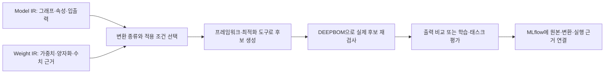

# 개발 중 fusion과 inverted residual을 비교하는 시나리오

목표는 **전체 모델의 역할과 외부 입출력을 유지하면서 내부 구현을 개선하는
실험 후보를 제안하는 것**이다. 내부 연산 수나 연결은 바뀔 수 있다. 같은
형상을 유지했다는 이유만으로 같은 함수를 계산한다고 판단하지 않는다.

## 두 종류의 변경

| 종류 | 예시 | 검증·학습 |
| --- | --- | --- |
| 추론용 그래프 변환 | 고정된 통계를 쓰는 Conv–BatchNorm folding, 지원 런타임의 Conv–activation fusion | 적용 조건과 수치 오차 확인, 대상 런타임 검증. 일반적으로 재학습 없이 적용 가능 |
| 구조 교체 | 일반 Conv 블록을 `1×1 expand → depthwise → 1×1 linear project (+ skip)`으로 변경 | 입출력·연결 검사 후 학습 또는 미세조정·증류, 태스크 품질 및 실행 성능 검증 |

ONNX Runtime은 basic optimization에 Conv–BatchNorm folding을 제공하고,
extended optimization에는 CPU의 Conv–activation fusion을 제공한다.
이 둘의 지원 범위는 같다 할 수 없으며, 이미 런타임에서 수행된 fusion을
새로운 최적화 이득으로 세면 안 된다.
[공식 graph optimization 문서](https://onnxruntime.ai/docs/performance/model-optimizations/graph-optimizations.html)

Inverted residual은 좁은 입출력 사이에서 채널을 확장하고 depthwise 연산을
수행한 뒤 선형 투영하는 구조다. 이 원리는 MobileNetV2에서 제안됐지만,
어떤 Conv든 같은 가중치로 그대로 바꾸거나 항상 더 싸게 만들 수 있다는 뜻은
아니다. [MobileNetV2 원 논문](https://arxiv.org/abs/1801.04381)

## 이번 실행 결과

임상 모델 대신, 입력·출력이 `[1,16,32,32]`인 작은 합성 ONNX 블록을 만들었다.
원본은 `3×3 Conv → BatchNorm → ReLU`이다. 모든 모델은 미학습 상태다.

| 변형 | 내부 구성 | 연산 수 | DEEPBOM 정적 MACs | 출력·개발 상태 |
| --- | --- | ---: | ---: | --- |
| 원본 | Conv → BN → ReLU | 3 | 2,359,296 | 비교 기준 |
| BN folding | Conv → ReLU | 2 | 2,359,296 | 시험 입력 16개에서 수치 오차 기준 통과 |
| Inverted e2 | expand 32 → DW → project 16 → skip | 6 | 1,343,488 | 원본 대비 MACs 약 43.06% 감소, 학습 필요 |
| Inverted e6 | expand 96 → DW → project 16 → skip | 6 | 4,030,464 | 원본 대비 MACs 약 70.83% 증가, 학습 필요 |

Fusion은 ONNX Runtime 1.23.2의 `ORT_ENABLE_BASIC`으로 실제 파일을 생성했다.
최적화된 파일에 Conv와 ReLU만 남았는지 검사했다. 따라서 이 예제는
**BN folding**을 보여주며, ReLU까지 하나의 커널에 결합했다고 주장하지 않는다.
가중치·bias는 folding에 맞게 변환되었으며 바이트가 동일한 것은 아니다.

검증 시에는 추가 graph optimization을 끈 CPU 세션으로 원본과 후보를 각각
실행했다. 0, 1, −1, impulse, 여러 크기의 정규분포 입력을 사용했다.
허용 오차는 실행 전에 `atol=1e-5`, `rtol=1e-4`로 정했고, 최대 절대 오차는
약 `7.63e-6`이었다. 이 입력들에서 통과했다는 결과이며 모든 입력에 대한
수학적 증명이나 태스크 정확도 검증은 아니다.

Inverted 후보는 두 확장 비율을 명시적으로 정해 생성했다. 확장·depthwise 뒤에
ReLU6를 사용하고 projection은 선형이며, 동일 입출력에 residual add를 연결했다.
새 가중치를 초기화했으므로 원본 출력과 달랐다. 두 후보 모두 기존 블록의
학습된 기능을 보존한 변환본이 아니며, 학습 전 구조 실험용 파일이다.

정적 MACs는 공통 DEEPBOM 엔진에서 계산하고, 작은 블록의 독립 계산과 대조했다.
BN folding에서 MACs가 같은 것은 정상이다. 제거한 BN 처리·중간 메모리 접근의
영향을 Conv MACs만으로 표현할 수 없으며, 속도 개선은 별도 실측이 필요하다.
이번 예제는 지연시간을 측정하지 않았다.

## DEEPBOM과 MLflow의 역할



Fusion의 적용 여부는 그래프, 연산 속성, dtype·양자화 조건, 중간 출력의 다른
사용자, 대상 런타임 등을 확인해야 한다. Weight IR의 필터 유사도만으로
fusion을 결정하지 않는다. Inverted 후보 역시 가중치 통계는 제안의 근거 중
일부이며, 정확도나 최적 구조를 직접 결정해 주지 않는다.

이번 스크립트는 MLflow에 네 run을 생성한다. 각 run에 실제 모델 SHA-256,
공통 검사 요약, 구조 diff, Weight IR를 포함한 분석, 그래프 SVG, 실행 비교
결과를 기록한다. 원본 파일과 시험 입력도 로컬 MLflow에 저장하고, 다시
내려받아 파일 해시와 지표·태그를 대조한다. 실행은 ONNX Runtime이 수행하며,
DEEPBOM이 모델을 실행했다고 기록하지 않는다. 실행 결과 JSON은 이 예제의
실험 기록으로, Activation IR를 생성·검증했다고 주장하지 않는다.

## 현재 구현과 다음 제품 기능의 경계

기존 Redesign의 `expand_ratio`는 **이미 inverted bottleneck으로 식별된
블록**의 확장 비율을 바꾸는 기능이다. 현재 `RedesignBlockEdit`에는
`replace_with=inverted_residual`이나 fusion rewrite 항목이 없다.

추가한 예제는 합성 블록의 fusion과 구조 교체를 실제로 실행·비교하는 개발
시나리오다. 임의의 기존 모델에서 최적 블록을 자동으로 고르고 변환하는 범용
기능이 완성된 것은 아니다. 그 기능에는 적용 조건·예외, 가중치 이식·재학습
구분, 원본 연산과 새 연산의 대응, 출력·런타임 검증 결과를 연결하는 처리가
필요하다. 공통 IR에 원본 관찰과 새 후보 증거를 각각 유지해야 한다.

## 학습 전 모델 입력과 출력: 추가 구현 목표

아래는 2026-10-07에 정리한 제품 요구사항이며, 현재 배포된 CLI 명령이나
지원 보장이 아니다. 위 ONNX 실험은 추론 변환을 검증한 것으로, 수정한 모델의
역전파나 학습 가능성을 검증한 결과로 사용할 수 없다.

파일·모델 생성 함수·메모리 객체별 입력과 CLI/Python 호출 시점은
[학습 모델 진입점 제안](TRAINABLE_ENTRY_POINTS.ko.md)에 예시로 정리한다.

### 제품의 중심: 사용자의 모델을 바꾼 뒤 학습한다

기본 사용자 흐름은 **자기 모델 입력 → 구조 후보 생성 → 비교·조건 수정·재생성
→ 후보 선택 → 자기 데이터와 학습 코드로 학습 → 학습 중·완료 근거 분석**이다.
추천 결과를 한 번의 작업으로 받을 수 있어야 하며, 개별 변경의 적용 위치와
이유는 펼쳐서 확인한다. 사용자가 변환 pass를 하나씩 직접 조립하는 것을 기본
경험으로 삼지 않는다.

구조 후보 검토는 본 학습과 독립적으로 반복할 수 있어야 한다. 추천 후보를
좋아하지 않으면 블록 유지·변환 제외·변경 폭·비용 목표를 조정해 다시 생성한다.
원본·이전 후보·선택 이력은 보존하며, 구체적인 후보를 선택한 뒤 학습 코드에
연결한다. [별도 검토 루프의 CLI/API 제안](TRAINABLE_ENTRY_POINTS.ko.md#5a-학습과-독립적인-후보-검토-루프)을
따르고, `optimize` 호출을 본 학습 시작으로 취급하지 않는다.

이 경로에서는 구조와 함수가 달라지는 것이 허용된다. 원본과 출력이 동일해야
한다는 조건을 후보 생성의 기본 제약으로 걸지 않는다. 반드시 유지할 입력·출력
계약, 과제에 필요한 구조 제약, 변경 가능한 영역, 타겟과 비용 목표를 구분한다.
추론 비용 우선·학습 메모리 우선 등의 preset을 제공하고 사용한 가정을 기록한다.
일반적인 Conv를 inverted residual이나 재매개변수화 블록으로 바꾸는 것도
지원 패턴과 제약이 맞으면 구조 후보에 포함한다.

자동화는 후보 탐색·구조 변경·기본 학습 검증·결과 패키징까지 수행한다.
첫 출력의 기본 범위는 학습 가능한 추천 후보 하나와 변경 보고서이며, 추가 후보와
비용의 상충 관계도 확인할 수 있게 한다. 후보는 새로 학습할 모델로 다루고,
warm start는 가중치 이식 규칙이 있는 경우에 선택한다. 미학습 가중치의 분포를
근거로 과제 품질이나 채널 중요도를 확정하지 않는다. 비용 추정·해당 환경의
실측·학습 후 품질 결과는 각각 별도 필드와 표시 상태를 갖는다.

입력은 학습 가능한 모델 정의와 입력 계약이어야 한다. **PyTorch와 TensorFlow를
사용하는 Keras 학습 모델을 모두 핵심 지원 대상으로 둔다.** 각각의 어댑터가 모델
생성 함수 또는 지원되는 저장 형식, 생성 인자, 입력 shape·dtype·동적 차원 제약을
받는다. 초기 가중치는 선택 사항이다. `state_dict`만으로 임의의 `forward`를
복원하지 않는다. 사용자 정의 계층·공유 파라미터·동적 제어 흐름은 지원 여부를
명시한다. 파일 확장자를 읽을 수 있다는 것과 모델을 재구성할 수 있다는 것은
별개의 기능이다.

### 두 학습 프레임워크의 공통 지원 계약

| 경로 | 우선 지원할 입력 | 학습 가능한 출력 | 학습 기록 연결 |
| --- | --- | --- | --- |
| PyTorch | 그래프 추출이 가능한 `nn.Module` 생성 함수, 설정, 선택적 초기 state | 후보 `nn.Module` 정의·설정·state와 재로딩 방법 | 학습 루프 collector, 명시적인 forward/backward/optimizer 경계 |
| TensorFlow/Keras | TensorFlow backend의 Functional/Sequential 생성 함수 또는 재구성 가능한 `.keras` 모델 | 후보 Keras 모델과 `.keras` 산출물, 필요한 custom object와 설정 | `fit` callback 및 custom training loop 수집 지점 |

두 경로는 같은 최적화 요청·변경 보고서·IR 연결·시각화 계약을 사용하고, 입력한
프레임워크에서 계속 학습할 수 있는 모델을 반환한다. 이를 PyTorch↔TensorFlow
모델 변환 기능으로 해석하지 않는다. 실제 지원은 프레임워크·Keras·어댑터 버전과
연산·변환 패턴의 조합으로 관리한다. 특정 조합에서 실행되지 않은 변환은 동일한
지원으로 표시하지 않는다. 최초 공통 지원 범위의 완료 기준에도 두 경로의 학습
한 스텝·저장·새 프로세스 재로딩 검증을 모두 포함한다.

Subclassed Keras와 순수 `tf.Module`은 모델 생성 함수·명시적 구조 어댑터로 지원을
확장할 대상이다. SavedModel의 실행 signature나 동결 그래프를 읽는 것만으로
편집 가능한 Keras 모델을 복원했다고 하지 않는다. Keras 2의 `tf.keras`와 Keras 3
조합은 별도로 명시하며, Keras의 다른 backend까지 TensorFlow 검증 결과로
포함하지 않는다. [Keras 모델 재구성 계약](https://keras.io/api/models/model_saving_apis/model_config_serialization/)
상 subclassed 모델과 공유 객체에는 추가 처리가 필요하다.

PyTorch [FX](https://docs.pytorch.org/docs/2.14/fx.html)는 `nn.Module`의 그래프를
변환하고 새로운 `GraphModule`을 만드는 기반을 제공한다. Keras의
[clone_model](https://keras.io/api/models/model_saving_apis/model_config_serialization/)
역시 지원되는 모델의 계층 교체에 활용할 수 있다. 프레임워크가 실행·미분·변환을
담당하고, DEEPBOM은 적용 조건·대응 관계·공통 계산·검증 근거를 관리한다.
로컬 모델 생성 함수 실행은 사용자가 명시적으로 선택하는 개발 경로로 두며,
기존 정적 `audit`나 ChatGPT 첨부 분석에서 암묵적으로 실행하지 않는다.

### 최적화 전후 구조 비교를 기본 결과로 제공한다

후보를 반환할 때 CLI 요약·공통 JSON과 로컬에서 열 수 있는 비교 HTML을 함께
제공하는 것을 목표로 한다. 화면 첫 진입에는 양쪽 전체 그래프를 무조건 축소해
보여주지 않고, 변경 블록 요약과 읽을 수 있는 크기의 해당 구간을 보여준다.

| 비교 화면 | 확인할 내용 |
| --- | --- |
| 원본·후보 나란히 보기 | 동기화된 선택·이동, 바뀐 블록으로 이동, 블록 펼치기와 연산 상세 |
| 변경만 보기 | 유지·수정·교체·추가·삭제·분할·병합 및 연결 재배선 |
| 선택한 블록 상세 | 전후 op/속성, 입력·출력 shape, 채널·kernel·stride·groups, 변경 이유와 적용 규칙 |
| 비용 차이 | 동일 입력 조건에서 MAC·정확히 확인된 파라미터·텐서 크기·메모리 추정의 전후 값과 계산 범위 |
| 가중치 처리 | 새 초기화·이식·변환·삭제, 공유 파라미터 관계 변화 |
| 학습 근거로 이동 | 선택한 블록에 대응하는 checkpoint·Weight IR·Activation IR·학습 기록 |

색뿐 아니라 텍스트와 기호로 변경을 표시한다. 변하지 않은 문맥은 접어서 유지하고,
그래프에는 pan·zoom·스크롤을 제공한다. UI는 공통 diff를 렌더링하며 비교나 비용
계산을 다시 구현하지 않는다. CLI·HTML·Web에서 같은 근거의 수치와 변경 분류가
일치해야 한다.

예를 들어 Conv 한 개를 inverted residual 블록으로 교체하면 원본 Conv와 후보의
확장 Conv·depthwise·projection을 하나의 교체 묶음으로 연결한다. 노드가 삭제되고
여러 개 추가됐다는 목록만 보여주지 않는다. 원본과 후보의 연산 수가 달라도 클릭
한 번으로 대응 영역과 외부 입출력, 내부 형상 변화를 확인할 수 있어야 한다.

대응은 변환 단계가 생성하는 변경 manifest를 우선 사용한다. Manifest는 원본·후보
그래프 및 설정 식별자, 변환 규칙 버전, 실제 source/target subject reference,
일대일·일대다·다대일 관계를 포함해야 한다. 참조와 해시를 실제 두 모델에 대조하고,
변환기가 대응을 기록했다는 사실을 함수 동등성이나 정확도 유지의 증명으로 삼지
않는다. 기록이 없는 외부 모델 비교에서는 유일하게 확인된 구조·계약 대응만
연결하며, 이름·노드 순서·화면 위치만으로 동일 레이어를 결정하지 않는다.

기존 `artifact-diff.js`와 `semantic-artifact-diff.js`는 같은 아티팩트 형식의 비교를
요구하며, 전자는 유일한 구조·계약 대응, 후자는 직렬화된 좌표의 변경을 다룬다.
기존 format 검사를 제거해 학습 모델 비교를 우회하지 않는다. 학습 어댑터의
Model IR 투영과 변환 manifest를 소비하는 공통 구조 비교 계약을 별도로 정의하고,
기존 수치 표현·검증·렌더링 요소를 재사용한다. 프레임워크 사이의 연산 대응까지
확인하지 않은 상태에서 범용 교차 프레임워크 diff를 지원한다고 하지 않는다.

계산은 동일한 batch·입력 shape·dtype·계산 범위에서 비교한다. NCHW/NHWC와
kernel 축, groups, padding, shared variable, trainable/non-trainable state를
명시적으로 투영한다. Trainable 파라미터는 학습 프레임워크에서 확인한 속성과
공유 관계를 근거로 세며 직렬화 저장량에서 추정하지 않는다. 논리 activation
크기의 합·생존 구간 기반 추정·실측 peak 메모리를 분리하고, 기준값이 0이거나
범위가 다르면 부정확한 증감률을 만들지 않는다.

비교의 수용 기준에는 양 프레임워크의 블록 교체·분기·공유 계층·다중 입출력,
변경 없는 모델, 모호한 대응, 틀린 manifest, 지원하지 않는 연산을 포함한다.
기록된 수정 외의 변경도 탐지하고, 원본 노드와 후보 노드를 각각 빠짐없이
계수해야 한다. 공통 의미와 입력 조건이 같은 양쪽 fixture의 구조·MAC 비교도
검증한다. 기존 프레임워크 학습 모델을 넣어 실제 후보를 받고 이 화면까지 여는
통합 검증이 완료되기 전에는 합성 ONNX 비교만으로 기능 완료를 선언하지 않는다.

### 변환 목적을 구분한다

| 목적 | 학습 전 또는 학습 중 처리 | 배포 시 확인 |
| --- | --- | --- |
| Fusion이 가능한 연결 유지 | 지원 백엔드의 Conv–BN–activation 패턴과 분기·layout 변환을 검사하고, 의미를 보존할 수 있는 경우에만 그래프를 정리 | 고정된 추론 모드에서 실제 folding·fusion 여부와 수치 오차 검사 |
| 구조적 재매개변수화 | 지원되는 위치에 RepVGG/MobileOne 계열의 학습용 블록을 구성하고 학습 | 정해진 변환식으로 배포용 블록을 만들고 학습 모델의 eval 출력과 비교 |
| 구조 탐색 | 채널 수·expansion·블록 종류를 바꾼 학습 가능한 후보 생성 | 후보를 학습·평가한 뒤 품질·메모리·지연시간 비교 |
| 학습 메모리 감소 | 지원 구간의 activation checkpointing 등 적용 | 역전파·학습 결과와 메모리 감소, 추가 계산 비용을 함께 확인 |
| 추론 메모리·접근 비용 감소 | 중간 activation 크기, 텐서 생존 구간, 불필요한 복사·layout 전환을 줄일 후보 탐색 | 대상 런타임의 실제 peak 메모리·복사·지연시간 측정 |

`Conv → ReLU → BN`을 `Conv → BN → ReLU`로 바꾸는 것은 일반적인 동등 변환이
아니다. 구조 변경 후보로 제시하고 학습해야 한다. 단순한 노드 표시 순서 변경도
실행 스케줄이나 메모리 배치 개선으로 해석하지 않는다. 런타임이 이미 같은
최적화를 수행한다면 DEEPBOM 적용 이득을 중복 계상하지 않는다.

[RepVGG](https://openaccess.thecvf.com/content/CVPR2021/html/Ding_RepVGG_Making_VGG-Style_ConvNets_Great_Again_CVPR_2021_paper.html)는
학습 시 여러 분기를 두고 추론 시 단일 경로로 변환하는 선행 사례다.
[MobileOne](https://machinelearning.apple.com/research/mobileone)도 배포 지연시간을
고려한 구조 설계의 사례다. 이 원리를 적용할 때는 지원 블록의 선형 분기 합산,
공간 정렬, stride·padding·groups, 고정된 BN 통계 등의 조건을 검사해야 한다.
분기마다 비선형 활성화가 들어간 임의의 구조를 하나의 Conv로 합칠 수는 없다.
학습용 분기를 늘리면 학습 비용과 메모리는 오히려 증가할 수 있다.

일반적인 [Conv–BN folding](https://docs.pytorch.org/tutorials/intermediate/torch_compile_conv_bn_fuser.html)은
고정된 통계를 사용하는 추론 변환이다. 이를 학습 전부터 적용해 BN 학습 동작을
제거하지 않는다. 반대로 [activation checkpointing](https://pytorch.org/blog/activation-checkpointing-techniques/)
은 재계산으로 학습 메모리를 줄인다. 학습 메모리와 추론 메모리를 같은 수치로
보고하지 않으며, MAC 감소를 peak 메모리나 지연시간 감소로 대신 보고하지 않는다.

### 공통 IR와 출력 계약

원본·학습 후보·배포 산출물은 각각 별도의 식별자를 갖는다. Model IR에는 관찰된
그래프와 원본 연산의 대응을, Weight IR에는 식별 가능한 가중치 스냅샷의 분석을
연결한다. 변환 설정·코드·학습 실행·산출물 사이의 관계는 Provenance IR의 공통
규칙으로 연결한다. 실측은 측정 범위와 입력·환경 식별자를 갖는 실행 증거로
연결하고, Activation IR의 지원 계약과 맞는 캡처만 그 형식으로 가져온다.
현재 스키마에 표현되지 않는 정보는 정식 계약 확장 검토 없이 기존 필드에
끼워 넣지 않는다. 공통 엔진의 shape·MAC·통계 계산을 어댑터에서 중복 구현하지
않으며, 지원하지 않는 계산은 범위와 이유를 기록한다.

출력에는 다시 불러와 학습할 수 있는 모델 정의·설정과 가중치, 변경 계획,
원본–후보 대응, 재사용·변환·새 초기화·제거된 파라미터의 구분, 검증 결과가
포함되어야 한다. 변경된 파라미터에 기존 optimizer state가 그대로 적용된다고
가정하지 않는다. ONNX/TFLite 파일만 생성하고 학습 모델을 반환했다고 하지 않는다.

최소 검증은 새 프로세스에서 재로딩한 뒤 forward, 유한한 loss·gradient,
의도된 trainable 파라미터의 gradient 연결, optimizer step, 저장·재로딩을
확인하는 것이다. 동등 변환은 출력·gradient 비교 범위와 허용 오차를 정하고,
추론 전용 변환은 eval 출력만 비교한다. 구조 교체는 원본과의 수치 동일성을
요구하지 않지만 입출력 계약과 실제 과제 품질을 별도로 검증한다. 학습 한 스텝
성공은 수렴이나 품질 유지의 증명이 아니다.

학습 중 분석은 주기적으로 정확한 저장 상태와 Model IR에 결합한 Weight IR를 기록하는
방향이다. 분포·채널 통계·희소성·특이값을 기존 공통 분석으로 계산하고 MLflow에
연결한다. 파일/구조 대응이 없는 live 관찰은 Training 기록으로 보존하며, step·epoch만으로
기존 Weight IR를 생성하지 않는다. gradient·activation·시간 변화는 별도의 캡처가 필요하며, 현재 Weight IR
단독으로 관찰했다고 주장하지 않는다. 전체 텐서 분석의 시간·메모리 비용을
고려해 기록 주기와 분석 예산을 지정한다. 실시간 학습 callback과 TensorBoard
수준의 이력 UI는 별도 구현 항목이다.

### Training IR와 선택된 모델의 근거

공통 이름과 책임은 [Training lifecycle 설계](../../docs/evidence-ir/TRAINING_LIFECYCLE.md)를
따른다. **Training IR**는 관찰된 라이프사이클·시간축·학습 고유 증거와 시점별 상태
참조를 가진 불변 snapshot이다. 종료 후에도 같은 IR 종류를 유지하며, 별도
**Trained IR는 만들지 않는다.** 기존 Model·Weight·Activation·Provenance IR의
계산과 책임은 유지한다. 선택적 **Training Result Manifest**는 특정 checkpoint의
선택 근거와 관련 문서를 참조하는 포장이다. Training IR 사용의 필수 조건은 아니다.
Training IR·manifest·live 학습 수집기는 미구현 설계이며 위의 실행 결과와 구분한다.

| 단계 | 사용자에게 보여줄 내용 | 근거 연결 |
| --- | --- | --- |
| 학습 전 설계 | 원본과 후보 구조, 변경 블록, 예상 비용, 재매개변수화 계획 | 각 모델의 Model IR, 변경 manifest, 코드·설정 식별자 |
| Training history | 관찰 시점별 lifecycle·loss·gradient·optimizer 맥락, 연결 가능한 수치 근거 | Training IR와 정확히 대응한 checkpoint의 Weight/Activation IR; 미대응 관찰은 별도 유지 |
| Selected model evidence | 선택한 checkpoint, 제공된 학습 이력, 해당 상태의 구조·수치·평가 | 선택적 Training Result Manifest; artifact에 결합된 Provenance IR; 마지막 checkpoint와 동일시하지 않음 |
| 배포 변환 | 학습 모델과 배포 모델의 대응, 변환 내역, 수치 회귀·대상 런타임 측정 | 별도 배포 산출물의 IR와 검증 기록 |

Training 화면은 그래프에서 레이어를 선택하고 epoch·step 슬라이더를 움직이면
그 시점의 weight histogram, activation 분포·영점 비율·유한성, 수집된 gradient
지표를 함께 보여주는 형태로 설계한다. 입력마다 달라지는 activation을 비교할
때는 고정 probe와 실제 학습 batch를 구분한다. 그래프의 정적 연결과 특정 실행에서
관찰한 텐서 전달을 구분하고, 상관관계로 레이어 간 인과적 영향이나 중요도를
확정하지 않는다. 캡처하지 않은 지점은 미수집으로 표시한다.

시계열 정합성의 최소 조건은 다음과 같다.

- 구조·checkpoint·run·step·phase·입력의 식별자를 함께 기록한다. Epoch만으로
  스냅샷을 연결하지 않는다. 재시작·분산 rank·microbatch·gradient accumulation을
  구분하고, optimizer 갱신 전후의 어느 상태인지 명시한다.
- Activation과 연결된 weight·BN buffer는 그 forward가 실제로 사용한 상태여야
  한다. optimizer step 이후의 weight를 직전 forward의 값으로 잘못 붙이지 않는다.
  수집한 상태를 불변 snapshot으로 만든 뒤 분석하고, 변경 중인 텐서를 비동기로
  읽어 서로 다른 시점의 값이 섞이는 것을 방지한다.
- 모듈 이름만으로 연결하지 않는다. 공유 모듈의 여러 호출, control-flow 경로,
  구조 변경 전후의 일대다·다대일 대응을 명시하고, 불명확한 대응은 남겨 둔다.
- Histogram은 bin 경계와 표본 수, 채널 비교는 축·shape·대응을 함께 기록한다.
  표본추출·잘림·미수집 범위를 표시하며 표본 통계를 전체 텐서의 정확한 값으로
  표시하지 않는다. 수집·복사·분석 비용도 기록 주기와 예산에 포함한다.
- Train/eval, AMP와 loss scaling, checkpoint 재계산·compile 여부를 기록한다.
  재계산 때문에 발생한 중복 hook 호출을 새 학습 step으로 세지 않는다. gradient는
  weight와 별도 관찰량으로 취급하고, optimizer 적용 전의 어느 시점에 수집했는지
  기록한다. 현재 Activation IR의 직접적인 gradient 지원으로 간주하지 않는다.
- 선택한 checkpoint는 last인지, 어떤 validation 기준으로 고른 best인지 기록한다.
  Training 완료 상태와 품질 검증 상태는 별도로 표시한다. 중단된 run도 관찰 기록은
  남길 수 있지만 완료된 학습으로 표시하지 않는다.

현재 Activation IR는 입력·실행·환경과 Model IR의 value reference를 연결하는
기반을 제공한다. 기존 실행 수집기는 ONNX/LiteRT 경로이며, PyTorch/Keras 학습
callback이 이미 구현된 것은 아니다. 학습 어댑터는 위 시점·phase·호출 대응을
표현하고 검증하는 캡처 프로파일을 추가해야 한다. 동적인 학습 모델을 deployment
export와 같은 그래프로 가정하지 않으며, 정확한 구조 투영과 연결할 수 없는
관찰은 임의의 Model IR value에 붙이지 않는다.

학습 프레임워크는 학습을 실행하고, MLflow는 run과 metric·artifact를 저장한다.
DEEPBOM은 그 안에서 구조·수치·실행·계보를 대응시켜 분석한다. 사용자는 기존
학습 루프에 collector/callback을 연결하는 방식으로 시작하고, 전체 학습 플랫폼을
교체할 필요가 없게 한다. 위의 자동 구조 변환·학습 callback·시계열 탐색 화면은
각각 추가 구현 항목이며, 이 문서 수정으로 지원 기능이 새로 생긴 것은 아니다.

## 실행

기존 SDK 예제 환경에서 다음을 실행한다. 외부 모델은 실행하지 않으며,
스크립트가 생성한 작은 합성 모델만 CPU에서 실행한다.

```sh
. .local-validation/sdk-venv/bin/activate
python -m pip install -r examples/integrations/requirements-architecture.txt
python examples/integrations/fusion_inverted_study.py
```

결과는 `.local-validation/mlflow-architecture/study-*/RESULTS.md`에 생긴다.
각 하위 폴더의 `graph.svg`와 `weight-analysis.json`에서 구조와 Weight IR를
확인한다. MLflow 실험 이름은 `deepbom-fusion-inverted-development`다.

```sh
mlflow ui --backend-store-uri sqlite:///.local-validation/mlflow-architecture/mlflow.db \
  --host 127.0.0.1 --port 5000
```
