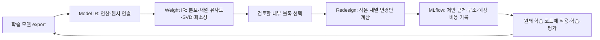

# 개발 단계에서 사용하는 Weight IR · Redesign · MLflow

Fusion이나 일반 Conv를 inverted residual로 교체하는 개발 흐름은
[구조 변환 시나리오](MLFLOW_ARCHITECTURE_SCENARIO.ko.md)에 별도로 구현했다.
아래 예제는 내부 연결까지 유지하는 채널 조정 실험이다. 구조 변환 시나리오는
외부 입출력을 유지하면서 내부 연산과 연결이 달라지는 경우를 다룬다.

**학습한 모델에서 개선할 곳을 찾고, 작은 구조 변경을 실험하며, 근거와 결과를
함께 축적하는 시나리오**다. DEEPBOM은 다음 실험의 설계를 돕고, MLflow는
설계 근거와 이후의 학습·평가 결과를 같은 개발 이력으로 연결한다.



## 이번에 실제 연결한 개발 실험

저장소의 `mobilenet_v1_025_224_float.tflite`를 분석했다. Weight IR의
`binding_refs → Model IR weight_bindings → operation_ref`를 따라가서
가중치를 실제 연산과 연결하고, 그 연산의 구조 블록을 찾는다. 텐서 이름에서
레이어 위치를 추측하지 않는다.

이 예제의 선택 규칙은 공개된 단순 휴리스틱이다. 출력 채널이 64개 이상인
내부 depthwise-separable 블록의 pointwise 가중치 중, 필터 간 signed cosine
0.95 이상인 쌍이 관찰되고 다른 연산과 가중치를 공유하지 않는 대상을 찾는다.
그중 원본 MAC 기여가 가장 큰 블록을 우선한다. 근거가 없으면 임의의 후보를
만들지 않는다. 관찰하지 못한 유사도도 0으로 간주하지 않는다.

실제 선택은 다음과 같다.

- 블록: `block_006`, 연산: `operator:scope:tflite:subgraph:0:12`
- 가중치: `weight:20`, `MobilenetV1/Conv2d_6_pointwise/weights`
- 형상: `[128,1,1,64]`, 값 8,192개
- 필터 0과 100의 cosine: 약 **0.951223**
- 선택한 가중치는 별도 분석 예산으로 SVD를 다시 요청해 전체 특이값을 계산했다.

이 쌍은 **살펴볼 이유**다. 두 필터의 기능이 같거나 8개·16개 채널을 안전하게
없앨 수 있다는 증거는 아니다. 변경량 8·16은 명시적으로 정한 실험 크기이며,
유사도에서 도출한 허용 제거량이나 타겟의 필수 정렬 조건이 아니다.

## 큰 구조를 유지하는 자동 제안

선택 블록의 출력 채널만 `128 → 120`, `128 → 112`로 요청한다.
입력 해상도, 전역 width multiplier, dtype, 커널 크기, 블록 반복 수는 유지한다.
공통 Redesign 엔진이 다음 연산들로 채널 변화가 어떻게 전달되는지 계산한다.

| 실험 | 선택 블록 채널 | 구조상 예상 MACs | 원본 대비 | 직렬화 파라미터 원소 수 | 예상 peak live activation bytes |
| --- | ---: | ---: | ---: | ---: | ---: |
| 원본 | 128 | 41,030,528 | 기준 | 467,593 | 1,204,224 |
| 국소 변경 A | 120 | 40,715,360 | −0.7681% | 465,969 | 1,204,224 |
| 국소 변경 B | 112 | 40,400,192 | −1.5363% | 464,345 | 1,204,224 |

세 경우 모두 다음 조건을 프로그램으로 대조했다.

- 입력 `[1,224,224,3]`, 출력 `[1,1001]`, dtype 유지
- 31개 연산의 종류·식별자·연결·블록 소속 유지
- 원본 바이트와 SHA-256 유지
- Redesign 계약의 error 항목 없음

채널 폭과 연결되는 가중치 형상은 바뀐다. 따라서 기존 weight를 그대로 넣어
실행할 수 있는 새 모델이 만들어졌다는 의미는 아니다. 후보의 shape 계산은
31개 중 **28개 exact shape rule, 3개 serialized-shape scaling fallback**이며,
이 범위도 MLflow에 따로 기록한다. 표는 이 계산 가정하의 제안 수치다.

실제 속도는 측정하지 않았고 정확도도 알 수 없다. 이 국소 변경에서 전체 MAC
감소는 작고, 예상 peak activation도 줄지 않았다. 이것도 유용한 개발 결과다.
학습 비용을 쓰기 전에 이 정도의 변경을 실험할 가치가 있는지 판단할 수 있다.

## Weight IR로 병행할 수 있는 검토

이번 실행은 원본의 저장 객체 56개, 값 467,593개를 분석했다. 전체 예산 안에서
채널 분석 35개, 유사도 48개, SVD 34개가 평가됐고 나머지는 이유와 함께 남는다.
선택한 텐서에는 별도 요청을 사용해 SVD까지 계산했다. 출력물에 포함된 그림은
기존 웹 Weight workbench와 같은 렌더러의 분포·채널·유사도·특이값·희소성 SVG다.

같은 텐서의 50% magnitude-mask 시뮬레이션도 별도 JSON에 포함한다. 이 경우
4,096개 값을 새로 0으로 만들어 가중치 제곱합의 약 **98.7136%**를 유지했다.
이는 **가중치 에너지**이며 정확도 보존율이 아니다. 텐서 크기는 그대로이고,
새 TFLite 파일이나 희소 커널의 속도 향상을 만든 결과도 아니다.

SVD·유사도는 관찰한 가중치의 정적 구조를 보여준다. Activation IR나 실제
검증 데이터 평가를 더하면 입력별 중요도와 출력 변화까지 살펴볼 수 있다.
현재 데모에서는 실행 증거를 생성하지 않았다.

## MLflow의 개발 실험 구성

실험 이름은 `deepbom-weight-guided-development`이며 run은 세 개다.

| Run | 상태 | 내용 |
| --- | --- | --- |
| `baseline` | `development_reference` | 원본 IR, Weight 분석·시각화, 선택 근거, 전체 비교 보고서 |
| `local-channels-120` | `ready_for_training_experiment` | 변경 요청, 전파 결과, 예상 비용, 구조 코드 초안 |
| `local-channels-112` | `ready_for_training_experiment` | 변경 요청, 전파 결과, 예상 비용, 구조 코드 초안 |

후보는 아직 파일이 없으므로 후보 모델 SHA-256을 만들지 않는다. **원본 파일
SHA-256 + 변경 요청 SHA-256 + projection SHA-256**으로 제안을 식별한다.
후보 run에는 원본 run ID를 연결한다. 지표 이름은 `projection.*`로 구분하며
실측 정확도·지연시간은 채우지 않는다.

PyTorch·Keras 구조 코드 초안도 기존 codegen으로 생성했다. 가중치를 포함하지
않고 원래 학습 코드를 복원한 것이 아니다. 이번 계획은 exact codegen 2개,
scaffold 29개이며, 생성된 Python 파일 8개의 문법을 확인했다. 실제 개발에서는
**원래 학습 코드에 변경안을 적용하는 방법**을 우선하고, 이 초안은 구조 확인과
구현 계획에 사용한다.

다음 학습 실험은 다음 항목을 연결하면 된다.

1. 선택한 proposal run ID 및 요청·projection 해시
2. 원본 체크포인트와 호환되는 weight 이식 방법, 코드 commit, 데이터 split,
   seed, 학습 설정
3. 학습 후 export한 실제 후보의 SHA-256과 새로운 DEEPBOM 검사 결과
4. 같은 데이터에서의 품질 지표·출력 변화, 같은 실행 환경에서의 지연시간·메모리

`FINISHED`는 MLflow 기록 완료를 뜻한다. `ready_for_training_experiment`도
학습·평가가 끝났다는 의미가 아니다. 이번 데모는 후보 제안과 기록까지 실제
실행했으며 학습·추론·배포는 수행하지 않았다.

## 실행·열람

[기존 예제 설치](README.md#install-and-run-from-this-checkout)를 완료하고
Node가 PATH에 있는 이 저장소에서 실행한다.

```sh
. .local-validation/sdk-venv/bin/activate
python examples/integrations/mlflow_development.py
```

콘솔에 생성된 `study-*/index.html` 경로와 MLflow UI 시작 명령이 출력된다.
HTML을 열면 비교 표와 가중치 그림, 제안별 코드·근거 링크를 볼 수 있다.
MLflow 화면에서는 세 run을 선택하여 비교한다. 결과는 기본적으로
`.local-validation/mlflow-development/` 아래에만 저장된다.

## 현재 지원 범위

Weight IR는 여러 형식의 payload를 공통 표현으로 분석한다. 이 **국소 자동
제안 예제는 standalone TFLite의 해당 블록 패턴**을 대상으로 한다. 다른 형식도
같은 수준으로 자동 재설계된다고 주장하지 않는다.

이 예제는 checkout의 공통 Weight·Redesign·시각화 모듈을 직접 재사용한다.
별도 계산 엔진이나 새 IR를 추가하지 않았고, 안정된 공개 SDK API를 추가한
것도 아니다. 기존 CLI에서는 `audit --weight-analysis`, `explore --request`를
사용할 수 있지만, 후자는 해상도·width grid를 탐색한다. 이번 예제처럼 선택한
블록의 작은 변경만 고정 비교하는 흐름은 별도의 예제 선택 규칙으로 구성했다.

선택 규칙을 운영 기능으로 확장하려면 포맷별 구조 지원, 사용자가 지정한
제약조건, 후보별 원본 학습 코드 연결, 학습·실측 결과의 환류를 더해야 한다.
이번 결과는 그 개발 흐름을 직접 확인할 수 있는 제한된 실행 예제다.
