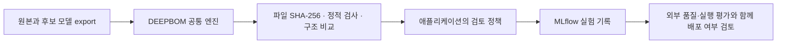

# MLflow 연결 시나리오: 모델 교체 전 검토 근거를 실험 기록에 남기기

모델 개발팀이 기존 모델을 새 후보로 교체하려고 한다. 학습 실험의 점수만
비교하는 대신, **실제로 배포할 파일이 무엇이고 기존 서비스의 입출력 계약을
유지하는지**도 같은 MLflow 실험에서 확인한다.

DEEPBOM은 파일을 검사하고 원본·후보의 차이를 계산한다. MLflow는 그 결과와
검토 결정을 실험별로 보관한다. 이미 있는 학습·평가 파이프라인의 **모델 export
직후, 배포 승인 이전**에 이 단계를 넣는 시나리오다.



## 이번 예제의 실제 결과

동일한 입력 `[1,4]`를 받는 작은 ONNX 모델 세 개를 생성한다. 연산은
`MatMul → Relu`이고, 학습되지 않은 연결 검증용 예제다. 의료 성능이나
최적화 이득을 입증하는 모델이 아니다.

| MLflow run | 변경 사항 | 출력 형상 | 정적 MACs | 아티팩트 결함 | 검토 결과 |
| --- | --- | --- | ---: | ---: | --- |
| `baseline` | 비교 기준 | `[1,2]` | 8 | 0 | `reference_only` |
| `candidate` | 가중치 값 하나 변경 | `[1,2]` | 8 | 0 | `hold_for_external_evaluation` |
| `incompatible` | 출력 너비 변경 | `[1,3]` | 12 | 0 | `reject` |

MAC 수는 DEEPBOM 결과이며, 예제 생성기가 `4 × 출력 너비`라는 독립적인
계산과 일치하는지도 확인한다. 세 모델 모두 연산 2개, 주의사항 2개,
증거 공백 관련 finding 2개로 확인됐다. 미평가 capability 수는 별도 기록한다.

출력 너비 변경은 유효한 ONNX 파일에서도 발생한다. 따라서 `incompatible`은
파일 파손 때문에 거부된 것이 아니라 **기존 서비스의 출력을 그대로 유지한다는
이 예제의 교체 정책**에 맞지 않아 거부된다. 새로운 인터페이스로 서비스를
변경하는 프로젝트라면 별도의 정책과 검토가 필요하다.

`candidate` 역시 배포 승인 상태가 아니다. 입력·출력 형상이 같고 결함이
없어도 예측값, 정확도, 지연시간이 유지된다는 뜻은 아니다. 이 실행의 diff에서는
대응하는 저장 객체의 payload digest가 충분하지 않아 가중치 동일성도
`not_assessable`이다. 예제에서 가중치 하나를 바꿨다는 사실은 생성 설정에서
알 수 있지만, 이를 비교기가 증명한 수치적 가중치 차이로 보고하지 않는다.

## MLflow에서 무엇을 보는가

실험 이름은 `deepbom-release-review`다. 한 번 실행할 때 세 run이 만들어지고,
공통 `deepbom.scenario_id` 태그로 묶인다. 두 후보는 `review.baseline_run_id`로
정확한 기준 run을 참조한다.

| 위치 | 저장 내용 | 용도 |
| --- | --- | --- |
| Tags | 파일 SHA-256, Evidence Envelope SHA-256, 엔진 버전 | 같은 이름의 다른 파일을 구분 |
| Tags | 검토 정책, 후보별 결정, 외부 평가 부재 | 정상적인 스크립트 종료와 배포 승인을 구분 |
| Metrics | 파일 bytes, 연산 수, MACs, 결함·주의·공백 수, 검사 범위 | 세 run을 나란히 비교 |
| Artifacts / `deepbom/summary.json` | 공통 SDK 요약 | 검사 범위와 제한 확인 |
| Artifacts / `deepbom/evidence.json` | 전체 Evidence Envelope | 요약의 근거 확인 |
| 후보 Artifacts / `comparison.json`, `decision.json` | 구조 비교와 예제 정책의 판단 이유 | 왜 보류·거부됐는지 추적 |
| 기준 Artifacts / `contract.json`, `verification.json` | 기준 파일의 계약과 자체 검증 | 비교 기준 보존 |

MLflow의 `FINISHED`는 기록 절차가 완료됐다는 뜻이다. **교체 가능 여부는
`review.disposition`과 `decision.json`에서 확인**한다. 모델 바이트는 로컬 검토
bundle에 남고 MLflow에는 위 JSON만 기록한다. JSON에도 모델 이름·구조가
포함되므로 실제 연결에서는 승인된 저장소를 선택해야 한다.

알 수 없는 MACs는 0으로 기록하지 않는다. MLflow 수치 지표는 부동소수점이므로
정확하게 표현할 수 없는 큰 MAC 수도 지표에서 제외하며, 전체 값과 평가 상태는
원본 JSON에 남긴다. 파일 해시는 무결성 연결이며 제조사 서명·신뢰 인증은 아니다.

## 실행 방법

이 저장소의 [기존 설치 절차](README.md#install-and-run-from-this-checkout)를
완료한 환경에서는 아래 세 단계로 실행한다. Python SDK와 Node SDK는 동일한
DEEPBOM 버전을 사용해야 한다. 이 예제는 DEEPBOM 2.1.0, MLflow 3.10.1,
ONNX 1.19.0으로 실제 확인했다.

```sh
. .local-validation/sdk-venv/bin/activate

# 새 디렉터리를 사용하여 이전 실행과 섞이지 않게 한다.
DEEPBOM_DEMO_INPUTS=$(mktemp -d "$PWD/.local-validation/mlflow-scenario-XXXXXX")
python examples/integrations/after_export.py "$DEEPBOM_DEMO_INPUTS"
node .local-validation/sdk-consumer/release_review.mjs "$DEEPBOM_DEMO_INPUTS"
python examples/integrations/mlflow_release_review.py \
  "$DEEPBOM_DEMO_INPUTS"/release-reviews/run-* \
  --store .local-validation/mlflow-release-scenario
```

새 스크립트는 기존 export·비교 스크립트의 완료된 bundle을 소비한다. 검사나
판단 공식을 새로 구현하지 않는다. 기록 전에 bundle의 파일 해시, 기준·후보
식별자, 요약과 Evidence Envelope의 연결을 확인한다. 기록 후에는 각 JSON을
다시 내려받아 내용이 같은지 확인하고, 태그·지표도 읽어서 대조한다.

완료 기록은 다음 위치에 생긴다.

```text
.local-validation/mlflow-release-scenario/
├── mlflow.db
├── artifacts/                  # MLflow가 관리하는 JSON 결과
└── scenarios/<scenario-id>/
    ├── progress.json           # 실행 추적용; 완료 증거로 사용하지 않음
    ├── completed.json          # 전부 저장·검증된 경우에만 생성
    ├── baseline/deepbom/
    ├── candidate/deepbom/
    └── incompatible/deepbom/
```

스크립트 마지막에 출력되는 `mlflow ui ...` 명령을 실행한다. 같은 컴퓨터에서는
`http://127.0.0.1:5000`으로 접속해 `deepbom-release-review` 실험을 연다.
세 run을 선택해 **Compare**에서 MACs와 파일 크기를 비교하고, 각각의
Artifacts에서 판단 근거를 연다. 다른 서버에서 실행 중이라면 서버의 localhost와
내 PC의 localhost가 다르므로 SSH 포트 전달 등 기존 접속 방식을 사용한다.

## 실제 팀의 파이프라인으로 바꿀 때

1. 예제 ONNX 생성 대신 실제 학습·변환 과정에서 export한 원본과 후보를 넣는다.
2. 공통 SDK의 검사·비교를 실행하고, 서비스가 요구하는 입출력·결함 정책을 적용한다.
3. 승인된 MLflow 서버에 결과를 저장하고 학습 run과의 관계를 명시한다.
4. 동일 후보 SHA-256에 대표 데이터 평가, 데이터 버전, 평가 코드·실행 환경,
   실측 성능 결과를 연결한다.
5. 그 근거를 모두 검토한 뒤 별도의 배포 절차를 진행한다.

이 예제는 1–3의 로컬 연결을 검증한다. 모델 등록·배포, 추론, 정확도·지연시간
측정은 수행하지 않는다. 병원용 모델에도 같은 연결을 사용할 수 있지만
임상적 유효성이나 규제 적합성 판단은 이 정적 검사만으로 얻을 수 없다.

MLflow의 experiments/runs 및 지표·산출물 기록은
[공식 Tracking 문서](https://mlflow.org/docs/latest/ml/tracking/), 저장·조회 API는
[공식 MlflowClient 문서](https://mlflow.org/docs/latest/api_reference/python_api/mlflow.client.html)를 따른다.
