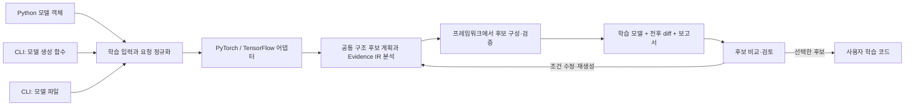

# 학습 가능한 모델의 최적화와 선택적 근거 기록: CLI·Python API 진입점

> 구현 상태 갱신: CPU용 PyTorch·TensorFlow native 경로와 Training IR가 구현되었습니다.
> 실행 가능한 현재 API·지원 범위는 [Native model and training guide](../../docs/NATIVE_MODEL_TRAINING_GUIDE.md)를 따릅니다.
> 아래 내용은 구현 전 설계 기록입니다. 예전의 미구현 표시는 그 시점의 상태이며,
> 제안 API 전부가 현재 지원된다는 뜻은 아닙니다.


**상태: 2026-10-07 인터페이스 제안. `deepbom.optimization`, `deepbom.training`,
아래 CLI 명령과 Python API는 아직 구현·배포되지 않았다.
현재 DEEPBOM 2.1.0에서 실행하는 안내가 아니다.**
프레임워크 모델 정의 예시는 일반 PyTorch/Keras 코드이며, 전체 예제의 실행 검증은
향후 양 프레임워크 어댑터 구현 후 수행한다. 현재 실행 가능한 예제는
[통합 예제 README](README.md)를 참고한다.

**기본 목적은 모델 최적화다.** 선택한 모델의 구조·가중치·필요한 buffer를
복원해 사용자의 새 optimizer로 학습하거나 fine-tuning할 수 있도록 한다.
학습률·optimizer·학습 스케줄 탐색이나 이전 학습 과정의 재개를 목표로 하지 않는다.
구조 변경 때문에 유지할 수 없는 state는 변환·신규 초기화·제거 내역을 표시한다.
학습 중 관찰은 이와 독립적인 선택 사항이며 원본 모델에도 붙일 수 있다.

| 제안 진입점 | 책임 | 결과 |
| --- | --- | --- |
| `deepbom.optimization` | `optimize`, `refine`, `compare`, `export` | 모델 후보·전후 diff·선택한 상태의 패키지/객체·코드 문서 |
| `deepbom.training` | 관찰 수집, 기존 기록 import, 근거 조회 | Weight/Activation 근거와 이를 시점에 연결하는 Training IR |
| 표시·저장 adapter | 같은 공통 근거를 소비자에 투영 | DeepBoard(가칭) 또는 MLflow artifacts·TensorBoard summaries·W&B Artifacts |

두 namespace는 미구현 설계 명칭이다. 이미 출시된 API의 이름 변경이나
호환 alias를 만드는 작업은 아니다.
수집·표시를 위해 전체 학습을 재현할 수 있는 checkpoint를 요구하지 않는다.
공통 책임은 [Training 계약 §1](../../docs/evidence-ir/TRAINING_LIFECYCLE.md#1-핵심-구분),
외부 연결 규칙은 [§8.5](../../docs/evidence-ir/TRAINING_LIFECYCLE.md#85-하나의-근거-선택-가능한-표시저장-대상)을 따른다.

## 1. 세 입력 방식, 하나의 최적화 경로

| 사용 환경 | DEEPBOM에 전달할 입력 | 결과 사용 방법 |
| --- | --- | --- |
| 학습 코드·노트북 | 생성한 `nn.Module` 또는 TensorFlow backend Keras 모델 객체 + 예제 입력 | 후보를 비교·수정하고 선택한 모델로 optimizer와 학습 루프 구성 |
| 터미널·자동화 | 로컬 모델 생성 함수의 `module:function` + 입력 명세 | 후보 패키지들을 독립적으로 검토한 뒤 선택한 패키지를 학습 코드에 연결 |
| 모델 파일 | 재구성 가능한 `.keras` + 입력 명세, 필요하면 custom object 등록 모듈 | 같은 프레임워크의 후보를 비교·선택하고 학습 |

PyTorch checkpoint의 `state_dict`처럼 가중치만 담은 파일에는 모델 생성 함수가
추가로 필요하다. Python 파일 경로만 받아 임의의 학습 스크립트 `main()`을 실행하지
않는다. `build_model()`처럼 모델 생성만 담당하는 명시적인 함수를 받는다. 기존
프로젝트 전체를 DEEPBOM 서버에 업로드하는 방식은 요구하지 않는다.



파일·함수 입력도 로컬에서 모델 객체를 구성한 다음 같은 최적화 경로로 들어온다.
프레임워크 변환 코드는 어댑터가 소유하고 shape·MAC·수치 통계 등 공통 계산은
기존 엔진이 소유한다. CLI와 Python API에서 각각 변환 규칙이나 diff를 구현하지
않는다. Node CLI는 기존 정적 분석을 계속 제공하며, 학습 경로는 Python 환경을
명시적으로 사용한다. Python API가 객체를 주고받는 경로는 기존 파일 기반 SDK의
프로세스 호출 계약과 다른 선택적 모듈이다.

`optimize`는 학습 가능한 후보를 만드는 작업이다. 호출 자체로 본 학습을 시작하거나
기존 학습 코드의 모델을 교체하지 않는다. 사용자는 이 단계에서 검토·재생성을
반복하고 종료할 수 있으며, 선택한 후보만 이후 학습 코드에 연결한다. 로딩·형상·
짧은 backward smoke 검사는 본 학습과 구분해 실행 범위·비용을 기록한다.

## 2. 입력 계약

필수 입력은 모델 구조, 모델 호출 방법, 입력 계약, 최적화 목적이다. 입력 계약은
예제 tensor에서 추출하거나 CLI JSON으로 지정한다. 예제 하나로 관찰되지 않은
동적 분기·입력 범위까지 지원한다고 간주하지 않는다.

| 항목 | 의미 |
| --- | --- |
| 모델 | 메모리 객체 / 모델 생성 함수 / 지원 파일 중 하나 |
| 입력 | positional·keyword 구조, dtype, shape, 축 의미, 필요한 유효 값·동적 제약 |
| 목적 | 예: CPU 추론 비용, MAC 감소, 모델 구조에 따른 텐서 메모리 감소 |
| 타겟 | 런타임·장치·dtype 조건. `current-cpu` 제안은 현재 CPU와 실제 사용한 런타임 설정을 기록 |
| 유지 조건 | 외부 입출력, 출력 의미, 보존할 블록, 과제에 필요한 제약 |
| 선택 사항 | 초기 가중치, 탐색 예산, task loss·평가 callback, seed |

아래 `deepbom.model_input_spec.v1`은 **제안 이름**이다. 정식 IR catalog에
등록된 스키마가 아니다. float 입력의 `zeros`는 구조·실행 가능성 확인용이며 과제
평가 데이터가 아니다. Token index·mask처럼 값 제약이 있는 입력은 유효한 예제
파일을 별도로 받는다. `args`와 `kwargs`의 중첩 구조를 보존하고 암묵적인 cast나
layout 변환을 하지 않는다. 누락된 제약은 성공한 검사로 처리하지 않는다.

PyTorch 예시의 `torch-inputs.json`:

```json
{
  "schema": "deepbom.model_input_spec.v1",
  "args": [
    {"kind": "tensor", "dtype": "float32", "shape": [1, 3, 32, 32], "layout": "NCHW", "values": "zeros"}
  ],
  "kwargs": {}
}
```

Keras 예시의 `keras-inputs.json`은 같은 계약에 `shape: [1, 32, 32, 3]`,
`layout: "NHWC"`를 지정한다. 이 두 예시는 의도적으로 각 모델의 layout을 따른다.
모델의 shape만 보고 축 의미를 임의로 결정하지 않는다.

### 2.1 프레임워크와 구조 관찰의 지원 범위

지원 여부는 파일 확장자 하나로 결정하지 않는다. 프레임워크·버전·backend·입력
경로·실행 모드(eager/compiled)·custom layer·dtype/device·변환 규칙의 조합으로
공개한다. 처음 검증할 범위는 PyTorch eager와 TensorFlow backend Keras의 지원
구조다. 다른 backend·동적 제어 흐름·분산·compiled 실행은 별도 검증 전까지
미확인이다. 파일을 읽었다는 사실만으로 학습 가능한 후보 생성 지원을 선언하지 않는다.

다음 세 구조를 구분한다. native module/layer 구성은 공유 상태와 학습 속성을,
관찰한 호출 그래프는 특정 입력·모드에서 실행된 호출을, 배포 그래프는 export된
연산을 나타낸다. 같은 모듈을 두 번 호출하면 상태 소유자는 하나일 수 있어도 호출
노드는 둘이다. 관찰하지 않은 분기를 실행 불가로 간주하거나 배포 그래프만 보고
원래 학습 구조를 완전히 복원했다고 표시하지 않는다.

native 코드 생성·모델 로딩·진단 실행은 사용자가 명시적으로 선택하는 로컬 경로다.
현재 파일 기반 정적 SDK나 브라우저 audit가 이 경로를 자동 실행하지 않는다.
RAM 모델을 기존 Artifact IR로 가장하지 않으며, native 구조·상태를 Model IR에
연결하려면 [source 전환 계약](../../docs/evidence-ir/TRAINING_LIFECYCLE.md#65-source-계약의-전환과-소비자-호환성)을
먼저 구현해야 한다. 이 작업 없이 live 모델 지원을 출시하지 않는다.

## 3. 터미널: PyTorch 코드 입력

프로젝트 안에 `torch_entry.py`를 둔다. 아래처럼 생성 함수만 따로 만들거나 기존
함수를 그대로 지정한다. 실제 모델이 외부 패키지에 의존하면 그 패키지가 설치된
프로젝트 환경에서 실행한다.

```python
import torch.nn as nn

def build_model():
    return nn.Sequential(
        nn.Conv2d(3, 16, 3, padding=1),
        nn.ReLU(),
        nn.Conv2d(16, 32, 3, padding=1),
        nn.ReLU(),
        nn.AdaptiveAvgPool2d(1),
        nn.Flatten(),
        nn.Linear(32, 5),
    )
```

**제안 CLI — 아직 실행할 수 없는 인터페이스 예시:**

```sh
python -m deepbom.optimization optimize \
  --framework pytorch \
  --factory torch_entry:build_model \
  --inputs torch-inputs.json \
  --objective cpu_inference --target current-cpu \
  --output runs/torch-001
```

`python -m`을 기본 안내로 삼으면 전역 npm launcher나 다른 가상환경의 `deepbom`
실행 파일과 구분할 수 있다. 선택한 Python 환경에 프레임워크가 없으면 필요한
의존성을 안내하고 중단한다. 다른 Python을 조용히 선택하거나 전체 프레임워크를
자동 설치하지 않는다. `--factory`와 `--model`은 상호 배타적이다. 함수 인자가
필요하면 JSON으로 선언된 생성 인자를 받으며 Python 표현식을 `eval`하지 않는다.

## 4. 터미널: TensorFlow/Keras 코드 또는 파일 입력

TensorFlow backend가 설정된 환경의 `keras_entry.py`:

```python
import keras

def build_model():
    inputs = keras.Input(shape=(32, 32, 3))
    x = keras.layers.Conv2D(16, 3, padding="same", activation="relu")(inputs)
    x = keras.layers.Conv2D(32, 3, padding="same", activation="relu")(x)
    x = keras.layers.GlobalAveragePooling2D()(x)
    outputs = keras.layers.Dense(5)(x)
    return keras.Model(inputs, outputs)
```

**제안 CLI — 코드 입력:**

```sh
python -m deepbom.optimization optimize \
  --framework tensorflow \
  --factory keras_entry:build_model \
  --inputs keras-inputs.json \
  --objective cpu_inference --target current-cpu \
  --output runs/keras-001
```

파일을 선호하면 Keras에서 모델을 먼저 저장할 수 있다. 이 저장 코드는 일반
Keras 사용법이며 DEEPBOM 명령이 아니다.

```python
from keras_entry import build_model

build_model().save("baseline.keras")
```

**제안 CLI — 파일 입력:**

```sh
python -m deepbom.optimization optimize \
  --framework tensorflow \
  --model baseline.keras \
  --inputs keras-inputs.json \
  --objective cpu_inference --target current-cpu \
  --output runs/keras-file-001
```

`.keras`에 custom object의 Python 코드가 포함되는 것은 아니다. 필요한 경우
로컬 등록 모듈을 명시적으로 지정하는 입력이 추가된다. SavedModel·동결 그래프나
가중치 파일을 이 `.keras` 입력과 동일한 재구성 범위로 취급하지 않는다.

제안 로더는 `keras.saving.load_model(..., compile=False)`로 구조와 모델 state를
읽고 이전 compile/optimizer 구성을 자동으로 이어받지 않는다. 필요한 custom object는
사용자가 지정한 환경에서 해결하며 로딩 실패를 임의 초기화로 대체하지 않는다.
재로딩 뒤 variable 이름이 바뀔 수 있으므로 원래 이름만으로 subject를 연결하지
않고 검증된 layer/variable 대응을 사용한다.
[Keras load_model 계약](https://keras.io/api/models/model_saving_apis/model_saving_and_loading/)

## 5. Python 라이브러리: 학습 직전에 호출

**아래 `deepbom.optimization.optimize`는 제안 API이며 아직 존재하지 않는다.**
PyTorch와 TensorFlow에서 같은 함수와 결과 객체를 사용하도록 설계한다.

```python
import torch
from torch_entry import build_model
from deepbom.optimization import optimize

original = build_model()
result = optimize(
    original,
    framework="pytorch",
    example_args=(torch.zeros(1, 3, 32, 32),),
    objective="cpu_inference",
    target="current-cpu",
    output_dir="runs/torch-api-001",
)

# 보고서를 확인하고 다른 후보와 비교한 뒤 사용할 결과를 선택한다.
selected_result = result
model = selected_result.model
optimizer = torch.optim.Adam(model.parameters(), lr=1e-3)
# 이 model과 optimizer를 기존 학습 루프에 연결한다.
```

```python
import keras
import tensorflow as tf
from keras_entry import build_model
from deepbom.optimization import optimize

original = build_model()
result = optimize(
    original,
    framework="tensorflow",
    example_args=(tf.zeros((1, 32, 32, 3)),),
    objective="cpu_inference",
    target="current-cpu",
    output_dir="runs/keras-api-001",
)

# 보고서를 확인하고 다른 후보와 비교한 뒤 사용할 결과를 선택한다.
selected_result = result
model = selected_result.model
model.compile(
    optimizer="adam",
    loss=keras.losses.SparseCategoricalCrossentropy(from_logits=True),
)
# 이 model.fit(...)에 기존 데이터와 학습 설정을 연결한다.
```

호출 시점은 모델 생성·선택적인 초기 가중치 로딩 후, optimizer·분산 wrapper·
compile 구성을 만들기 전이다. 구조가 달라져 생긴 새 파라미터에 이전 optimizer가
연결돼 있다고 가정하지 않는다. 반환 모델은 선택 후보의 구조·가중치·buffer 및
지원되는 추가 상태를 갖고, optimizer는 예시처럼 사용자가 새로 만든다.
이미 학습 중인 객체의 즉시 교체나 기존 optimizer state 이식은 이 범위에 포함하지 않는다.

최적화는 원본 객체를 덮어쓰지 않고 후보를 반환해야 한다. 공유 파라미터·상태·
RNG·training mode를 다루는 지원 범위를 검증하고, 복제할 수 없는 객체는 명시적인
생성 함수로 재구성하거나 지원 불가로 보고한다. 동등성 보존은 구조 변경 경로의
기본 요구가 아니다. 외부 입출력과 명시적인 유지 조건을 검사한다.

## 5A. 학습과 독립적인 후보 검토 루프

구조 최적화의 반복과 모델 학습의 반복을 별도 작업으로 제공한다. 처음 생성된
추천 후보를 바로 채택하지 않아도 되고, 원본을 유지하거나 다른 조건의 후보를
선택할 수 있다. 기본 검토 화면은 원본·후보 A·후보 B의 비교, 변경 구간 탐색,
유지할 블록 선택, 변경 규칙 제외, 비용 목표 수정, 후보 저장·재생성·내보내기를
제공하는 것을 목표로 한다.

예를 들어 “첫 블록은 유지하고, inverted 교체는 제외하며, 채널 감소 폭을 줄인다”는
피드백을 UI에서 버전이 있는 제약 문서로 만든다. CLI와 API가 같은 문서를 사용한다.
단순히 싫어한 후보 하나를 숨긴 경우와 해당 변환 규칙을 다음 탐색에서 금지한 경우를
구분한다. 변경을 부분적으로 해제하면 연결된 downstream shape·블록 수정도 다시
계산하고 후보를 재구성·검증한다. 보고서의 행만 지워 유효한 모델처럼 보여주지 않는다.

**제안 CLI — 학습 없이 후보 A를 재검토하고 B를 만드는 예시:**

```sh
# runs/torch-001은 앞의 optimize 결과다.
python -m deepbom.optimization refine \
  --from runs/torch-001 --base original \
  --constraints revised-constraints.json \
  --output runs/torch-002

python -m deepbom.optimization compare \
  --runs runs/torch-001 runs/torch-002 \
  --output runs/comparison-001

# 비교 후 사용자가 선택한 후보를 학습 프로젝트에 내보낸다.
python -m deepbom.optimization export \
  --from runs/torch-002 --output selected-model
```

`revised-constraints.json`은 원본의 정확한 subject reference로 유지할 블록,
허용·금지할 등록 변환 규칙, 변경 폭과 비용 목표를 지정하는 **추가 설계 대상**이다.
내부 모듈 이름을 공통 subject reference로 자동 간주하지 않는다. 조건 충돌이나
목표를 만족하는 후보가 없는 경우 그 이유를 반환하고 제약을 조용히 완화하지 않는다.

**제안 Python API — 앞서 생성한 `result`를 학습 없이 재검토:**

```python
import json
from pathlib import Path
from deepbom.optimization import compare, refine

constraints = json.loads(Path("revised-constraints.json").read_text(encoding="utf-8"))
alternative = refine(
    result,
    base="original",
    constraints=constraints,
    output_dir="runs/alternative-001",
)
review = compare(
    [result, alternative],
    output_dir="runs/comparison-api-001",
)
print(review.report_path)
# 여기에서 종료해도 된다. 학습은 시작되지 않는다.
# 검토 후 선택한 결과의 .model을 별도의 학습 코드에서 사용한다.
```

원본 baseline은 고정한다. 기본 `refine`은 원본에 수정된 전체 제약을 적용한 새
후보를 만들며, 직전 후보에 변환을 무심코 누적하지 않는다. 후보를 출발점으로
선택하면 별도의 branch로 기록한다. 각 후보는 parent·root baseline·제약·변환·
구조·초기 state의 식별자를 갖고, 원본 대비 누적 diff와 parent 대비 diff를 따로
조회할 수 있어야 한다. 파일·IR는 덮어쓰지 않고 새 후보 ID로 남긴다.

후보 선택은 특정 구조·가중치·manifest 식별자를 지정한다. 화면의 “현재 후보”라는
가변 값만 학습에 넘기지 않는다. `export`는 선택한 패키지를 검증해 복사하며 다시
초기화하거나 구조를 다시 최적화하지 않는다. 이후 학습이 가중치를 변경하면 그
checkpoint를 새 상태로 기록한다. 선택 이력은 모델 품질 판정과 별개이며,
후보 생성 완료·검증 상태·사용자 선호·학습 상태를 하나의 PASS로 합치지 않는다.

`compare`는 저장된 근거를 읽는 독립 작업으로, 모델 실행이나 재학습을 요구하지
않게 한다. 메모리·지연시간은 기록된 측정 조건이 같을 때 비교하고, 미측정을
0이나 개선으로 해석하지 않는다. 미학습 상태에서도 구조·MAC·파라미터·논리
텐서 크기·변경 범위를 검토할 수 있다. 과제 품질은 연결된 학습·평가 결과가
있을 때 추가되며, 모든 후보를 본 학습해야 검토할 수 있는 구조로 만들지 않는다.

독립 HTML 보고서는 모델을 실행하지 않고 비교와 제약 문서 내보내기를 제공한다.
브라우저의 재생성 버튼에서 Python 변환까지 수행하려면 명시적으로 연결한 로컬
실행 프로세스가 필요하다. 로컬 실행 연결이 없으면 제약 파일과 재실행 명령을
제공한다. deepbom.org에서 사용자 Python 코드를 실행하는 기능으로 확대하지 않는다.

자동 탐색도 이 후보 이력을 재사용할 수 있으나 후보 수·시간·실행 예산과 정지
조건을 받는다. 같은 구조·제약으로 되돌아오는 반복과 실패 사유를 기록한다.
선택한 모델을 짧게 학습한 뒤 결과를 검토해 다시 구조 탐색으로 돌아오는 경로도
별도로 연결한다. 이때 학습된 checkpoint를 새 baseline으로 쓸지, 원래 미학습
baseline에서 다시 시작할지 명시하고 학습 결과와 초기화 상태를 섞지 않는다.

## 5B. 변환 규칙과 검증의 분리

`fusion`이라는 이름으로 다음 세 작업을 합치지 않는다.

| 변환 종류 | 예 | 결과와 검증 범위 |
| --- | --- | --- |
| 학습 가능한 구조 변경 | inverted block, 채널 수 변경, fusion을 고려한 연산 배치 | 입출력 계약·state 대응·학습 가능성 검사; 같은 함수나 품질을 보장하지 않음 |
| 추론용 등가 변환 | 조건을 충족한 eval Conv–BatchNorm folding | 고정 모드·상태·입력 범위와 오차 기준으로 검사; 학습 동작의 등가는 별도 |
| 런타임 실행 계획 | delegate 선택, backend kernel fusion | 모델 변환 여부와 별도로 기록; 정적 지원 후보와 실제 실행 증거 구분 |

PyTorch의 eval folding은 두 모듈이 eval 모드이고 BatchNorm의 running buffer가
계산돼 있어야 한다. Keras BatchNormalization도 학습과 추론에서 다른 통계를 사용한다.
따라서 이를 학습 전 일반 구조 변환에 무조건 적용하거나 "같은 모델로 학습"이라고
설명하지 않는다. 규칙마다 버전·전제 조건·보존 의미·상태 변환·검증 범위를 기록한다.
[PyTorch eval folding](https://docs.pytorch.org/docs/main/generated/torch.nn.utils.fuse_conv_bn_eval.html),
[Keras BatchNormalization](https://keras.io/api/layers/normalization_layers/batch_normalization/)

상태 대응표는 parameter, persistent/nonpersistent buffer, custom extra state,
trainability, 모듈별 train/eval 설정, tied/shared storage를 구분한다. 파일이 저장하지
않는 상태는 명시적 재구성 방법이나 미지원 사유가 필요하다. `state_dict`의 얕은 참조,
`clone_model`의 새 가중치 초기화 또는 공유 객체 처리에 기대어 보존을 주장하지 않는다.
`strict=False`로 누락된 키를 숨기지 않으며, 신규 초기화는 후보 생성 때 한 번 확정한다.
원본과 후보 사이의 변경 가능한 storage는 분리하고 후보 내부의 의도된 공유 관계는
보존하거나 변경 내역을 기록한다.
[PyTorch Module](https://docs.pytorch.org/docs/main/generated/torch.nn.Module.html),
[Keras 모델 복제](https://keras.io/api/models/model_saving_apis/model_config_serialization/)

후보의 forward/backward/smoke update 검증은 격리한 작업 복사본에서 수행한다.
BatchNorm buffer, gradient, RNG, optimizer 갱신이 원본이나 확정 후보에 흘러들지
않아야 한다. 사용자 코드의 외부 부작용까지 일반적으로 격리할 수 있다고 보장하지는
않으며, 지원 어댑터에서 보존을 검증하지 못하면 그 한계를 반환한다.

검증 단계는 코드 생성 → 모델 구성 → 저장·재로딩 → forward → backward → 예상
gradient coverage → 짧은 갱신으로 나눈다. 각 단계에 수행·통과·실패·미수행 이유를
기록한다. 합성 loss의 backward 성공은 모든 필요한 parameter가 갱신되었다는
증거도, 과제 품질이 유지된다는 증거도 아니다. 논리 tensor 크기·직렬화 크기·실측
peak allocated/reserved memory·프로세스 RSS도 별도 지표로 취급한다. MAC 감소를
지연시간·L1 cache 적중률·전력 감소로 변환하지 않는다.

전후 구조 대응은 일대일·일대다·다대일·신규·제거·미대응을 보존한다. 현재 Weight
비교의 일대일 대응(명시한 축 순열 포함)을 fusion의 다대일 수치 동등성 검사로
확대하지 않는다. 이름·shape 일치는 후보 탐색 근거일 뿐 의미적 동등성의 증명이 아니다.

## 6. 반환물과 즉시 비교

CLI와 라이브러리 모두 동일한 디렉터리 계약을 생성하는 것을 목표로 한다.
기존 출력 폴더를 자동으로 덮어쓰지 않는다.

```text
runs/torch-api-001/
  request.json                 정규화된 입력·목적·제약
  environment.json             프레임워크·어댑터·런타임·타겟
  baseline/                    원본 식별·구조·재구성 기록
  candidate/                   학습 가능한 후보 패키지·가중치·로더
  transformation.json          변경 규칙과 전후 subject 대응
  comparison.json              공통 diff와 계산 범위
  validation.json              로딩·forward·학습 smoke 검증 범위와 결과
  report/index.html            원본·후보 그래프와 변경 구간 비교
  report/model-code.md         생성된 소스·사용 예시·가중치 로딩 계약
  manifest.json                완료 상태·파일 식별자·근거 연결
```

라이브러리는 `result.model`, `result.comparison`, `result.report_path`,
`result.manifest_path`를 반환하는 형태를 제안한다. 터미널은 같은 요약과 보고서
위치를 출력한다. 반환 모델을 다시 학습할 때는 해당 객체를 직접 쓰고, 별도
프로세스에서는 후보 패키지의 로더를 사용한다. 외부 코드 의존성이 남으면
명시하며, 모든 사용자 모델이 단일 독립 Python 파일로 변환된다고 약속하지 않는다.
RAM 반환과 파일 재로딩 모두 선택된 후보의 모델 상태를 사용한다. 학습 재개용
optimizer·RNG·데이터 위치는 반환 계약의 필수 항목이 아니며 자동 복원하지 않는다.
기존 state를 유지하는 항목과 새로 초기화한 항목을 구분해 같은 가중치의 모델인지
구조가 변경된 새 후보인지 판단할 수 있게 한다.

### 6.1 코드·Markdown·웹 복사의 일관성

학습용 후보 출력에는 `.py` 파일과 동일한 코드를 Python fenced code block으로
담은 Markdown을 함께 제공하는 것을 제안한다. 웹 보고서는 파일별 코드를 보여주고
**Copy code**, **Download .py**, **Copy Markdown**, **Download Markdown**으로
같은 소스를 전달한다. Markdown을 별도로 코드 생성하거나 웹에서 코드를 다시
추론하지 않는다. 원본·후보 식별자, 변환 규칙, 지원 범위, 외부 의존성과 가중치
포함 여부를 함께 표시한다. 복사 권한이 없으면 파일 다운로드를 제공한다.

학습용 출력에서는 코드만 복사하면 구조만 생성되는지, 선택한 snapshot의 가중치를
로딩하는지 구분한다. 가중치는 Markdown에 인라인으로 넣지 않고 패키지의 파일과
검증된 식별자로 연결한다. 별도 패키지가 필요하면 로딩 예시에 그 조건을 명시한다.
RAM 반환·재로딩 패키지·코드 문서가 같은 선택 후보를 가리키게 하고, 코드 문서
생성을 이유로 모델을 재초기화하지 않는다. 후보가 바뀌면 보고서와 코드도 갱신한다.

**현재 구현과의 구분:** 기존 웹의 TFLite Redesign은 **View code → Code and
Markdown**에서 PyTorch·Keras 구조 초안을 복사하거나 다운로드할 수 있다.
ZIP에는 같은 Python 소스를 담은 `structure-code.md`가 포함된다. 이 출력은
`contains_weights: false`인 구조 초안으로 원본 가중치를 복구하지 않는다.
시나리오 수정·재계산 중에는 이전 코드의 복사와 내보내기를 차단한다.
위에서 제안한 학습용 후보 패키지·RAM 객체 반환·snapshot 가중치 로딩은 아직
이 웹 구조 초안 기능에 구현된 것으로 해석하지 않는다.

### 6.2 모델 상태와 검증 경계

메모리 객체 입력도 원본·후보의 구조와 state를 불변 snapshot으로 식별한다.
소스 파일 하나의 해시나 객체의 메모리 주소를 모델 전체의 artifact SHA-256으로
대신하지 않는다. 현재 artifact 기반 IR를 재사용하는 경로에서는 실제 저장된 패키지의
바이트와 구성원 목록으로 식별자를 만들고 어댑터 계약을 검증해야 한다. 후속 설계의
[Model State Snapshot](../../docs/evidence-ir/TRAINING_LIFECYCLE.md#64-파일보다-상위의-모델-상태-스냅샷)은
일관된 메모리 상태를 직접 식별할 수 있다. 이 경로는 새로운 공통 source 계약을
필요로 하며, 파일 저장을 모델 상태의 존재 조건으로 삼거나 snapshot hash를 기존
artifact hash 필드에 넣는 방식으로 구현하지 않는다.

미학습 모델에서 과제 품질을 판정하지 않는다. 기본 backward 검증에 합성 loss를
사용했다면 실제 task loss 검증과 구분한다. 사용자 loss·유효 입력을 받지 않아
검증할 수 없는 항목은 이유를 기록한다. 초기화·측정·탐색 예산을 남기고, 실제
검사한 범위와 결과에 맞춰 완료 상태를 표시한다. 후보가 없으면 원본을 최적화
성공으로 포장하지 않고 개선 후보 없음 또는 지원 범위 부족을 반환한다.

### 6.3 불변 후보와 변경 가능한 반환 객체

`result.model`은 선택한 후보 상태에서 만든 변경 가능한 작업 객체다. 후보 패키지와
보고서는 확정한 불변 snapshot을 가리킨다. 사용자가 반환 객체를 학습·수정해도
기존 후보와 근거는 바뀌지 않는다. snapshot과 작업 객체가 storage를 공유하면 안 된다.

`export`와 후보 선택은 확정된 패키지를 사용한다. 나중에 변경된 `result.model`을
읽어서 이전 후보 ID로 다시 저장하지 않는다. 변경된 live 객체를 기록하려면 새로운
snapshot과 식별자를 만들고 원래 후보와의 관계를 남긴다. 작업 객체가 아직 같은
상태인지 확인하지 않았다면 과거 보고서를 현재 객체의 근거라고 표시하지 않는다.
이를 위해 매 학습 step에 모델 전체를 해싱할 필요는 없다. 명시적인 snapshot 경계와
관찰 범위를 기록하고, 그 사이 상태의 동일성은 미확정으로 유지한다.

## 7. 학습 중·학습 후의 진입점

이 절의 명칭과 상태·참조 규칙은
[Training 과정과 학습된 상태의 계약](../../docs/evidence-ir/TRAINING_LIFECYCLE.md)을
따른다. **Training IR**는 특정 관찰 경계까지의 학습 라이프사이클·시간축·학습 고유
증거와 시점별 모델 상태 참조를 담는 불변 스냅샷이다. 종료 후에도 같은 IR를 유지한다.
**Training Result Manifest**는 필요할 때 선택한 결과 상태에 기존 IR와 평가 근거를
연결하는 선택적 문서다. 별도의 Trained IR는 만들지 않는다.
이 계약과 live training 수집기는 아직 구현되지 않았다.

| 시점 | 사용자 연결 위치 | 수집 대상 |
| --- | --- | --- |
| 학습 시작 | run 생성과 확보된 모델 식별 기록 | 코드·설정·데이터 참조·원본과 후보 계보; 파일이 없으면 상태 binding 미확정 |
| 선택한 forward | 모델 호출 전후 | 파라미터·buffer 상태, 입력·activation, 호출 ID·실제 실행 모드 |
| 선택한 backward | gradient 관찰 경계 | loss scaling·누적·clipping·분산 reduction 전후를 명시한 gradient |
| optimizer 갱신 | optimizer별 step 경계 | 시도/적용/skip 구분·갱신 전후 상태·checkpoint 연결 |
| checkpoint 선택 | 학습 중 또는 종료 후 | 정확한 상태·선택 기준·평가를 연결하는 Training Result Manifest |
| 학습 종료 | 정상·중단·실패 신호 관찰 | Training IR의 실행 상태·종료 이유·수집 범위 확정 |

학습 종료와 결과 선택은 독립적이다. best는 기준·split·방향·후보 집합이 있어야
하며 마지막 상태와 같다고 가정하지 않는다. 이미 학습된 외부 모델에는 이력이
없을 수 있고, 정적 분석만으로 그 이력을 재구성하지 않는다. 새 fine-tuning은
이전 결과를 시작 상태로 참조하는 별도 run이다.

PyTorch에는 루프 collector, Keras `fit`에는 callback과 필요한 `train_step`
계측을 제공하는 방향이다. 단순 batch-end callback만으로 실제 학습 forward의
모든 activation·gradient를 정확하게 수집했다고 하지 않는다. 별도 probe forward는
원래 학습 batch의 관찰과 구분하고, 학습 상태·RNG에 미친 영향도 관리해야 한다.
전체 기록을 강제하지 않으며 수집 주기·레이어·표본·예산을 지정한다.

원본·후보 비교와 학습 시계열은 검증된 subject 대응을 재사용하도록 한다. 현재
Activation IR 비교는 같은 정확한 artifact/Model IR 안에서만 가능하며, 서로 다른
checkpoint 사이의 비교는 별도 대응 계약이 필요하다. 사용자는 보고서에서
교체된 블록을 선택한 뒤 해당 블록의 Weight IR·Activation IR와 시간 변화를
이어 볼 수 있어야 한다. MLflow는 기록 저장을 맡고 이 대응·분석은 DEEPBOM이
소유한다. 상세 정합성 요구는 [아키텍처 시나리오](MLFLOW_ARCHITECTURE_SCENARIO.ko.md)에 있다.

### 7.1 학습을 소유하지 않는 기록·뷰어 진입점

기존 TensorBoard/MLflow/CSV 기록과 저장된 checkpoint를 가져오는 경로를 우선한다.
원래 기록되지 않은 gradient·activation이 필요할 때만 선택적 수집기를 붙인다.
저장된 근거를 읽는 뷰어는 학습 코드나 본 학습 실행 없이 별도로 열어야 한다.
관찰 경계·부분 기록·외부 histogram의 한계는
[학습 연결 계약](../../docs/evidence-ir/TRAINING_LIFECYCLE.md#81-학습-연결과-독립-뷰어)을 따른다.

**제안 CLI — 아래 명령은 아직 구현되지 않았다.**

```sh
# 기존 TensorBoard 기록을 독립 근거 폴더로 가져오기
python -m deepbom.training import \
  --source tensorboard --logdir runs/experiment-01 \
  --output evidence/experiment-01

# 정규화된 근거만 읽는 로컬 뷰어: 모델 실행·학습 시작 없음
python -m deepbom.training view --evidence evidence/experiment-01
```

이 import 예시는 기록된 정보만 가져온다. checkpoint·Model IR와의 대응은 별도
식별 근거가 있어야 하며, `step`의 뜻과 대응이 없으면 미확인으로 유지한다.
매번 학습 전체를 DEEPBOM 명령으로 감싸거나 optimizer를 교체하도록 요구하지 않는다.
진행 중 갱신은 같은 capture/import 계약에 추가하되 불완전한 기록을 성공으로 보이지 않는다.

### 7.2 간단한 연결을 기본 사용 경험으로

기본 사용자가 import·정규화·worker 실행을 각각 조작하도록 요구하지 않는다.
§7.1의 분리 명령은 기록 처리·자동화용으로 유지하고, 일반 사용에는 다음 네 진입점을
제공하는 것을 목표로 한다. **아래 API·명령은 모두 미구현 설계 예시다.**

| 현재 사용자 환경 | 기본 연결 방식 | 수집 범위 |
| --- | --- | --- |
| 이미 TensorBoard/W&B/MLflow 사용 | 폴더 또는 명시한 기존 run에 뷰어 연결 | 기록된 사실만 읽으며 logger 교체나 이중 기록 불필요 |
| TensorFlow backend Keras `fit` | callback 하나 추가 | callback이 제공하는 metric·phase·모델/optimizer 맥락; 내부 gradient/activation은 별도 계측 |
| TensorFlow `GradientTape` 사용자 정의 루프 | 모델/optimizer 관찰 등록 + gradient 계산 후·갱신 호출 후 기록 | 사용자 계산 결과와 정확한 관찰 경계; `fit`으로 변환하지 않음 |
| 일반 PyTorch 루프 | 모델·optimizer 관찰 등록 | 검증된 관찰 지점의 증거; loss·데이터 의미는 기존 logger 또는 명시 기록 필요 |

Keras의 목표 사용 형태:

```python
from deepbom import training

model.fit(
    x_train, y_train,
    callbacks=[training.callback(logdir="evidence/experiment-01")],
)
```

이미 callbacks가 있으면 하나를 추가한다. 순서와 중복 기록을 검증하며 기존 callback을
교체하지 않는다. callback을 붙였다고 실제 학습 forward의 내부 activation까지
자동 수집된 것으로 표시하지 않는다.

PyTorch의 목표 사용 형태:

```python
from deepbom import training

with training.watch(model, optimizer=optimizer,
                    logdir="evidence/experiment-01") as evidence:
    train_with_existing_loop(model, optimizer)  # 사용자의 기존 함수
```

context 종료는 collector의 해제·flush를 뜻하며 학습 정상 완료의 증거가 아니다.
이 최소 예시가 관찰하지 못한 loss·epoch·AMP skip 등은 미수집으로 보인다.
기존 logger가 있으면 그 기록을 연결하고, 없으면 사용자가 metric·시점 의미를
명시하는 추가 진입점이 필요하다. `watch`가 임의의 Python 지역 변수나 사용자의
train 함수 의미를 추정해서 값을 채우지는 않는다. PyTorch hook 및 optimizer 관찰의
지원 범위는 실행 모드·분산 방식·프레임워크 버전별로 검증한다.

이 최소 형태는 `observation="auto"`를 기본으로 제안한다. 아래의 상세 루프 예시는
`observation="manual"`로 update 관찰을 명시적 호출에만 맡긴다. 동일 경계를 자동
hook과 수동 호출로 두 번 기록하지 않는다. 등록 모드가 충돌하면 구성 오류로 알린다.
공통 의미는 [관찰 API 계약](../../docs/evidence-ir/TRAINING_LIFECYCLE.md#84-공통-관찰-api의-의미)을 따른다.

저장된 DEEPBOM 근거를 여는 목표 명령:

```sh
python -m deepbom.training view --evidence evidence/experiment-01
```

기존 TensorBoard 사용자에게는 import 단계를 내부 처리하는 한 명령을 제공한다.

```sh
python -m deepbom.training view --source tensorboard --logdir runs/experiment-01
```

이 결합 진입점도 분리 import와 같은 정규화기를 사용한다. 파생 파일은 별도
DEEPBOM 출력/cache에 저장하고 원본 logdir를 수정하지 않는다. W&B는 지정한
host/entity/project/run, MLflow는 지정한 tracking URI/run으로 범위를 고정한다.
기존 서비스 인증은 필요한 연결에서만 사용하고 로컬 분석에는 DEEPBOM 계정이나
외부 서버를 요구하지 않는다. 서비스에 결과를 쓰는 export는 읽기 연결과 별도 동작이다.

연결 직후 경로·로컬 viewer URL과 함께 **수집 가능 / 추가 연결 필요 / 미지원**을
항목별로 표시한다. 기본은 metric와 명시적으로 확정된 checkpoint 근거이고,
gradient·activation 등 상세 수집은 sampling·대상·예산을 선택한 경우만 활성화한다.
사용자가 source mapping이나 해시를 손으로 만들 필요 없이 어댑터가 계산·검증하되,
성립하지 않는 state binding을 자동으로 만들어내지 않는다.

기존 로거가 같은 관찰을 다른 서비스로 동기화한 경우 원본 식별 근거가 있을 때만
중복으로 처리한다. 이름·step·값이 같다는 이유만으로 서로 다른 관찰을 삭제하지 않는다.
같은 프로세스에서 여러 `watch`나 callback이 붙을 때에도 수집 중복·해제 책임이 명확해야 한다.

이 사용성 설계의 완료 기준은 “모든 정보를 한 줄로 수집”이 아니라 **기본 연결은
몇 줄 또는 한 명령, 누락 없는 coverage 표시, 필요할 때만 상세 수집 확대**다.
일반 사용자에게 IR schema·프로세스 구성·수동 import가 선행 학습 과제가 되어서는 안 된다.

비교 근거: W&B는 모델 hook을 통한 parameter/gradient 관찰을 제공하며,
MLflow는 지원되는 framework 경로에 autologging을 제공한다. MLflow의 일반 PyTorch
경로는 Lightning과 같은 범위의 자동 학습 기록을 보장하지 않는다. API 표면의 짧음과
실제 관찰 범위를 분리해야 한다.
[W&B Run.watch](https://docs.wandb.ai/ref/python/experiments/run/),
[MLflow PyTorch autolog](https://mlflow.org/docs/latest/api_reference/python_api/mlflow.pytorch.html),
[MLflow TensorFlow autolog](https://mlflow.org/docs/latest/api_reference/python_api/mlflow.tensorflow.html)

### 7.3 TensorFlow GradientTape 사용자 정의 루프

`model.fit()`과 독립된 정식 진입점으로 설계한다. `tf.GradientTape`로 계산한
사용자의 loss·gradient와 optimizer 호출을 그대로 유지하고, callback 경로와 같은
Training capture 정규화기·Training IR·수치 엔진·뷰어로 연결한다.
TensorFlow `tf.Module`/변수 기반 모델도 명시한 변수와 관찰을 입력으로 받을 수
있도록 하되, Keras layer나 공통 Model IR 대응이 자동으로 생겼다고 가정하지 않는다.

**다음은 제안 API이며 아직 실행할 수 없다.** 아래 예시는 eager 실행, 단일
optimizer·단일 replica, loss scaling/gradient accumulation/사용자 clipping이 없는
루프다. `model`, `optimizer`, `dataset`, scalar loss를 반환하는 `loss_fn`은 사용자가
이미 정의한 객체다. DEEPBOM이 loss 정의나 gradient 계산 방식을 바꾸지 않는다.

```python
import tensorflow as tf
from deepbom import training

with training.watch(model, optimizer=optimizer,
                    logdir="evidence/tape-01",
                    observation="manual",
                    capture=("metrics", "gradients")) as evidence:
    for microbatch, (x, y) in enumerate(dataset):
        with tf.GradientTape() as tape:
            prediction = model(x, training=True)
            loss = loss_fn(y, prediction)

        variables = tuple(model.trainable_variables)
        gradients = tape.gradient(loss, variables)  # 기존 계산, 한 번만 수행

        observation = evidence.before_update(
            optimizer=optimizer,
            at={"phase": "train", "microbatch": microbatch},
            loss=loss,
            gradients=gradients,
            variables=variables,
            gradient_stage="computed",
        )
        optimizer.apply_gradients(zip(gradients, variables))  # 기존 갱신
        evidence.after_update(observation, optimizer=optimizer)
```

연결 추가는 관찰 등록과 두 기록 지점이다. 반환된 `observation`은 같은 시도의 전후를
연결하는 토큰이며 checkpoint 식별자가 아니다. `microbatch`를 optimizer 적용 횟수로
바꾸지 않는다. 다중 optimizer는 각 시도를 별도 ID로 기록한다.
`capture`는 gradient 진단의 명시적 opt-in이며 관찰 예산·sampling 정책을 적용한다.
기존 Weight/Activation IR로 연결할 수 없는 값은 Training 관찰로 보존한다.

- `before_update`는 tape 바깥에서 이미 계산된 값을 관찰한다. 선택된 수집 범위의
  필요한 값을 고정한 뒤 비동기 writer에 넘기며, 살아 있는 변수 참조를 나중에 읽어
  갱신 전 값인 것처럼 저장하지 않는다. 매 step 모든 weight를 저장하지 않는다.
- `after_update`는 해당 호출이 반환된 경계와 확인 가능한 optimizer 상태를 기록한다.
  호출 반환만으로 실제 update 적용을 판정하지 않는다. AMP skip·accumulation은
  검증된 optimizer adapter가 판정할 수 있는 경우에만 표시하고 아니면 미확인이다.
  중간에 예외가 나면 전후가 완성되지 않은 관찰을 보존한다.
- gradient와 변수의 1:1 대응을 검증한다. `None`은 미분 결과 없음이며 영점 tensor가
  아니다. `IndexedSlices`는 values/indices/dense shape를 보존하고 무조건 dense로
  변환하지 않는다. 중복 index의 결합과 논리적 영점을 처리하지 않은 values 통계를
  전체 gradient 통계로 표시하지 않는다.
- `tape.gradient()`를 다시 호출하거나 tape를 persistent로 바꾸지 않는다. 사용자가
  얻은 gradient를 clipping·unscale·누적·수정하거나 optimizer로 대신 전달하지 않는다.
  추가 통계 계산은 공통 엔진이 맡고 실제 사용자 학습 값은 변경하지 않는다.
- loss scaling·clipping·누적·분산 reduction을 사용하면 관찰 단계와 해당 맥락을
  함께 전달한다. `computed`는 계산된 값의 관찰이며 unscaled/final gradient 보증이 아니다.
  `tape.gradient` 반환이라는 native 경계는 adapter 출처에 남긴다. 미확인 맥락을
  이 기본 예시의 조건처럼 scaling·누적 없음으로 채우지 않는다.
  사용자가 변환한 gradient를 추가로 기록할 때는 계산 직후 값과 구분한다.
- activation은 forward가 명시적으로 노출한 tensor 또는 검증된 수집 경로에서만 받는다.
  GradientTape가 있다는 이유만으로 모든 중간 activation에 접근할 수 있다고 하지 않는다.

실행 방식별 계약도 분리한다.

| 실행 방식 | 기록 연결 원칙 |
| --- | --- |
| eager GradientTape | 위 예시처럼 실제 관찰 경계에서 Python 수집기 호출 |
| `tf.function` | 실행 때마다 생성하는 진단 tensor/명시적 반환 capture를 host에서 수집하거나 검증된 graph 수집 연산 사용 |
| `tf.distribute` | replica별 관찰과 cross-replica reduction 전후를 구분; 명시한 집계만 수행 |
| XLA·중첩/persistent tape·고차 미분 | 별도 호환성 검증 전에는 지원을 주장하지 않음 |

`tf.function` 내부에 일반 Python `before_update`/`after_update`를 그대로 넣지 않는다.
Python side effect는 tracing 시점에만 실행될 수 있다. compiled step이 반환하는
capture도 갱신 전후 읽기 의존성을 보장해야 하며, step이 끝난 뒤 변수를 읽어
이전 상태로 표시하지 않는다. `tf.py_function`을 자동 삽입해 지원되는 것처럼
우회하지 않는다. 첫 구현은 eager 경계를 검증하고 graph/distributed 경로는 별도
지원 항목으로 확장한다.

TensorFlow는 사용자 정의 루프에서 forward/loss → `tape.gradient` →
`optimizer.apply_gradients` 경로를 제공한다. 이 계산 순서를 유지하면서 관찰만 추가한다.
[공식 사용자 정의 학습 루프](https://www.tensorflow.org/guide/keras/writing_a_training_loop_from_scratch)
Python side effect와 tracing의 구분은
[tf.function 가이드](https://www.tensorflow.org/guide/function)를 따른다.
loss scaling·accumulation의 의미는 실제 버전의
[LossScaleOptimizer 계약](https://www.tensorflow.org/api_docs/python/tf/keras/mixed_precision/LossScaleOptimizer)을
고정해 검증한다.

### 7.4 PyTorch autograd 사용자 정의 루프

PyTorch도 TensorFlow와 같은 `watch` 및 `before_update`/`after_update` 의미를
사용한다. §7.2의 최소 watch는 관찰 가능한 범위의 자동 연결이고, 정확한 loss·
gradient 단계가 필요한 사용자 정의 루프에는 아래 명시적 경계를 제공한다.
**Training API는 아직 미구현이며 다음은 목표 인터페이스 예시다.**

아래는 eager·단일 optimizer·단일 프로세스, AMP·누적·clipping·closure가 없는
일반 학습이다. optimizer는 예시 모델의 파라미터를 대상으로 하며 모델·데이터·loss와
학습 모드 설정은 사용자가 소유한다.

```python
from deepbom import training

model.train()
with training.watch(model, optimizer=optimizer,
                    logdir="evidence/torch-01",
                    observation="manual",
                    capture=("metrics", "gradients")) as evidence:
    for microbatch, (x, y) in enumerate(loader):
        optimizer.zero_grad(set_to_none=True)
        prediction = model(x)
        loss = loss_fn(prediction, y)
        loss.backward()

        parameters = tuple(model.parameters())
        observation = evidence.before_update(
            optimizer=optimizer,
            at={"phase": "train", "microbatch": microbatch},
            loss=loss,
            gradients=tuple(parameter.grad for parameter in parameters),
            variables=parameters,
            gradient_stage="computed",
        )
        optimizer.step()
        evidence.after_update(observation, optimizer=optimizer)
```

이는 PyTorch의 기존 backward/step 순서에 관찰 지점을 추가한 것이다.
[PyTorch 최적화 루프](https://docs.pytorch.org/tutorials/beginner/basics/optimization_tutorial.html)
DEEPBOM은 `zero_grad`, `backward`, `step`, model mode 변경을 대신 호출하지 않는다.
관찰 값은 autograd graph를 보관하지 않는 고정 copy로 전달하되 detach만으로
별도 storage가 생겼다고 가정하지 않는다. 선택한 범위 밖의 값은 수집하지 않는다.
`computed`는 GradientTape 예시와 공통 의미를 사용하고 `backward` 후라는 native
경계는 adapter가 보존한다. 누적·scaling·reduction 맥락이 다르면 같은 단계의
gradient도 직접 비교 가능한 것으로 취급하지 않는다. 이 예시는 gradient 진단을
명시적으로 요청하지만 activation·모든 weight 저장까지 요청하는 것은 아니다.

| 조건 | 보존할 의미 |
| --- | --- |
| `.grad is None` | 관찰 시점에 gradient 없음; 영점·frozen 판정과 구분 |
| AMP | scaled/unscaled, clipping 전후와 scaler 맥락; `scaler.step`의 반환값만으로 applied/skip 판정 금지 |
| gradient accumulation | 각 backward 관찰과 optimizer 갱신 경계 분리; 누적 횟수와 loss 정규화 방법 |
| 다중 optimizer·일부 파라미터만 최적화 | optimizer ID와 parameter group 대응; 모델 전체 gradient를 모두 해당 갱신 대상으로 세지 않음 |
| 희소 gradient | sparse layout·indices·values·shape와 중복 처리 범위; 무조건 densify하지 않음 |
| forward activation | 명시적으로 선택한 module 호출/출력만 관찰; functional 연산 전체를 포착했다고 주장하지 않음 |
| closure·재계산 | 실제 forward/backward 호출 식별; 한 `step`의 여러 closure 호출과 activation checkpoint 재계산 구분 |

AMP에서는 사용자의 `scaler.scale(loss).backward()`, 선택적 `unscale_`/clipping,
`scaler.step`/`update` 순서를 그대로 유지한다. DEEPBOM이 관찰 편의를 위해
unscale이나 clipping을 자동 수행하지 않는다. adapter가 확인하지 못하는 skip은
미확인으로 남긴다. [PyTorch AMP 계약](https://docs.pytorch.org/docs/stable/notes/amp_examples.html)

`torch.compile`, CUDA Graph, DDP/FSDP는 별도 지원 검증이 필요하다. graph break나
재컴파일을 숨기지 않고, rank별 gradient와 reduction 전후·shard 범위를 표시한다.
shard를 전체 parameter로 세거나 각 rank에 복제된 논리 update를 합산하지 않는다.
첫 구현은 eager 경계를 검증하며, 일반 eager 시험을 이들 실행 방식의 지원 증거로 쓰지 않는다.

등록할 때 자동/수동 update 관찰 모드를 하나로 지정한다. `manual` 모드에서는
명시적 기록이 같은 경계의 소유자이며 gradient/update를 hook과 이중 집계하지 않는다.
선택한 optimizer·parameter 대응을 벗어나거나 모호한 관찰은 조용히 묶지 않고
coverage에 표시한다. 모든 경로가 같은 Training IR를 만들며 Torch IR는 추가하지 않는다.

## 8. 구현 완료 기준

제안 명령과 코드를 실제 API로 공개하려면 최소한 다음을 통과해야 한다.

1. 양 프레임워크의 함수·객체 입력과 Keras 파일 입력이 같은 공통 요청으로 연결된다.
2. 해당 프레임워크의 후보를 새 프로세스에서 로딩하고 학습 한 스텝 후 저장·재로딩한다.
3. 고정 입력·seed·설정에서 CLI와 API의 정규화된 구조·변경·비교 결과가 일치한다.
   시각·경로·run ID와 비결정적 측정 수치까지 같다고 요구하지 않는다.
4. 전후 diff가 일대다 블록 교체와 모든 미대응 노드를 빠짐없이 설명한다.
5. 미지원 연산·모호한 모델 소스·잘못된 입력·누락된 custom object를 조용히 우회하지 않는다.
6. 학습 수집기는 실제 모델 상태·step에 근거를 연결하며, 기존 정적 SDK 경로는
   학습 프레임워크를 설치하거나 모델 코드를 실행하지 않아도 계속 동작한다.
7. 후보 생성·비교·조건 수정·재생성·선택·내보내기를 본 학습 없이 수행한다.
   기존 baseline과 후보가 보존되고, 비교만 할 때 프레임워크 실행이 발생하지 않는다.
8. 유지 제약 위반·실현 불가능한 목표·부분 변경의 downstream 불일치·오래된 선택
   manifest를 탐지하며, 선택·내보내기·학습 시작이 동일한 후보 식별자를 사용한다.
9. 기존 기록 연결 한 명령, Keras callback 추가, PyTorch 관찰 등록의 기본 경로를
   사용자가 별도 import/worker 조작 없이 수행한다. 수집 범위·누락·중복·관찰 종료를
   정확하게 보고하며, 외부 로거와 함께 사용해도 계산·기록이 이중 적용되지 않는다.
10. TensorFlow eager `GradientTape`에서 관찰 연결 전후의 loss·gradient·갱신 상태를
    같은 입력/초기화/설정으로 비교한다. 미분·optimizer 호출 수가 증가하지 않으며,
    `None`·희소 gradient·갱신 예외·AMP skip·누적을 수집 범위대로 정확히 구분한다.
    `tf.function`/분산 지원을 추가할 때는 tracing 횟수와 실행 횟수, replica별 기록,
    갱신 전후 상태를 별도 검사한다. `fit` callback 테스트로 이를 대신하지 않는다.
11. PyTorch eager 루프의 관찰 전후 loss·gradient·parameter/buffer와 optimizer 상태를
    비교한다. backward/step 호출 수와 학습 모드가 바뀌지 않아야 하며 자동/manual
    중복 기록, `None`·희소 gradient·일부 optimizer 대상·AMP·누적은 별도 검증한다.
    compiled/distributed/closure 경로는 지원을 선언하기 전에 각각 회귀 검사를 추가한다.

12. eval folding과 학습 구조 변환의 조건을 분리하고, 잘못된 모드·누락 running
    buffer·unsupported backend에서는 적용을 거부한다. 호출 그래프의 관찰 범위를 보존한다.
13. 원본/후보 storage 격리와 후보 내부 tied weights, buffer·extra state·trainability를
    검증한다. 검증용 실행의 상태 변경이 확정 후보에 남지 않고 재로딩 시 재초기화되지 않는다.
14. 반환 객체를 학습으로 수정한 뒤 기존 후보를 export해도 기존 snapshot이 유지된다.
    새 객체 상태를 선택하려면 새 식별자가 필요하며, stale 보고서를 현재 근거로 표시하지 않는다.
15. 다대일 구조 변환과 비교 불가능한 tensor를 억지로 일대일 대응시키지 않는다.
    배포 그래프와 학습 호출 그래프의 동일 이름, 같은 모듈의 반복 호출을 별도로 시험한다.
16. compile된 Keras 파일을 입력해도 이전 optimizer를 이어받지 않고 모델 state를
    복원한다. 재로딩으로 variable 이름이 바뀐 경우에도 subject 대응과 누락 검사가 유효하다.

프레임워크 근거:
[PyTorch 모델 저장·로딩](https://docs.pytorch.org/tutorials/beginner/saving_loading_models.html),
[Keras 저장·재구성](https://keras.io/guides/serialization_and_saving/),
[Keras 모델 복제](https://keras.io/api/models/model_saving_apis/model_config_serialization/).
